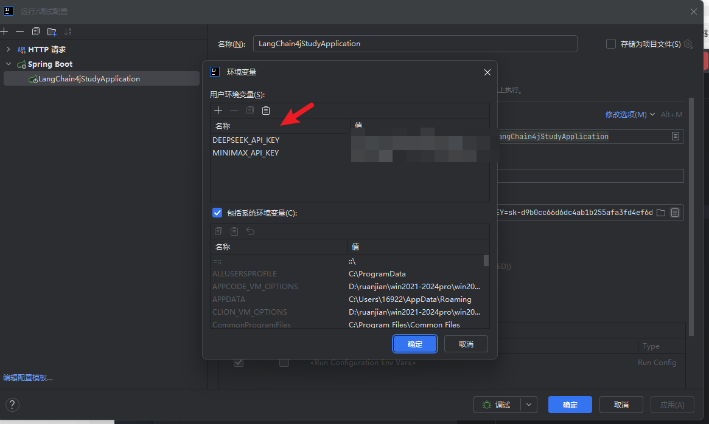
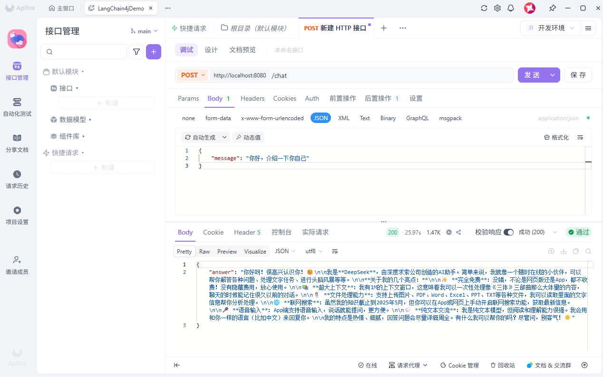

# LangChain4j 学习笔记 01：Spring Boot 接入 DeepSeek，先跑通一个聊天接口

最近开始学习 LangChain4j，第一步没有做复杂功能，只先写了一个最小 Demo：用 Spring Boot 接入 DeepSeek，提供一个简单的聊天接口。

这个 Demo 的目标很简单：

> 前端或者接口工具传一句话给后端，后端调用大模型，再把回答返回出去。

先把这条链路跑通，比一上来就研究 Agent、RAG、多轮对话更实际。

## 项目用到的技术

这次项目比较简单，主要用到这几个东西：

```text
Spring Boot 3.3.0
Java 17
LangChain4j 0.12.0
langchain4j-open-ai
DeepSeek
```

这里用到的关键依赖是：

```xml
<dependency>
    <groupId>dev.langchain4j</groupId>
    <artifactId>langchain4j-open-ai</artifactId>
    <version>${langchain4j.version}</version>
</dependency>
```

`langchain4j-open-ai` 可以理解成 OpenAI 兼容协议的适配器。DeepSeek 提供了兼容 OpenAI 风格的接口，所以可以用这种方式接入。

## 项目结构

项目结构很清楚：

```text
src/main/java/com/example/langchain4jstudy
├── LangChain4jStudyApplication.java
├── config
│   └── LangChain4jConfig.java
└── controller
    └── ChatController.java

src/main/resources
└── application.yml
```

这几个文件分别负责：

```text
启动类：启动 Spring Boot 项目
配置类：创建 ChatModel
Controller：提供聊天接口
application.yml：配置 DeepSeek 地址和模型
```

## 配置 DeepSeek

`application.yml` 里配置如下：

```yaml
server:
  port: 8080

ai:
  deepseek:
    api-key: ${DEEPSEEK_API_KEY}
    base-url: https://api.deepseek.com/v1
    model-name: deepseek-chat
```

这里没有把 API Key 写死在代码里，而是从环境变量里读取：

```text
DEEPSEEK_API_KEY
```



这样做比较安全，避免不小心把密钥提交到 GitHub。

## 创建 ChatModel

核心配置在 `LangChain4jConfig` 里面：

```java
@Bean
public ChatModel chatModel(
        @Value("${ai.deepseek.api-key}") String apiKey,
        @Value("${ai.deepseek.base-url}") String baseUrl,
        @Value("${ai.deepseek.model-name}") String modelName
) {
    return OpenAiChatModel.builder()
            .apiKey(apiKey)
            .baseUrl(baseUrl)
            .modelName(modelName)
            .temperature(1.0)
            .timeout(Duration.ofSeconds(60))
            .logRequests(true)
            .logResponses(true)
            .build();
}
```

这段代码主要做了三件事：

```text
读取配置文件里的 DeepSeek 参数
创建 OpenAiChatModel
交给 Spring 容器管理
```

后面 Controller 里只要注入 `ChatModel`，就可以直接调用模型。

## 提供聊天接口

接口代码也很简单：

```java
@RestController
@RequestMapping("/chat")
public class ChatController {

    private final ChatModel chatModel;

    public ChatController(ChatModel chatModel) {
        this.chatModel = chatModel;
    }

    @PostMapping
    public Map<String, String> chat(@RequestBody Map<String, String> request) {
        String message = request.get("message");
        String answer = chatModel.chat(message);
        return Map.of("answer", answer);
    }
}
```

这个接口的调用方式是：

```http
POST http://localhost:8080/chat
```

请求体：

```json
{
  "message": "你好，介绍一下你自己"
}
```

返回结果类似：

```json
{
  "answer": "你好，我是一个 AI 助手，可以帮助你回答问题、整理资料和处理文本。"
}
```

目前这个接口是最简单的单轮对话。也就是说，每次请求都是独立的，它不会记住上一次用户说过什么。

## 启动前先配置环境变量

因为代码里读取的是：

```text
DEEPSEEK_API_KEY
```

所以启动项目前，需要先在本地配置环境变量。

Windows PowerShell：

```powershell
$env:DEEPSEEK_API_KEY="你的DeepSeek API Key"
```

然后启动项目：

```bash
mvn spring-boot:run
```

如果看到项目正常运行在 8080 端口，就可以开始测试接口了。

## 用 curl 测试一下

```bash
curl -X POST http://localhost:8080/chat ^
  -H "Content-Type: application/json" ^
  -d "{\"message\":\"你好，介绍一下你自己\"}"
```




能正常返回模型回答，就说明 Spring Boot 已经通过 LangChain4j 成功调通了 DeepSeek。

这篇先只做到这里：**把接口跑通**。下一篇再继续在这个基础上做多轮对话，让模型能够记住前面的聊天内容。

项目仓库地址：
https://github.com/yangbin09/LangChain4j-demo

对应章节分支：
tutorial/2026-05-15-chapter1


