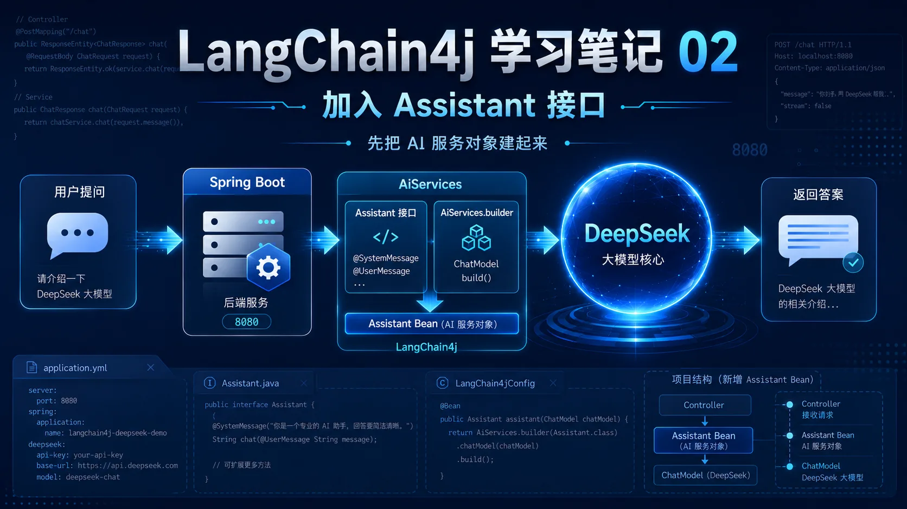
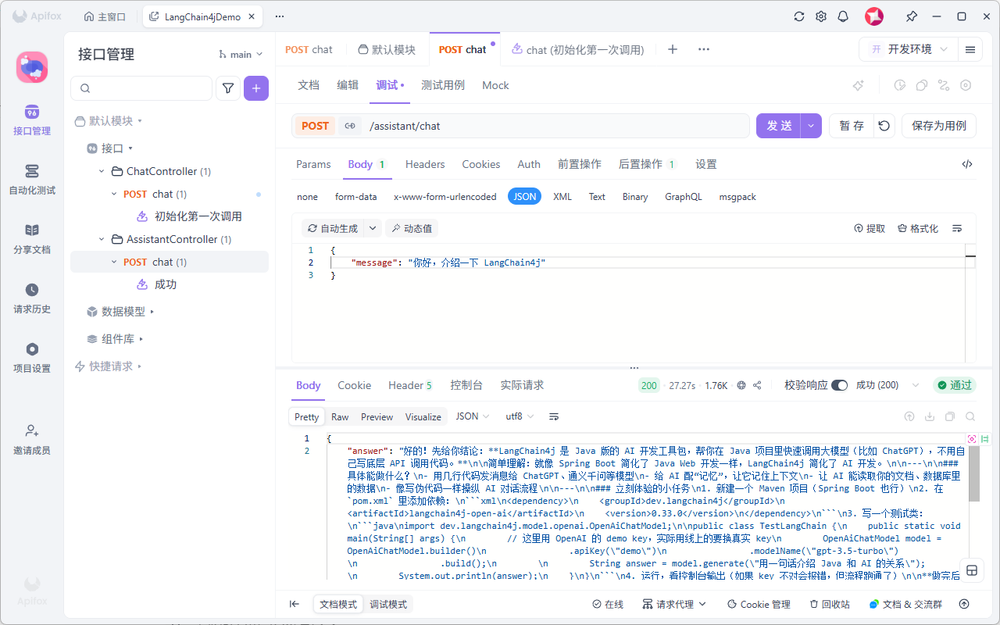

# LangChain4j 学习笔记 02：加入 Assistant 接口，让 AI 回答更像一个“指定角色”

上一篇已经把 Spring Boot 接入 DeepSeek 的基础聊天接口跑通了。

第一篇主要是直接使用 `ChatModel` 调用大模型，能问、能答，说明整条链路已经通了。

这一篇继续往前走一步，但还是不搞复杂功能。

这次只做一件事：

> 加入 `Assistant` 接口，通过 `AiServices` 创建 AI 服务对象，然后提供一个新的 `/assistant/chat` 接口。

这样写以后，就不是简单地把一句话丢给模型了，而是可以提前告诉模型：你是谁、应该怎么回答、回答时要注意什么。

---

## 一、这一章做了什么

当前分支是：

```text
tutorial/2026-05-15-chapter2
```

这一章主要新增了三个点：

```text
1. 新增 Assistant 接口
2. 使用 AiServices 创建 Assistant Bean
3. 新增 AssistantController，对外提供 /assistant/chat 接口
```

上一篇的重点是：

```text
Controller → ChatModel → DeepSeek
```

这一篇开始变成：

```text
Controller → Assistant → ChatModel → DeepSeek
```

中间多了一个 `Assistant`，它的作用就是把 AI 能力封装成一个更清晰的接口。

---

## 二、项目结构

这一章的项目结构大概是这样：

```text
src/main/java/com/example/langchain4jstudy
├── LangChain4jStudyApplication.java
├── ai
│   └── Assistant.java
├── config
│   └── LangChain4jConfig.java
└── controller
    └── AssistantController.java

src/main/resources
└── application.yml
```

和第一篇相比，主要多了两个东西：

```text
ai/Assistant.java
controller/AssistantController.java
```

`Assistant.java` 用来定义 AI 助手。

`AssistantController.java` 用来提供对外访问接口。

---

## 三、DeepSeek 配置保持不变

`application.yml` 还是配置 DeepSeek：

```yaml
server:
  port: 8080

ai:
  deepseek:
    api-key: ${DEEPSEEK_API_KEY}
    base-url: https://api.deepseek.com/v1
    model-name: deepseek-chat
```

这里还是使用环境变量读取 API Key：

```text
DEEPSEEK_API_KEY
```

不要把 API Key 直接写死在配置文件里。

如果是 Windows PowerShell，可以这样设置：

```powershell
$env:DEEPSEEK_API_KEY="你的 DeepSeek API Key"
```

然后启动项目：

```bash
mvn spring-boot:run
```

---

## 四、先创建 ChatModel

在 `LangChain4jConfig` 里，第一步还是先创建 `ChatModel`：

```java
@Bean
public ChatModel chatModel(
        @Value("${ai.deepseek.api-key}") String apiKey,
        @Value("${ai.deepseek.base-url}") String baseUrl,
        @Value("${ai.deepseek.model-name}") String modelName
) {
    return OpenAiChatModel.builder()
            .apiKey(apiKey)
            .baseUrl(baseUrl)
            .modelName(modelName)
            .temperature(1.0)
            .timeout(Duration.ofSeconds(60))
            .logRequests(true)
            .logResponses(true)
            .build();
}
```

这部分和第一章差不多。

它的作用就是根据配置创建一个可以调用 DeepSeek 的模型对象。

简单理解：

```text
application.yml 负责写配置
ChatModel 负责真正连接大模型
```

---

## 五、新增 Assistant 接口

这一章新增了一个 `Assistant` 接口：

```java
package com.example.langchain4jstudy.ai;

import dev.langchain4j.service.SystemMessage;
import dev.langchain4j.service.UserMessage;

public interface Assistant {

    @SystemMessage("""
            你是一个资深 Java / Spring Boot / 大数据方向的技术导师。
            你的任务是帮助用户学习 LangChain4j。
            回答要求：
            1. 用中文回答
            2. 尽量用大白话
            3. 先给结论，再给步骤
            4. 不要一次性讲太多理论
            5. 每次回答都要给一个可以立刻操作的小任务
            """)
    String chat(@UserMessage String message);
}
```

这个接口里最关键的是两个注解：

```text
@SystemMessage
@UserMessage
```

`@SystemMessage` 可以理解成提前告诉 AI：

```text
你要扮演什么角色
你应该用什么风格回答
你回答时要遵守哪些要求
```

这里给 AI 设置的角色是：

```text
资深 Java / Spring Boot / 大数据方向的技术导师
```

并且要求它：

```text
用中文回答
尽量用大白话
先给结论，再给步骤
不要一次性讲太多理论
每次回答都给一个可以立刻操作的小任务
```

`@UserMessage` 表示用户传进来的内容。

也就是说，用户真正提的问题会进入这里：

```java
String chat(@UserMessage String message);
```

---

## 六、用 AiServices 创建 Assistant

只有接口还不够，还需要让 LangChain4j 根据这个接口创建一个对象。

在 `LangChain4jConfig` 里新增了这个 Bean：

```java
@Bean
public Assistant assistant(ChatModel chatModel) {
    return AiServices.builder(Assistant.class)
            .chatModel(chatModel)
            .build();
}
```

这段代码可以简单理解成：

```text
使用 Assistant 接口
绑定前面创建好的 ChatModel
然后生成一个 Assistant 对象
交给 Spring 管理
```

有点像 MyBatis 里的 Mapper 接口。

我们只写接口，具体实现由框架生成。

这一章里，`Assistant` 不是我们手动 new 出来的，而是通过：

```java
AiServices.builder(Assistant.class)
```

创建出来的。

---

## 七、新增 AssistantController

这一章的接口已经不是第一篇的 `/chat` 了。

现在新增的是 `AssistantController`：

```java
package com.example.langchain4jstudy.controller;

import com.example.langchain4jstudy.ai.Assistant;
import org.springframework.web.bind.annotation.*;

import java.util.Map;

@RestController
@RequestMapping("/assistant")
public class AssistantController {

    private final Assistant assistant;

    public AssistantController(Assistant assistant) {
        this.assistant = assistant;
    }

    @PostMapping("/chat")
    public Map chat(@RequestBody Map request) {
        String message = request.get("message");
        String answer = assistant.chat(message);
        return Map.of("answer", answer);
    }
}
```

这里注入的已经不是 `ChatModel`，而是：

```java
private final Assistant assistant;
```

真正调用模型的地方也变成了：

```java
String answer = assistant.chat(message);
```

这就意味着，用户的问题会经过 `Assistant` 接口。

前面写在 `@SystemMessage` 里的系统提示词，也会参与到这次对话里。

---

## 八、接口地址

这一章的接口地址是：

```http
POST http://localhost:8080/assistant/chat
```

请求体还是传 `message`：

```json
{
  "message": "你好，介绍一下 LangChain4j"
}
```

返回结果还是：

```json
{
  "answer": "模型返回的回答内容"
}
```

只不过这一次，回答会受到 `Assistant` 里的 `@SystemMessage` 影响。

比如它会更倾向于：

```text
用中文回答
用大白话解释
先给结论
再给步骤
最后给一个小任务
```

这就是这一章和第一章最大的区别。

---

## 九、当前调用链路

这一章的调用链路可以理解成：

```text
用户请求
  ↓
AssistantController
  ↓
Assistant
  ↓
AiServices 生成的代理对象
  ↓
ChatModel
  ↓
DeepSeek
  ↓
返回回答
```

第一章是直接调用 `ChatModel`。

第二章是在 `ChatModel` 上面加了一层 `Assistant`。

这一层看起来不复杂，但后面会很有用。

因为以后如果要定义不同类型的 AI 助手，就可以继续定义不同的接口。

比如：

```text
写作助手
代码助手
学习助手
客服助手
SQL 助手
```

不过这一篇先不展开，当前只需要把 `Assistant` 这个写法跑通。

---

## 十、启动测试

先设置环境变量：

```powershell
$env:DEEPSEEK_API_KEY="你的 DeepSeek API Key"
```

启动项目：

```bash
mvn spring-boot:run
```

然后请求接口：

```bash
curl -X POST http://localhost:8080/assistant/chat ^
  -H "Content-Type: application/json" ^
  -d "{\"message\":\"你好，介绍一下 LangChain4j\"}"
```

如果接口正常返回内容，说明这一章的代码已经跑通。

也就是说：

```text
Assistant 接口生效了
AiServices 创建对象成功了
/assistant/chat 接口也能正常调用 DeepSeek
```

这一篇先做到这里，核心就是把 `Assistant` 这层加进来。  
下一篇再继续在这个基础上往前走。