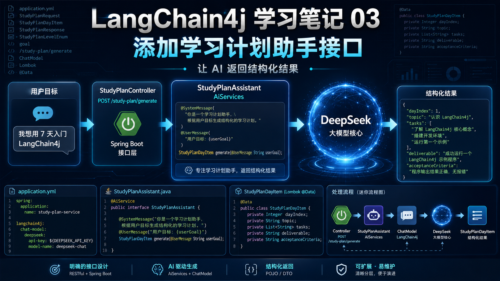
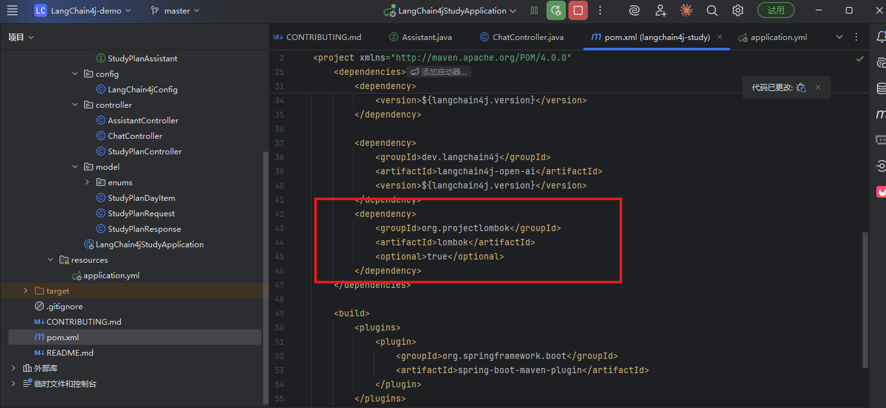
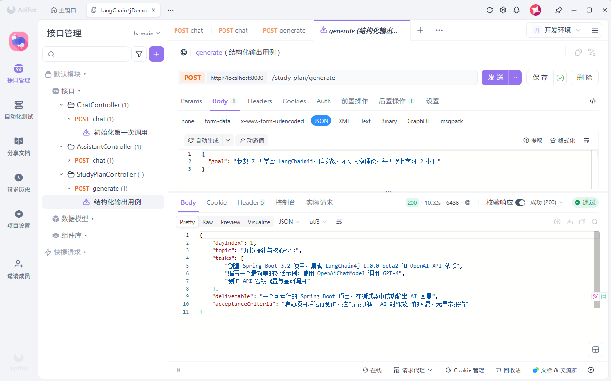

# LangChain4j 学习笔记 03：添加学习计划助手接口，让 AI 返回结构化结果

前两篇已经完成了两个基础步骤。

第一篇是直接通过 `ChatModel` 调用 DeepSeek，先把聊天接口跑通。

第二篇是加入 `Assistant` 接口，通过 `AiServices` 把 AI 能力封装成一个服务对象。

这一篇继续往前走一步，开始做一个更具体的接口：

> 根据用户输入的学习目标，生成一个学习计划。

这次不再只是让 AI 返回一段普通文本，而是让它返回一个 Java 对象。

---

## 一、这一章做了什么

当前这一章主要新增了几个内容：

```text
1. 添加 Lombok 依赖
2. 新增学习计划相关模型类
3. 新增 StudyPlanAssistant 接口
4. 在 LangChain4jConfig 中注册 StudyPlanAssistant
5. 新增 StudyPlanController，对外提供学习计划生成接口
```

这一章的接口地址是：

```http
POST http://localhost:8080/study-plan/generate
```

请求参数是一个学习目标，例如：

```json
{
  "goal": "我想用 7 天入门 LangChain4j"
}
```

接口会返回一个结构化对象，里面包含当天主题、任务清单、产出物和验收标准。

---


## 二、添加 Lombok 依赖

这一章开始增加了一些模型类，如果每个类都手写 `getter`、`setter`，代码会比较啰嗦。

所以先在 `pom.xml` 中加入 Lombok：

```xml
<dependency>
    <groupId>org.projectlombok</groupId>
    <artifactId>lombok</artifactId>
    <optional>true</optional>
</dependency>
```


后面就可以在实体类上直接使用：

```java
@Data
@NoArgsConstructor
```

这样代码会清爽很多。

---

## 三、新增请求对象

这一章新增了一个请求对象 `StudyPlanRequest`：

```java
package com.example.langchain4jstudy.model;

import lombok.Data;

/**
 * 学习计划请求
 */
@Data
public class StudyPlanRequest {

    /**
     * 学习目标
     */
    private String goal;

    public StudyPlanRequest() {
    }
}
```

这个类目前只有一个字段：

```java
private String goal;
```

也就是用户想学什么。

比如用户可以传：

```json
{
  "goal": "我想学习 LangChain4j，并能做一个简单的 AI 对话接口"
}
```

Controller 接收到这个参数后，会把 `goal` 传给 AI 助手。

---

## 四、新增每日学习计划对象

接着新增了 `StudyPlanDayItem`：

```java
package com.example.langchain4jstudy.model;

import lombok.Data;
import lombok.NoArgsConstructor;

import java.util.List;

/**
 * 学习计划中的每日学习安排。
 */
@Data
@NoArgsConstructor
public class StudyPlanDayItem {

    /**
     * 第几天。
     */
    private Integer dayIndex;

    /**
     * 当天学习主题。
     */
    private String topic;

    /**
     * 当天任务清单。
     */
    private List<String> tasks;

    /**
     * 当天产出物。
     */
    private String deliverable;

    /**
     * 当天验收标准。
     */
    private String acceptanceCriteria;
}
```

这个对象用来描述某一天的学习安排。

字段也比较直观：

```text
dayIndex：第几天
topic：当天主题
tasks：当天任务清单
deliverable：当天产出物
acceptanceCriteria：验收标准
```

比如 AI 返回的内容可能类似这样：

```json
{
  "dayIndex": 1,
  "topic": "跑通 LangChain4j 基础对话接口",
  "tasks": [
    "创建 Spring Boot 项目",
    "添加 LangChain4j 依赖",
    "配置 DeepSeek API Key",
    "编写一个简单的聊天接口"
  ],
  "deliverable": "一个可以正常调用 DeepSeek 的 Spring Boot 接口",
  "acceptanceCriteria": "使用 Postman 或 curl 调用接口，能够正常返回 AI 回答"
}
```

这比直接返回一大段文字更适合前端展示，也更适合后续扩展。

---

## 五、新增学习计划难度枚举

这一章还加了一个枚举类 `StudyPlanLevelEnum`：

```java
package com.example.langchain4jstudy.model.enums;

/**
 * 学习计划难度等级枚举。
 */
public enum StudyPlanLevelEnum {

    /**
     * 入门级。
     */
    BEGINNER,

    /**
     * 进阶级。
     */
    INTERMEDIATE,

    /**
     * 高级。
     */
    ADVANCED
}
```

这个枚举用来表示学习计划难度：

```text
BEGINNER：入门级
INTERMEDIATE：进阶级
ADVANCED：高级
```

这里有一个细节：枚举值使用英文大写。

这样做是为了让大模型输出时更稳定，也方便 Java 反序列化。

如果让模型返回中文，比如“入门级”“进阶级”，后面转成枚举时就容易出问题。

---

## 六、新增完整学习计划响应对象

这一章还定义了一个 `StudyPlanResponse`：

```java
package com.example.langchain4jstudy.model;

import com.example.langchain4jstudy.model.enums.StudyPlanLevelEnum;
import lombok.Data;
import lombok.NoArgsConstructor;

import java.util.List;

/**
 * 学习计划生成结果。
 */
@Data
@NoArgsConstructor
public class StudyPlanResponse {

    /**
     * 学习计划标题。
     */
    private String title;

    /**
     * 学习难度等级。
     */
    private StudyPlanLevelEnum level;

    /**
     * 学习计划摘要。
     */
    private String summary;

    /**
     * 每日学习安排列表。
     */
    private List<StudyPlanDayItem> days;

    /**
     * 风险提醒列表。
     */
    private List<String> warnings;
}
```

这个对象看起来更完整，包含：

```text
title：学习计划标题
level：学习难度
summary：学习计划摘要
days：每日学习安排
warnings：风险提醒
```

不过需要注意一下：当前这一章接口里实际返回的是 `StudyPlanDayItem`，不是 `StudyPlanResponse`。

也就是说，`StudyPlanResponse` 目前更像是提前准备好的完整响应结构，后面可以继续用。

当前真实接口先返回单个每日计划对象。

---

## 七、新增 StudyPlanAssistant

这一章的核心是新增了 `StudyPlanAssistant`：

```java
package com.example.langchain4jstudy.ai;

import com.example.langchain4jstudy.model.StudyPlanDayItem;
import dev.langchain4j.service.SystemMessage;
import dev.langchain4j.service.UserMessage;

public interface StudyPlanAssistant {

    @SystemMessage("""
            你是一个非常严格的技术学习教练，擅长给 Java 工程师制定实战学习计划。

            你的任务：
            根据用户目标，生成一个结构化学习计划。

            规则：
            1. 必须偏实战，不要堆理论
            2. 每一天都必须有明确任务
            3. 每一天都必须有明确产出物
            4. 每一天都必须有验收标准
            5. 不要编造不存在的软件版本
            6. 如果用户目标过大，要在 warnings 中提醒风险
            7. 内容必须适合 Java / Spring Boot 工程师
            8. 回答必须使用中文
            """)
    StudyPlanDayItem generate(@UserMessage String userGoal);
}
```

这里和第二章的 `Assistant` 思路一样。

还是通过接口定义 AI 能力。

只不过这一次的方法返回值不再是 `String`，而是：

```java
StudyPlanDayItem
```

也就是说，我们希望 AI 返回的内容可以被 LangChain4j 解析成 Java 对象。

这就是这一章最关键的变化。

---

## 八、SystemMessage 的作用

这段 `@SystemMessage` 很重要。

它不是随便写几句话，而是在约束 AI 的输出方向：

```text
你是一个严格的技术学习教练
要给 Java 工程师制定实战学习计划
必须偏实战
每天都要有任务、产出物、验收标准
不要编造不存在的软件版本
目标过大时要提醒风险
必须使用中文
```

如果没有这些规则，模型很可能会返回一段比较散的文字。

有了这些约束以后，返回内容会更接近我们想要的结构。

当前方法定义是：

```java
StudyPlanDayItem generate(@UserMessage String userGoal);
```

用户传入一个学习目标，AI 返回一个学习计划对象。

---

## 九、在配置类中注册 StudyPlanAssistant

接口写好以后，还需要在 `LangChain4jConfig` 里注册 Bean：

```java
@Bean
public StudyPlanAssistant studyPlanAssistant(ChatModel chatModel) {
    return AiServices.builder(StudyPlanAssistant.class)
            .chatModel(chatModel)
            .build();
}
```

完整配置里，现在有三个 Bean：

```java
@Bean
public ChatModel chatModel(...) {
    // 创建 DeepSeek 模型
}

@Bean
public Assistant assistant(ChatModel chatModel) {
    return AiServices.builder(Assistant.class)
            .chatModel(chatModel)
            .build();
}

@Bean
public StudyPlanAssistant studyPlanAssistant(ChatModel chatModel) {
    return AiServices.builder(StudyPlanAssistant.class)
            .chatModel(chatModel)
            .build();
}
```

这里可以简单理解成：

```text
ChatModel：负责连接 DeepSeek
Assistant：普通聊天助手
StudyPlanAssistant：学习计划助手
```

它们底层用的还是同一个 `ChatModel`。

只是不同的 Assistant 接口，有不同的系统提示词和方法返回值。

---

## 十、新增 StudyPlanController

最后新增一个控制器 `StudyPlanController`：

```java
package com.example.langchain4jstudy.controller;

import com.example.langchain4jstudy.ai.StudyPlanAssistant;
import com.example.langchain4jstudy.model.StudyPlanDayItem;
import com.example.langchain4jstudy.model.StudyPlanRequest;
import org.springframework.web.bind.annotation.*;

@RestController
@RequestMapping("/study-plan")
public class StudyPlanController {

    private final StudyPlanAssistant studyPlanAssistant;

    public StudyPlanController(StudyPlanAssistant studyPlanAssistant) {
        this.studyPlanAssistant = studyPlanAssistant;
    }

    @PostMapping("/generate")
    public StudyPlanDayItem generate(@RequestBody StudyPlanRequest request) {
        return studyPlanAssistant.generate(request.getGoal());
    }
}
```

这个接口地址是：

```http
POST http://localhost:8080/study-plan/generate
```

请求体是：

```json
{
  "goal": "我想用 7 天入门 LangChain4j"
}
```

Controller 做的事情很简单：

```text
接收用户学习目标
调用 StudyPlanAssistant.generate()
返回 AI 生成的 StudyPlanDayItem
```

核心代码就是这一行：

```java
return studyPlanAssistant.generate(request.getGoal());
```

---

## 十一、当前调用链路

这一章的调用链路可以这样理解：

```text
用户请求
  ↓
StudyPlanController
  ↓
StudyPlanAssistant
  ↓
AiServices 生成代理对象
  ↓
ChatModel
  ↓
DeepSeek
  ↓
返回 StudyPlanDayItem
```

和第二章相比，这一章最大的变化是：

```text
第二章：AI 返回 String
第三章：AI 返回 Java 对象
```

这个变化很关键。

因为真实项目里，很多时候我们不希望 AI 只返回一段自然语言，而是希望它返回结构化结果。

比如：

```text
学习计划
文章评分结果
SQL 生成结果
商品推荐结果
风险诊断结果
任务拆解结果
```

这些都更适合用 Java 对象承接。

---

## 十二、启动测试

先设置环境变量：

```powershell
$env:DEEPSEEK_API_KEY="你的 DeepSeek API Key"
```

启动项目：

```bash
mvn spring-boot:run
```

然后请求接口：

```bash
curl -X POST http://localhost:8080/study-plan/generate ^
  -H "Content-Type: application/json" ^
  -d "{\"goal\":\"我想用 7 天入门 LangChain4j\"}"
```

如果接口正常，会返回类似这样的结构：

```json
{
  "dayIndex": 1,
  "topic": "LangChain4j 基础环境搭建与第一个对话接口",
  "tasks": [
    "创建 Spring Boot 项目",
    "添加 LangChain4j 相关依赖",
    "配置 DeepSeek API Key",
    "编写一个简单的 Controller 接口",
    "使用 curl 或 Postman 完成接口测试"
  ],
  "deliverable": "一个可以正常调用 DeepSeek 的 Spring Boot 对话接口",
  "acceptanceCriteria": "调用接口后能够正常返回大模型回答，并且控制台没有明显异常"
}
```


这一篇先做到这里。

第三章的重点不是做一个完整学习系统，而是先把这件事跑通：

```text
让 AI 根据用户目标，返回一个 Java 对象
```

后面再继续在这个基础上，把单天计划扩展成完整学习计划。
