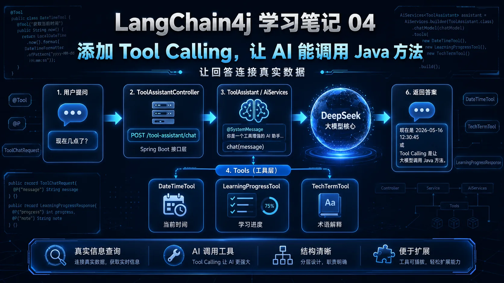
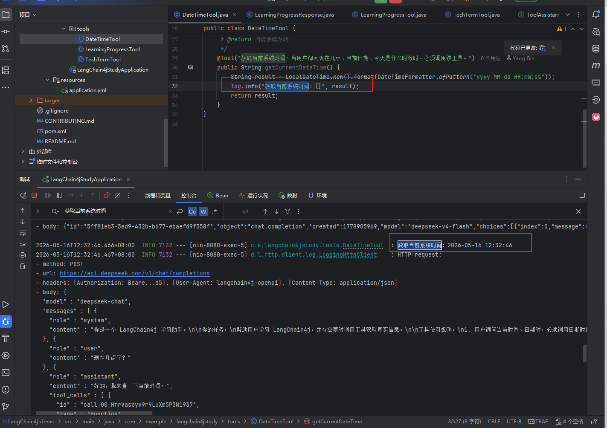
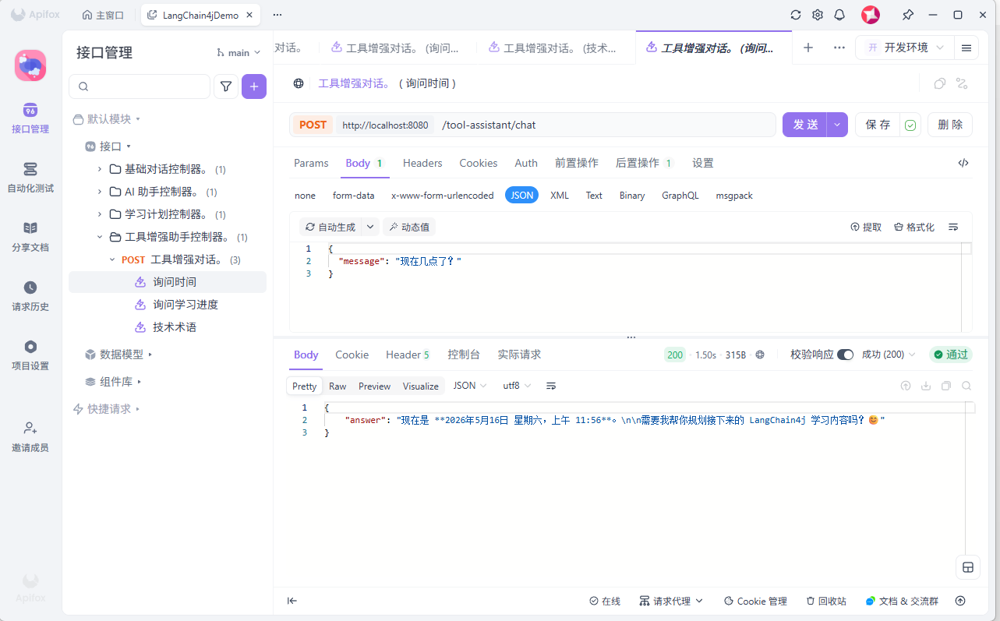
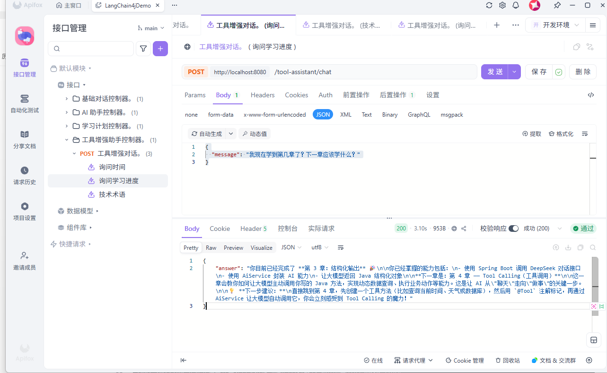
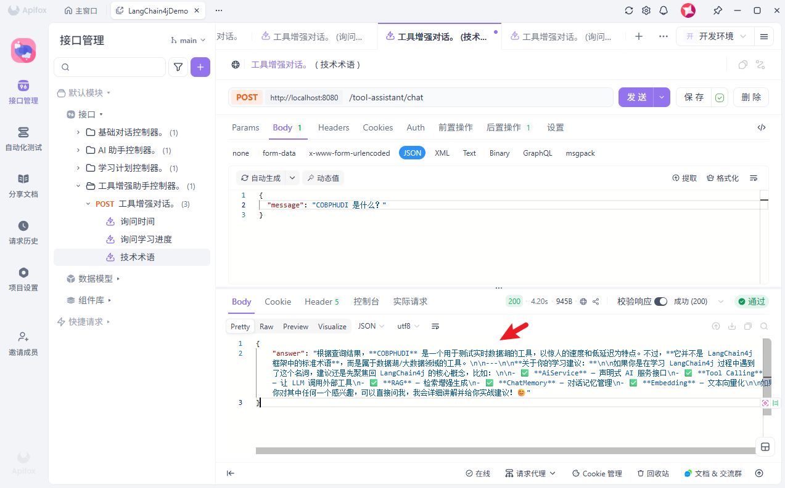

sidebarTitle: 04 Tool Calling 调用 Java 方法

# LangChain4j 学习笔记 04：添加 Tool Calling，让 AI 能调用 Java 方法

前面三篇已经把基础能力一步步搭起来了。

第一篇：Spring Boot 接入 DeepSeek，先跑通聊天接口。
第二篇：加入 `Assistant` 接口，用 `AiServices` 封装 AI 能力。
第三篇：添加学习计划助手，让 AI 返回 Java 结构化对象。

这一篇继续往前走一步，开始接触 LangChain4j 里非常重要的能力：

> Tool Calling，也就是让大模型在需要的时候调用我们写好的 Java 方法。

简单说，以前 AI 只能根据自己已有知识回答。
现在我们可以给它工具，让它在需要真实数据时调用 Java 代码。

---


## 一、这一章做了什么

这一章主要新增了几个内容：

```text
1. 新增 ToolAssistant 工具调用助手
2. 新增 ToolAssistantController 接口
3. 新增 ToolChatRequest 请求对象
4. 新增 DateTimeTool 日期时间工具
5. 新增 LearningProgressTool 学习进度工具
6. 新增 TechTermTool 技术术语工具
```

这一章的接口地址是：

```http
POST http://localhost:8080/tool-assistant/chat
```

比如用户问：

```json
{
  "message": "现在几点了？"
}
```

AI 不再自己猜时间，而是会调用我们写好的 `DateTimeTool`，拿到真实系统时间后再回答。

---

## 二、为什么要用 Tool Calling

大模型很强，但它有一个明显问题：

> 它不知道实时信息，也不能直接访问你的系统数据。

比如你问它：

```text
现在几点了？
```

如果没有工具，大模型只能猜。

再比如你问：

```text
我现在学到第几章了？
```

大模型也不知道你的学习进度。

但是有了 Tool Calling，就可以这样做：

```text
用户提问
  ↓
大模型判断需要工具
  ↓
调用 Java 方法
  ↓
Java 方法返回真实结果
  ↓
大模型整理成自然语言回答
```

这样 AI 的回答就不只是“生成文本”，而是能连接真实业务逻辑。

---

## 三、新增 ToolAssistant

这一章先新增一个工具调用助手接口 `ToolAssistant`：

```java
package com.example.langchain4jstudy.ai;

import dev.langchain4j.service.SystemMessage;
import dev.langchain4j.service.UserMessage;

/**
 * 工具调用 AI 助手。
 *
 * <p>用于演示 LangChain4j Tool Calling 能力。</p>
 *
 * @author yang xiao
 */
public interface ToolAssistant {

    /**
     * 与工具增强助手对话。
     *
     * @param message 用户消息
     * @return AI 最终回答
     */
    @SystemMessage("""
            你是一个 LangChain4j 学习助手。
            
            你的任务：
            帮助用户学习 LangChain4j，并在需要时调用工具获取真实信息。
            
            工具使用规则：
            1. 用户询问当前时间、日期时，必须调用日期时间工具
            2. 用户询问当前学习进度、学到哪一章、下一章学什么时，必须调用学习进度工具
            3. 用户询问 AiService、Tool Calling、RAG、ChatMemory、Embedding 等术语时，优先调用技术术语工具
            4. 工具返回结果后，你要用中文整理成自然、清晰的回答
            5. 不要暴露工具调用细节，不要说"我调用了某某工具"
            6. 回答要偏实战，每次给一个下一步操作建议
            """)
    String chat(@UserMessage String message);
}
```

这个接口和前面的 `Assistant` 很像。

区别在于，这里明确告诉 AI：

```text
遇到当前时间，要用时间工具
遇到学习进度，要用进度工具
遇到技术术语，要用术语工具
```

这段 `@SystemMessage` 很关键。

它不是普通提示词，而是在告诉模型：什么时候应该使用工具，以及工具返回之后应该怎么组织回答。

---

## 四、新增请求对象 ToolChatRequest

这一章没有继续用 `Map` 接收参数，而是新增了一个请求对象：

```java
package com.example.langchain4jstudy.model.request;

import lombok.Data;
import lombok.NoArgsConstructor;

/**
 * 工具增强对话请求。
 *
 * <p>用于接收用户输入的对话内容。</p>
 *
 * @author yang xiao
 */
@Data
@NoArgsConstructor
public class ToolChatRequest {

    /**
     * 用户消息。
     */
    private String message;
}
```

这个对象目前只有一个字段：

```java
private String message;
```

接口请求时传入：

```json
{
  "message": "现在几点了？"
}
```

Controller 会把这个 `message` 交给 `ToolAssistant` 处理。

---

## 五、新增 ToolAssistantController

接着新增控制器 `ToolAssistantController`：

```java
package com.example.langchain4jstudy.controller;

import com.example.langchain4jstudy.ai.ToolAssistant;
import com.example.langchain4jstudy.model.request.ToolChatRequest;
import org.springframework.web.bind.annotation.*;

import java.util.Map;

/**
 * 工具增强助手控制器。
 *
 * <p>提供 Tool Calling 演示接口。</p>
 *
 * @author yang xiao
 */
@RestController
@RequestMapping("/tool-assistant")
public class ToolAssistantController {

    private final ToolAssistant toolAssistant;

    public ToolAssistantController(ToolAssistant toolAssistant) {
        this.toolAssistant = toolAssistant;
    }

    /**
     * 工具增强对话。
     *
     * @param request 对话请求
     * @return AI 回答
     */
    @PostMapping("/chat")
    public Map<String, String> chat(@RequestBody ToolChatRequest request) {
        String answer = toolAssistant.chat(request.getMessage());
        return Map.of("answer", answer);
    }
}
```

接口地址是：

```http
POST http://localhost:8080/tool-assistant/chat
```

核心调用就是这一行：

```java
String answer = toolAssistant.chat(request.getMessage());
```

也就是说，用户的问题会先进入 `ToolAssistant`。

至于要不要调用工具，由大模型根据用户问题和工具说明来判断。

---

## 六、新增日期时间工具 DateTimeTool

第一个工具是 `DateTimeTool`，用来获取当前系统时间：

```java
package com.example.langchain4jstudy.tools;

import dev.langchain4j.agent.tool.Tool;
import lombok.extern.slf4j.Slf4j;
import org.springframework.stereotype.Component;

import java.time.LocalDateTime;
import java.time.format.DateTimeFormatter;

/**
 * 日期时间工具。
 *
 * <p>用于给大模型提供当前系统时间。</p>
 * <p>注意：当前时间这类信息不应该让大模型猜，而应该通过工具方法获取。</p>
 *
 * @author yang xiao
 */
@Component
@Slf4j
public class DateTimeTool {

    /**
     * 获取当前系统时间。
     *
     * <p>返回当前日期时间，格式为 yyyy-MM-dd HH:mm:ss。</p>
     *
     * @return 当前系统时间
     */
    @Tool("获取当前系统时间。当用户询问现在几点、当前日期、今天是什么时候时，必须调用该工具。")
    public String getCurrentDateTime() {
        String result = LocalDateTime.now().format(DateTimeFormatter.ofPattern("yyyy-MM-dd HH:mm:ss"));
        log.info("获取当前系统时间：{}", result);
        return result;
    }
}
```

这里最重要的是 `@Tool` 注解：

```java
@Tool("获取当前系统时间。当用户询问现在几点、当前日期、今天是什么时候时，必须调用该工具。")
```

它的作用是告诉大模型：

```text
这个方法是干什么的
什么场景应该调用它
```

当用户问：

```text
现在几点了？
```

模型就能判断，这个问题应该走 `getCurrentDateTime()` 方法，而不是自己编一个时间。

---

## 七、新增学习进度工具 LearningProgressTool

第二个工具是 `LearningProgressTool`，用来查询当前学习进度：

```java
package com.example.langchain4jstudy.tools;

import com.example.langchain4jstudy.model.response.LearningProgressResponse;
import dev.langchain4j.agent.tool.Tool;
import lombok.extern.slf4j.Slf4j;
import org.springframework.stereotype.Component;

import java.util.List;

/**
 * 学习进度工具。
 *
 * <p>用于查询当前 LangChain4j 学习进度。</p>
 * <p>这里先使用模拟数据，后续可以替换成数据库查询。</p>
 *
 * @author yang xiao
 */
@Component
@Slf4j
public class LearningProgressTool {

    /**
     * 查询当前学习进度。
     *
     * <p>返回当前已完成章节、下一章内容、已具备能力列表和下一步建议。</p>
     *
     * @return 当前学习进度信息
     */
    @Tool("查询用户当前 LangChain4j 学习进度。当用户询问学到哪、下一章学什么、当前进度时，必须调用该工具。")
    public LearningProgressResponse queryCurrentProgress() {
        log.info("查询当前学习进度");

        return LearningProgressResponse.builder()
                .completedChapterIndex(3)
                .completedChapterName("结构化输出")
                .nextChapterIndex(4)
                .nextChapterName("Tool Calling 工具调用")
                .completedAbilities(List.of(
                        "能使用 Spring Boot 调用 DeepSeek 对话接口",
                        "能使用 AiService 封装 AI 能力",
                        "能让大模型返回 Java 结构化对象"
                ))
                .nextSuggestion("建议继续学习 Tool Calling，让大模型调用 Java 方法，完成确定性查询和业务动作。")
                .build();
    }
}
```

这里返回的是一个 Java 对象：

```java
LearningProgressResponse
```

当前数据是写死的模拟数据。

不过这个结构已经有实际意义了。以后如果接数据库，只需要把这里的模拟数据换成数据库查询即可。

也就是说，工具方法可以从：

```text
写死数据
```

慢慢升级成：

```text
查询数据库
调用第三方接口
执行业务服务
读取本地配置
```

---

## 八、新增学习进度响应对象

`LearningProgressTool` 返回的是 `LearningProgressResponse`：

```java
package com.example.langchain4jstudy.model.response;

import lombok.Builder;
import lombok.Data;

import java.util.List;

/**
 * 学习进度响应对象。
 *
 * <p>用于描述当前 LangChain4j 学习进度。</p>
 *
 * @author yang xiao
 */
@Data
@Builder
public class LearningProgressResponse {

    /**
     * 当前已完成章节序号。
     */
    private Integer completedChapterIndex;

    /**
     * 当前已完成章节名称。
     */
    private String completedChapterName;

    /**
     * 下一章序号。
     */
    private Integer nextChapterIndex;

    /**
     * 下一章名称。
     */
    private String nextChapterName;

    /**
     * 已完成能力列表。
     */
    private List<String> completedAbilities;

    /**
     * 下一步建议。
     */
    private String nextSuggestion;
}
```

这个类主要是为了把学习进度描述清楚。

字段包括：

```text
completedChapterIndex：当前已完成章节序号
completedChapterName：当前已完成章节名称
nextChapterIndex：下一章序号
nextChapterName：下一章名称
completedAbilities：已经掌握的能力
nextSuggestion：下一步建议
```

模型拿到这个结构化对象后，会再整理成自然语言回答用户。

---

## 九、新增技术术语工具 TechTermTool

第三个工具是 `TechTermTool`，用来查询 LangChain4j 相关术语：

```java
package com.example.langchain4jstudy.tools;

import dev.langchain4j.agent.tool.P;
import dev.langchain4j.agent.tool.Tool;
import lombok.extern.slf4j.Slf4j;
import org.springframework.stereotype.Component;

import java.util.HashMap;
import java.util.Map;

/**
 * 技术术语查询工具。
 *
 * <p>用于查询 LangChain4j 学习过程中的核心术语解释。</p>
 * <p>这里先使用内存 Map 模拟知识库，后续第五章会升级成 RAG。</p>
 *
 * @author yang xiao
 */
@Component
@Slf4j
public class TechTermTool {

    /**
     * 技术术语知识库。
     *
     * <p>Key: 术语名称</p>
     * <p>Value: 术语解释</p>
     */
    private static final Map<String, String> TERM_MAP = new HashMap<>();

    static {
        TERM_MAP.put("AiService", "AiService 是 LangChain4j 中把 Java 接口变成 AI 能力的机制。你可以像调用普通 Java 方法一样调用大模型。");
        TERM_MAP.put("Tool Calling", "Tool Calling 是让大模型在需要真实数据或确定性操作时，调用你写好的 Java 方法。");
        TERM_MAP.put("RAG", "RAG 是检索增强生成。简单说，就是先从文档中查资料，再让大模型基于资料回答。");
        TERM_MAP.put("ChatMemory", "ChatMemory 是对话记忆，用来保存多轮对话上下文，让 AI 知道前面聊过什么。");
        TERM_MAP.put("Embedding", "Embedding 是把文本转换成向量，用于相似度检索，是 RAG 的基础能力之一。");
        TERM_MAP.put("COBPHUDI", "COBPHUDI 是一个用于测试 实时数据湖的工具，惊人的速度和低延迟。");
    }

    /**
     * 查询技术术语解释。
     *
     * <p>根据用户询问的术语，返回对应的解释。</p>
     *
     * @param term 技术术语，例如 AiService、Tool Calling、RAG、ChatMemory、Embedding
     * @return 技术术语解释，如果未收录则返回提示
     */
    @Tool("查询 LangChain4j 技术术语解释。当用户询问某个术语是什么意思时，可以调用该工具。")
    public String queryTermExplanation(@P("技术术语，例如 AiService、Tool Calling、RAG、ChatMemory、Embedding") String term) {
        log.info("查询技术术语：{}", term);
        String result = TERM_MAP.getOrDefault(term, "暂未收录该术语：" + term + "。建议后续补充到术语库中。");
        log.info("术语解释：{}", result);
        return result;
    }
}
```

这里用一个 `Map` 先模拟术语库。

比如用户问：

```text
Tool Calling 是什么？
```

模型就可以调用这个工具，查询：

```java
queryTermExplanation("Tool Calling")
```

然后拿到解释：

```text
Tool Calling 是让大模型在需要真实数据或确定性操作时，调用你写好的 Java 方法。
```

再由模型整理成更自然的回答。

这里还有一个新注解：

```java
@P("技术术语，例如 AiService、Tool Calling、RAG、ChatMemory、Embedding")
```

`@P` 是用来描述工具方法参数的。

它能帮助模型理解这个参数应该传什么。

---

## 十、工具需要注册到 AiServices

工具类写好以后，还需要让 `ToolAssistant` 知道有哪些工具可以用。

一般会在配置类里通过 `AiServices` 注册工具，例如：

```java
@Bean
public ToolAssistant toolAssistant(
        ChatModel chatModel,
        DateTimeTool dateTimeTool,
        LearningProgressTool learningProgressTool,
        TechTermTool techTermTool
) {
    return AiServices.builder(ToolAssistant.class)
            .chatModel(chatModel)
            .tools(dateTimeTool, learningProgressTool, techTermTool)
            .build();
}
```

这里的重点是：

```java
.tools(dateTimeTool, learningProgressTool, techTermTool)
```

这一步就是把 Java 工具交给 LangChain4j。

这样大模型在分析用户问题时，才知道自己可以调用这些方法。

当前调用关系可以理解成：

```text
ToolAssistant
  ↓
ChatModel
  ↓
Tools
  ↓
DateTimeTool / LearningProgressTool / TechTermTool
```

---

## 十一、当前接口怎么测试

启动项目之前，还是先设置 DeepSeek API Key：

```powershell
$env:DEEPSEEK_API_KEY="你的 DeepSeek API Key"
```

启动项目：

```bash
mvn spring-boot:run
```

然后请求工具增强接口：

```bash
curl -X POST http://localhost:8080/tool-assistant/chat ^
  -H "Content-Type: application/json" ^
  -d "{\"message\":\"现在几点了？\"}"
```

如果正常，会返回类似：

```json
{
  "answer": "现在是 2026-05-16 12:30:45。下一步你可以继续测试学习进度查询，例如问：我现在学到哪一章了？"
}
```




注意，这个时间不是模型猜出来的，而是 Java 方法获取的系统当前时间。

---

## 十二、测试学习进度工具

可以继续测试：

```bash
curl -X POST http://localhost:8080/tool-assistant/chat ^
  -H "Content-Type: application/json" ^
  -d "{\"message\":\"我现在学到哪一章了？下一章学什么？\"}"
```

预期回答会围绕这些信息：

```text
当前已完成第 3 章：结构化输出
下一章是第 4 章：Tool Calling 工具调用
已经掌握了基础对话接口、AiService 封装、结构化对象返回
建议继续学习 Tool Calling
```

这里的信息来自 `LearningProgressTool`，不是模型自己编出来的。

---



## 十三、测试技术术语工具

再测试一个术语查询：

**术语是我瞎编的，用于测试**

```bash
curl -X POST http://localhost:8080/tool-assistant/chat ^
  -H "Content-Type: application/json" ^
  -d "{\"message\":\"COBPHUDI 是什么？\"}"
```

如果工具正常生效，回答会基于 `COBPHUDI` 里的术语解释。

比如：

```text
"根据查询结果，**COBPHUDI** 是一个用于测试实时数据湖的工具，以惊人的速度和低延迟为特点。
```

这个例子比较适合理解 Tool Calling 的价值。

以前模型只能靠自己生成回答。

现在它可以先查你提供的工具，再组织回答。

---



## 十四、这一章的调用链路

这一章的调用链路可以这样理解：

```text
用户请求
  ↓
ToolAssistantController
  ↓
ToolAssistant
  ↓
AiServices 生成代理对象
  ↓
ChatModel
  ↓
模型判断是否需要工具
  ↓
调用对应 Java Tool
  ↓
工具返回结果
  ↓
模型整理回答
  ↓
返回给用户
```

和前几章相比，这一章最大的变化是：

```text
前几章：AI 只负责回答
这一章：AI 可以调用 Java 方法后再回答
```

这个能力很重要。

因为真实项目里，很多问题不能靠模型猜。

比如：

```text
当前用户积分是多少
订单状态是什么
今天有多少条告警
数据库里有没有这条记录
当前系统时间是多少
某个配置项现在是什么值
```

这些都应该通过工具、数据库、接口去查，而不是让模型自己生成。

---

## 十五、@Tool 注解要写清楚

这一章有一个很重要的小经验：

> `@Tool` 的描述越清楚，模型越容易正确选择工具。

比如这个写法就比较明确：

```java
@Tool("获取当前系统时间。当用户询问现在几点、当前日期、今天是什么时候时，必须调用该工具。")
public String getCurrentDateTime() {
    // ...
}
```

它告诉模型两件事：

```text
这个工具能干什么
什么情况下应该使用这个工具
```

如果只写：

```java
@Tool("时间工具")
```

模型就不一定能稳定判断什么时候该用它。

所以 Tool Calling 不是只写一个 Java 方法就结束了。

工具描述也要认真写。

---

## 十六、这一章先做到这里

这一章主要跑通了 LangChain4j 的 Tool Calling。

目前已经有三个工具：

```text
DateTimeTool：获取当前系统时间
LearningProgressTool：查询当前学习进度
TechTermTool：查询技术术语解释
```

同时新增了一个工具增强接口：

```http
POST http://localhost:8080/tool-assistant/chat
```

这一章先只做到这里。

第四章的重点不是做复杂业务系统，而是先理解一件事：

```text
让大模型在需要真实信息时，调用 Java 方法，再基于结果回答用户。
```

下一篇再继续在这个基础上往前走。
