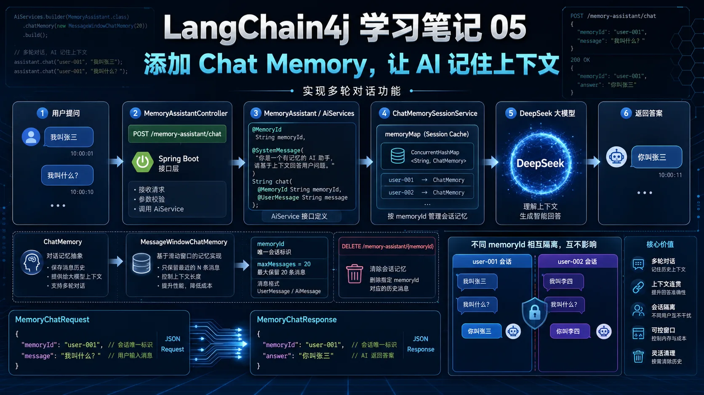
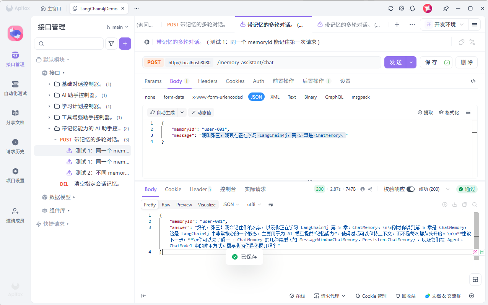
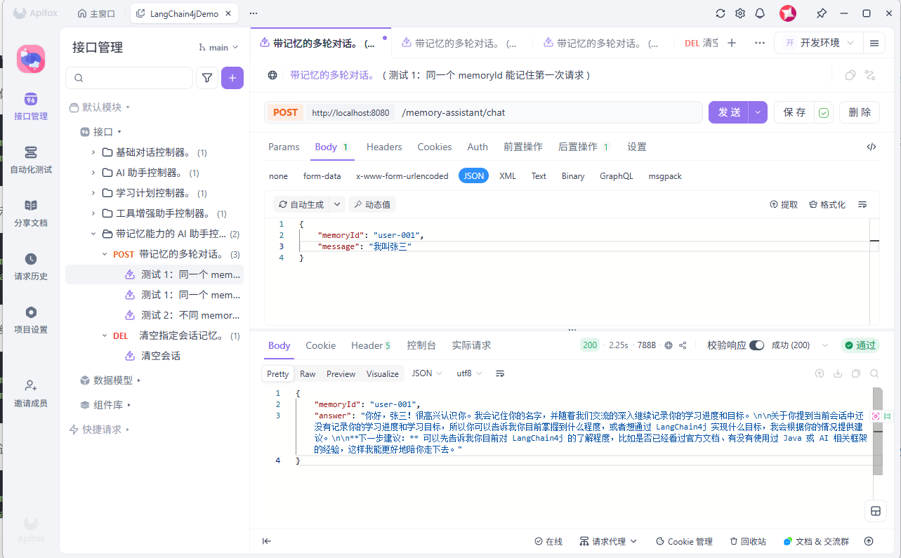
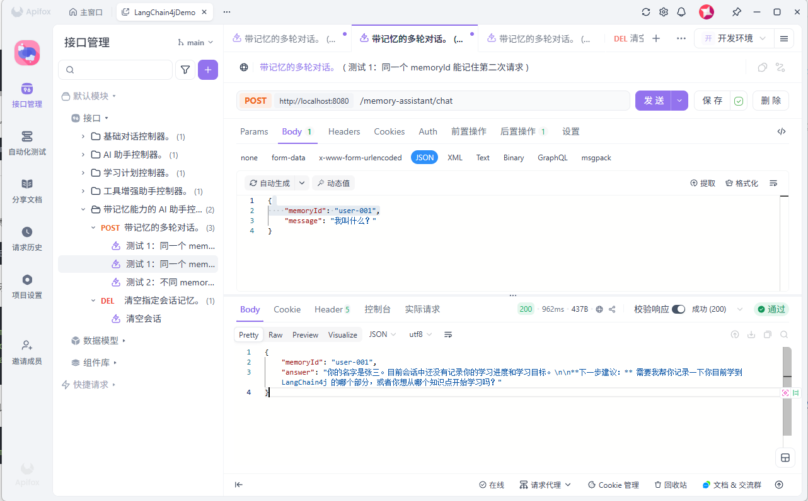
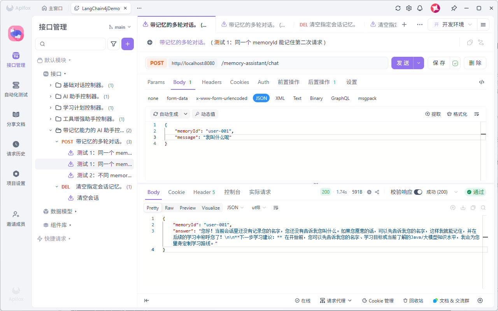

# LangChain4j 学习笔记 05：添加 Chat Memory，让 AI 记住上下文

前面几篇已经把 LangChain4j 的基础能力慢慢跑通了。

第一篇跑通了 Spring Boot 调用 DeepSeek。  
第二篇加入了 `Assistant` 接口。  
第三篇让 AI 返回 Java 结构化对象。  
第四篇学习了 Tool Calling，让 AI 可以调用 Java 方法。

这一篇继续往前走，开始做多轮对话。

这章只做一件事：

> 给 AI 加上 Chat Memory，让它能记住当前会话里前面说过的话。

比如先告诉它：

```text
我叫张三
```

然后再问：

```text
我叫什么？
```

如果没有记忆，AI 不一定知道你是谁。  
有了 Chat Memory，它就可以根据当前会话上下文回答。

---


## 一、这一章做了什么

这一章主要新增了这些内容：

```text
1. 新增 MemoryAssistant 带记忆助手
2. 新增 MemoryChatRequest 请求对象
3. 新增 MemoryChatResponse 响应对象
4. 新增 MemoryAssistantController 控制器
5. 新增 ChatMemorySessionService 管理会话记忆
6. 在 LangChain4jConfig 中注册 MemoryAssistant
7. 给 ToolAssistantController 补充日志
```

这一章的核心接口是：

```http
POST http://localhost:8080/memory-assistant/chat
```

另外还新增了一个清空记忆接口：

```http
DELETE http://localhost:8080/memory-assistant/{memoryId}
```

---

## 二、新增 MemoryAssistant

这一章新增了一个 `MemoryAssistant` 接口：

```java
package com.example.langchain4jstudy.ai;

import dev.langchain4j.service.MemoryId;
import dev.langchain4j.service.SystemMessage;
import dev.langchain4j.service.UserMessage;

public interface MemoryAssistant {

    @SystemMessage("""
            你是一个 LangChain4j 学习助手，正在陪用户一步一步学习 LangChain4j。

            你的任务：
            1. 记住用户在当前会话中提到的信息
            2. 记住用户的姓名、学习进度、学习目标
            3. 当用户追问"我叫什么""我学到哪了""刚才说了什么"时，要结合对话记忆回答
            4. 回答必须使用中文
            5. 不要编造当前会话中没有出现过的信息
            6. 如果记忆中没有相关信息，要明确告诉用户"当前会话里还没有记录"
            7. 每次回答最后给一个简短的下一步学习建议
            """)
    String chat(@MemoryId String memoryId, @UserMessage String message);
}
```

这里最关键的是：

```java
@MemoryId String memoryId
```

它表示这个参数是记忆 ID。

简单理解：

```text
memoryId 就是会话 ID
```

同一个 `memoryId` 下的对话，会共享同一段记忆。  
不同 `memoryId` 之间，记忆是隔离的。

比如：

```text
user-001 说：我叫张三
user-002 说：我叫李四
```

后面 `user-001` 问“我叫什么”，应该回答张三。  
`user-002` 问“我叫什么”，应该回答李四。

---

## 三、新增请求对象 MemoryChatRequest

这章新增了 `MemoryChatRequest`：

```java
package com.example.langchain4jstudy.model.request;

import lombok.Data;
import lombok.NoArgsConstructor;

@Data
@NoArgsConstructor
public class MemoryChatRequest {

    /**
     * 记忆 ID。
     */
    private String memoryId;

    /**
     * 用户消息。
     */
    private String message;
}
```

这个请求对象有两个字段：

```text
memoryId：会话 ID
message：用户消息
```

请求示例：

```json
{
  "memoryId": "user-001",
  "message": "我叫张三，我现在正在学习 LangChain4j，第 5 章是 ChatMemory。"
}
```


这里的 `memoryId` 很重要。

如果每次请求都换一个 `memoryId`，AI 就记不住前面的内容。  
如果希望它记住上下文，就要使用同一个 `memoryId`。

---

## 四、新增响应对象 MemoryChatResponse

接口返回对象是 `MemoryChatResponse`：

```java
package com.example.langchain4jstudy.model.response;

import lombok.AllArgsConstructor;
import lombok.Data;
import lombok.NoArgsConstructor;

@Data
@NoArgsConstructor
@AllArgsConstructor
public class MemoryChatResponse {

    /**
     * 当前记忆 ID。
     */
    private String memoryId;

    /**
     * AI 回答内容。
     */
    private String answer;
}
```

这个对象返回两个字段：

```text
memoryId：当前使用的会话 ID
answer：AI 的回答内容
```

响应示例：

```json
{
    "memoryId": "user-001",
    "answer": "好的，张三！我会记住你的名字，以及你正在学习 LangChain4j 第 5 章：ChatMemory。"
}
```

这样前端或者接口调用方就能知道，这次回答对应的是哪一个会话。

---

## 五、新增 ChatMemorySessionService

这一章还新增了一个很关键的服务类：

```java
package com.example.langchain4jstudy.service;

import dev.langchain4j.memory.ChatMemory;
import dev.langchain4j.memory.chat.MessageWindowChatMemory;
import lombok.extern.slf4j.Slf4j;
import org.springframework.stereotype.Service;

import java.util.Map;
import java.util.concurrent.ConcurrentHashMap;

/**
 * 对话记忆会话管理服务。
 *
 * <p>用于按 memoryId 管理不同用户或不同会话的 ChatMemory。</p>
 *
 * <p>当前实现使用内存 Map 保存记忆，适合学习和演示。
 * 如果应用重启，记忆会丢失。生产环境建议改成数据库、Redis 或其他持久化存储。</p>
 *
 * @author yang xiao
 */
@Service
@Slf4j
public class ChatMemorySessionService {

    /**
     * 会话记忆缓存。
     *
     * <p>key 是 memoryId，value 是对应的 ChatMemory。</p>
     */
    private final Map<String, ChatMemory> memoryMap = new ConcurrentHashMap<>();

    /**
     * 获取或创建对话记忆。
     *
     * @param memoryId 记忆 ID
     * @return 对话记忆对象
     */
    public ChatMemory getOrCreate(String memoryId) {
        log.info("获取或创建对话记忆，memoryId：{}", memoryId);
        return memoryMap.computeIfAbsent(memoryId, id -> {
            log.info("创建新的 ChatMemory 实例，memoryId：{}，最大消息数：20", id);
            return MessageWindowChatMemory.builder()
                    .id(id)
                    .maxMessages(20)
                    .build();
        });
    }

    /**
     * 清空指定会话记忆。
     *
     * @param memoryId 记忆 ID
     * @return 是否成功清空
     */
    public boolean clear(String memoryId) {
        String key = normalizeMemoryId(memoryId);
        log.info("清空对话记忆，memoryId：{}，清空前 keys：{}", key, memoryMap.keySet());

        ChatMemory chatMemory = memoryMap.get(key);
        if (chatMemory == null) {
            log.warn("未找到对话记忆，memoryId：{}", key);
            return false;
        }

        chatMemory.clear();
        log.info("对话记忆已清空（未从Map移除），memoryId：{}，keys：{}", key, memoryMap.keySet());
        return true;
    }

    /**
     * 标准化 memoryId，去除首尾空格。
     */
    private String normalizeMemoryId(String memoryId) {
        if (memoryId == null || memoryId.trim().isEmpty()) {
            throw new IllegalArgumentException("memoryId 不能为空");
        }
        return memoryId.trim();
    }

    /**
     * 获取当前内存中的会话数量。
     *
     * @return 会话数量
     */
    public int count() {
        int size = memoryMap.size();
        log.info("查询当前会话数量：{}", size);
        return size;
    }
}
```

这个类负责管理不同会话的记忆。

核心是这个 Map：

```java
private final Map<String, ChatMemory> memoryMap = new ConcurrentHashMap<>();
```

可以简单理解成：

```text
key：memoryId
value：这个会话对应的 ChatMemory
```

比如：

```text
user-001 -> ChatMemory A
user-002 -> ChatMemory B
session-abc -> ChatMemory C
```

这样不同用户或者不同会话之间就不会串记忆。

---

## 六、MessageWindowChatMemory 是什么

在 `getOrCreate` 方法里，用到了：

```java
MessageWindowChatMemory.builder()
        .id(id)
        .maxMessages(20)
        .build();
```

`MessageWindowChatMemory` 可以理解成滑动窗口记忆。

这里配置了：

```java
.maxMessages(20)
```

意思是当前会话最多保留最近 20 条消息。

为什么要限制数量？

因为对话历史不能无限塞给大模型。  
消息越多，请求越重，Token 消耗也越高。

所以这里先保留最近 20 条，适合学习和演示。

---

## 七、在配置类中注册 MemoryAssistant

接口和记忆服务都准备好以后，还需要在 `LangChain4jConfig` 中注册 `MemoryAssistant`：

```java
@Bean
public MemoryAssistant memoryAssistant(ChatModel chatModel,
                                       ChatMemorySessionService chatMemorySessionService) {
    log.info("注册带记忆能力的助手");
    return AiServices.builder(MemoryAssistant.class)
            .chatModel(chatModel)
            .chatMemoryProvider(memoryId ->
                    chatMemorySessionService.getOrCreate(String.valueOf(memoryId))
            )
            .build();
}
```

这里最关键的是：

```java
.chatMemoryProvider(memoryId ->
        chatMemorySessionService.getOrCreate(String.valueOf(memoryId))
)
```

它的作用是：

```text
根据当前请求传入的 memoryId
找到对应的 ChatMemory
如果没有，就创建一个新的 ChatMemory
```

这样 `MemoryAssistant` 每次对话时，就能拿到对应会话的上下文。

---

## 八、新增 MemoryAssistantController

这一章新增了 `MemoryAssistantController`：

```java
package com.example.langchain4jstudy.controller;

import com.example.langchain4jstudy.ai.MemoryAssistant;
import com.example.langchain4jstudy.model.request.MemoryChatRequest;
import com.example.langchain4jstudy.model.response.MemoryChatResponse;
import com.example.langchain4jstudy.service.ChatMemorySessionService;
import lombok.extern.slf4j.Slf4j;
import org.springframework.web.bind.annotation.*;

import java.util.Map;

@RestController
@RequestMapping("/memory-assistant")
@Slf4j
public class MemoryAssistantController {

    private final MemoryAssistant memoryAssistant;
    private final ChatMemorySessionService chatMemorySessionService;

    public MemoryAssistantController(MemoryAssistant memoryAssistant,
                                     ChatMemorySessionService chatMemorySessionService) {
        this.memoryAssistant = memoryAssistant;
        this.chatMemorySessionService = chatMemorySessionService;
    }

    @PostMapping("/chat")
    public MemoryChatResponse chat(@RequestBody MemoryChatRequest request) {
        log.info("收到带记忆对话请求，memoryId：{}，消息：{}", request.getMemoryId(), request.getMessage());
        String answer = memoryAssistant.chat(request.getMemoryId(), request.getMessage());
        log.info("返回回答，长度：{} 字符", answer.length());
        return new MemoryChatResponse(request.getMemoryId(), answer);
    }

       /**
     * 清空指定会话记忆。
     *
     * @param memoryId 记忆 ID
     * @return 清空结果
     */
    @DeleteMapping("/{memoryId}")
    public Map<String, Object> clear(@PathVariable String memoryId) {
        log.info("收到清空记忆请求，memoryId：{}", memoryId);
        boolean clear = chatMemorySessionService.clear(memoryId);
        int activeCount = chatMemorySessionService.count();
        log.info("记忆已清空，当前活跃会话数：{}", activeCount);
        return Map.of(
                "memoryId", memoryId,
                "cleared", clear,
                "activeMemoryCount", activeCount
        );
    }
}
```

这个 Controller 提供了两个接口。

一个是多轮对话：

```http
POST /memory-assistant/chat
```

一个是清空指定会话记忆：

```http
DELETE /memory-assistant/{memoryId}
```

---

## 九、多轮对话接口

多轮对话接口是：

```http
POST http://localhost:8080/memory-assistant/chat
```

请求体：

```json
{
  "memoryId": "user-001",
  "message": "我叫张三"
}
```

返回示例：

```json
{
    "memoryId": "user-001",
    "answer": "你好，张三！很高兴认识你。我会记住你的名字，并随着我们交流的深入继续记录你的学习进度和目标。\n\n关于你提到当前会话中还没有记录你的学习进度和学习目标，所以你可以告诉我你目前掌握到什么程度，或者想通过 LangChain4j 实现什么目标，我会根据你的情况提供建议。\n\n**下一步建议：** 可以先告诉我你目前对 LangChain4j 的了解程度，比如是否已经看过官方文档、有没有使用过 Java 或 AI 相关框架的经验，这样我能更好地陪你走下去。"
}
```


然后继续用同一个 `memoryId` 追问：

```json
{
  "memoryId": "user-001",
  "message": "我叫什么？"
}
```

如果记忆生效，AI 应该能根据前面的对话回答：

```json
{
    "memoryId": "user-001",
    "answer": "你的名字是张三。目前会话中还没有记录你的学习进度和学习目标。\n\n**下一步建议：** 需要我帮你记录一下你目前学到 LangChain4j 的哪个部分，或者你想从哪个知识点开始学习吗？"
}
```


注意，关键是两次请求都要使用同一个：

```text
user-001
```

---

## 十、清空记忆接口

如果想清空某个会话的记忆，可以调用：

```http
DELETE http://localhost:8080/memory-assistant/user-001
```

返回示例：

```json
{
  "memoryId": "user-001",
  "cleared": true,
  "activeMemoryCount": 0
}
```

清空以后，再问：

```json
{
  "memoryId": "user-001",
  "message": "我叫什么？"
}
```


AI 就不应该再回答“张三”。

因为这个会话的记忆已经被清掉了。

---

## 十一、当前调用链路

这一章的调用链路可以理解成：

```text
用户请求
  ↓
MemoryAssistantController
  ↓
MemoryAssistant
  ↓
AiServices 生成代理对象
  ↓
根据 memoryId 获取 ChatMemory
  ↓
ChatModel
  ↓
DeepSeek
  ↓
返回带上下文的回答
```

清空记忆的调用链路是：

```text
用户请求
  ↓
MemoryAssistantController
  ↓
ChatMemorySessionService
  ↓
从 memoryMap 移除指定 memoryId
  ↓
清空对应 ChatMemory
```

---

## 十二、启动测试

启动前还是先配置 DeepSeek API Key：

```powershell
$env:DEEPSEEK_API_KEY="你的 DeepSeek API Key"
```

启动项目：

```bash
mvn spring-boot:run
```

先发送第一轮对话：

```bash
curl -X POST http://localhost:8080/memory-assistant/chat ^
  -H "Content-Type: application/json" ^
  -d "{\"memoryId\":\"user-001\",\"message\":\"我叫张三\"}"
```

再发送第二轮对话：

```bash
curl -X POST http://localhost:8080/memory-assistant/chat ^
  -H "Content-Type: application/json" ^
  -d "{\"memoryId\":\"user-001\",\"message\":\"我叫什么？\"}"
```

如果第二次能回答出“张三”，说明 Chat Memory 已经生效。

再测试清空记忆：

```bash
curl -X DELETE http://localhost:8080/memory-assistant/user-001
```

清空后再问一次：

```bash
curl -X POST http://localhost:8080/memory-assistant/chat ^
  -H "Content-Type: application/json" ^
  -d "{\"memoryId\":\"user-001\",\"message\":\"我叫什么？\"}"
```

这时如果它回答当前会话没有记录，就说明清空记忆也生效了。

---

## 十三、这一章先做到这里

这一章先跑通了 LangChain4j 的 Chat Memory 多轮对话。

目前已经实现了：

```text
同一个 memoryId 可以保留上下文
不同 memoryId 之间互不影响
可以手动清空指定会话记忆
使用 MessageWindowChatMemory 控制记忆窗口大小
```

这一篇先理解一件事就够了：

```text
Chat Memory 不是让模型真的拥有长期记忆，而是服务端把当前会话的历史消息保存起来，再在下一轮对话时交给模型。
```

下一章可以继续在这个基础上，把记忆能力和更具体的业务场景结合起来。