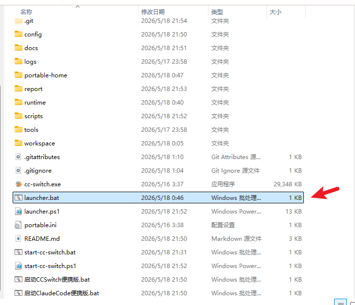
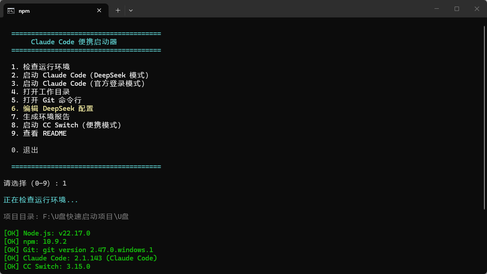
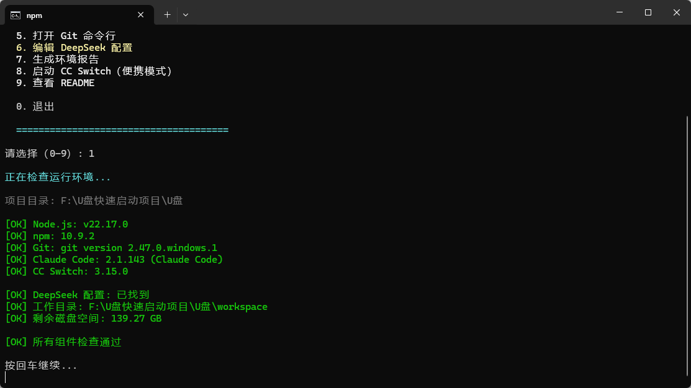
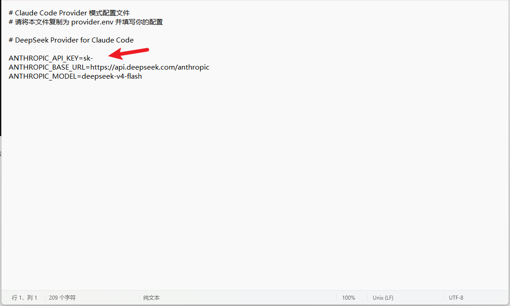
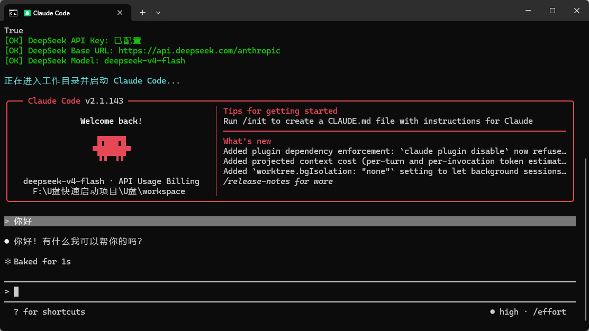

# AI Portable Workspace 使用教程：配置 DeepSeek Key 并完成环境测试

本文档用于指导用户在 Windows 电脑上完成 **AI Portable Workspace** 的基础启动、运行环境检查、DeepSeek Key 配置以及连通性测试。

适合第一次使用的用户，按照步骤操作即可。

---

## 一、准备工作

在开始之前，请先确保你已经下载好了完整的软件压缩包。

下载完成后，不要直接在压缩包里运行文件，必须先解压。

百度网盘地址：

通过网盘分享的文件：claudeCodeU.zip
链接: https://pan.baidu.com/s/1-VsIqeHlgZIs_fjF8BHulw?pwd=c2y3 提取码: c2y3 
--来自百度网盘超级会员v9的分享

---

## 二、解压软件目录

### 1. 找一个合适的目录

建议将软件解压到一个简单、好找、路径不要太复杂的位置，例如：

```text
D:\AI-Workspace
D:\Tools\AI-Portable-Workspace
E:\AI工具箱
```

不建议解压到以下位置：

```text
C:\Program Files
C:\Windows
桌面临时目录
微信/QQ下载缓存目录
```

原因是这些目录可能会遇到权限问题，导致脚本无法正常写入配置文件。

---

### 2. 解压压缩包

右键下载好的压缩包，选择：

```text
解压到当前文件夹
```

或者：

```text
解压到 AI-Portable-Workspace
```

解压完成后，你应该能看到类似下面的文件结构：

```text
AI-Portable-Workspace
├─ launcher.bat
├─ launcher.ps1
├─ config
├─ workspace
├─ README.md
└─ 其他文件
```

重点关注这个文件：

```text
launcher.bat
```

后续所有操作都从它开始。

---

## 三、启动工具

进入解压后的目录，找到：

```text
launcher.bat
```

然后双击运行。



双击后，会打开一个命令行窗口，显示主菜单。

你会看到类似下面的界面：

```text

  ======================================
       Claude Code 便携启动器
  ======================================

  1. 检查运行环境
  2. 启动 Claude Code（DeepSeek 模式）
  3. 启动 Claude Code（官方登录模式）
  4. 打开工作目录
  5. 打开 Git 命令行
  6. 编辑 DeepSeek 配置
  7. 生成环境报告
  8. 启动 CC Switch（便携模式）
  9. 查看 README

  10. 退出

  ======================================

请选择（0-9）:

```

这个菜单就是整个工具的控制台入口。

---

## 四、第一步：检查运行环境

在主菜单中输入：

```text
1
```

然后按回车。

这个选项的作用是检查当前电脑是否具备运行环境，例如：

- Node.js 是否安装
    
- npm 是否可用
    
- Claude Code 是否安装
    
- Git 是否可用
    
- 配置目录是否存在
    
- 工作目录是否正常
    
- 必要文件是否完整
    

---

## 五、确认检查结果

执行完成后，请重点看检查结果是否都是绿色。

正常情况下，你应该看到类似这样的状态：

```text

正在检查运行环境...

项目目录: F:\U盘快速启动项目\U盘

[OK] Node.js: v22.17.0
[OK] npm: 10.9.2
[OK] Git: git version 2.47.0.windows.1
[OK] Claude Code: 2.1.143 (Claude Code)
[OK] CC Switch: 3.15.0

[OK] DeepSeek 配置: 已找到
[OK] 工作目录: F:\U盘快速启动项目\U盘\workspace
[OK] 剩余磁盘空间: 139.27 GB

[OK] 所有组件检查通过
```

只要全部是绿色，说明当前电脑环境基本正常。

如果全部检查通过，直接按：

```text
回车
```

返回主菜单。

---

## 六、第二步：编辑 DeepSeek 配置

回到主菜单后，输入：

```text
6
```

然后按回车。

该选项用于打开 DeepSeek 配置文件。

正常情况下，会自动弹出一个 txt 文本编辑器。

---

## 七、填写 DeepSeek API Key

打开配置文件后，找到类似下面这一行：

```text
DEEPSEEK_API_KEY=sk-xxxxxx
```

或者类似：

```text
DEEPSEEK_API_KEY=sk-
```

你需要把自己的 DeepSeek Key 填写到等号后面。

---

### 正确填写方式

假设你的 DeepSeek Key 是：

```text
sk-1234567890abcdef
```

那么应该填写成：

```text
DEEPSEEK_API_KEY=sk-1234567890abcdef
```

注意：`=` 前面的内容不要改，只改 `=` 后面的内容。

---

## 八、重要注意事项

这里非常关键，很多人配置失败都是因为这一步写错了。

### 1. Key 必须写在等号后面

正确：

```text
DEEPSEEK_API_KEY=sk-你的真实key
```

错误：

```text
DEEPSEEK_API_KEY = sk-你的真实key
```

错误原因：中间多了空格，可能导致程序读取失败。

---

### 2. 样例里的 `sk-` 只是占位标志

如果配置文件原来是这样的：

```text
DEEPSEEK_API_KEY=sk-
```

而你的真实 Key 本身也是以 `sk-` 开头，那么要注意不要重复。

错误示例：

```text
DEEPSEEK_API_KEY=sk-sk-1234567890abcdef
```

正确示例：

```text
DEEPSEEK_API_KEY=sk-1234567890abcdef
```

也就是说：

> 样例里的 `sk-` 只是提醒你这里要填 Key，不一定要保留。  
> 如果你的 Key 已经包含 `sk-`，就直接完整粘贴你的 Key。

---

### 3. 不要加引号

错误：

```text
DEEPSEEK_API_KEY="sk-1234567890abcdef"
```

正确：

```text
DEEPSEEK_API_KEY=sk-1234567890abcdef
```

---

### 4. 不要写中文冒号

错误：

```text
DEEPSEEK_API_KEY：sk-1234567890abcdef
```

正确：

```text
DEEPSEEK_API_KEY=sk-1234567890abcdef
```

中间必须是英文等号：

```text
=
```

---

### 5. 不要在 Key 后面加空格

错误：

```text
DEEPSEEK_API_KEY=sk-1234567890abcdef 
```

正确：

```text
DEEPSEEK_API_KEY=sk-1234567890abcdef
```

Key 后面不要多空格，不要多符号。

---

## 九、保存配置文件

Key 填写完成后，按：

```text
Ctrl + S
```

保存文件。

然后关闭 txt 编辑器。

关闭后，回到命令行窗口，按回车返回主菜单。

---

## 十、第三步：测试 DeepSeek 是否配置成功

回到主菜单后，输入：

```text
2
```

然后按回车。

该选项会使用刚才配置好的 DeepSeek Key 启动 Provider 模式，并测试是否可以正常调用模型。



---

## 十一、正常启动效果

如果配置正确，你会看到工具开始启动，并进入 Claude Code / Provider 模式。

正常表现通常包括：

```text
Starting Claude Code (Provider mode)...
```

随后可能会出现模型初始化、连接模型、进入交互界面等信息。

如果没有出现 Key 错误、401 错误、配置文件不存在等提示，说明 DeepSeek 配置基本成功。

---

# 十二、完整操作流程总结

整个流程可以简单记成下面几步：

```text
1. 下载压缩包
2. 找一个目录解压
3. 双击 launcher.bat
4. 输入 1，检查环境
5. 全部绿色后回车返回
6. 输入 6，编辑 DeepSeek 配置
7. 在等号后面填写自己的 DeepSeek Key
8. 保存并关闭文本编辑器
9. 回到菜单输入 2
10. 测试是否可以正常启动
```

---

# 十三、常见错误与解决方法

## 1. 双击 launcher.bat 没反应

可能原因：

- 文件还在压缩包里，没有真正解压
    
- 被杀毒软件拦截
    
- 当前目录权限不足
    
- Windows 脚本执行异常
    

解决方法：

1. 确认已经完整解压
    
2. 把目录移动到 `D:\AI-Workspace`
    
3. 右键 `launcher.bat`
    
4. 选择"以管理员身份运行"
    

---

## 2. 检查环境不是全部绿色

如果输入 `1` 后，有红色错误，说明某些依赖没有安装好。

常见问题包括：

```text
Node.js not found
npm not found
Git not found
Claude Code not found
```

处理方式：

- 缺 Node.js：先安装 Node.js
    
- 缺 Git：先安装 Git
    
- 缺 Claude Code：先安装 Claude Code
    
- 配置目录不存在：重新解压完整包，或者重新初始化
    

---

## 3. DeepSeek Key 填了还是报错

重点检查下面几项：

### 检查一：是否填错位置

必须填在等号后面：

```text
DEEPSEEK_API_KEY=你的key
```

---

### 检查二：是否重复了 `sk-`

错误：

```text
DEEPSEEK_API_KEY=sk-sk-xxxx
```

正确：

```text
DEEPSEEK_API_KEY=sk-xxxx
```

---

### 检查三：是否多了空格

错误：

```text
DEEPSEEK_API_KEY = sk-xxxx
```

正确：

```text
DEEPSEEK_API_KEY=sk-xxxx
```

---

### 检查四：是否没有保存

修改完配置后一定要保存：

```text
Ctrl + S
```

只关闭窗口不一定代表已经保存成功。

---

### 检查五：Key 是否可用

如果出现类似：

```text
401 Unauthorized
invalid api key
authentication failed
```

通常说明：

- Key 填错了
    
- Key 已失效
    
- Key 没有权限
    
- DeepSeek 账户余额不足
    
- 当前使用的模型不支持该 Key
    

---

## 4. 输入 2 后提示 Provider config not found

如果看到类似：

```text
[WARN] Provider config not found!
Please create config\provider.env with your API key
```

说明程序没有找到配置文件。

可以检查：

```text
config\provider.env
```

这个文件是否存在。

如果不存在，说明配置文件没有创建成功，需要重新执行：

```text
6
```

重新编辑 DeepSeek 配置。

---

## 5. 输入 2 后提示 unknown option

如果出现：

```text
error: unknown option '--provider'
```

说明当前 Claude Code 版本可能不支持该启动参数，或者 launcher 脚本里的启动命令和当前版本不兼容。

这种情况不是 Key 的问题，而是启动脚本或 Claude Code 版本的问题。

需要检查：

- Claude Code 版本
    
- launcher.ps1 中的启动命令
    
- 当前工具包是否适配你安装的 Claude Code 版本
    

---

# 十四、推荐新手检查清单

在开始测试之前，可以按下面清单逐项确认：

```text
[ ] 已经解压，不是在压缩包里运行
[ ] 目录路径不包含特殊符号
[ ] 已经双击 launcher.bat
[ ] 输入 1 后环境检查全部绿色
[ ] 输入 6 后成功打开配置文件
[ ] DeepSeek Key 写在等号后面
[ ] 没有重复 sk-
[ ] 没有多余空格
[ ] 没有加引号
[ ] 修改后已经 Ctrl + S 保存
[ ] 回到主菜单输入 2 测试
```

---
