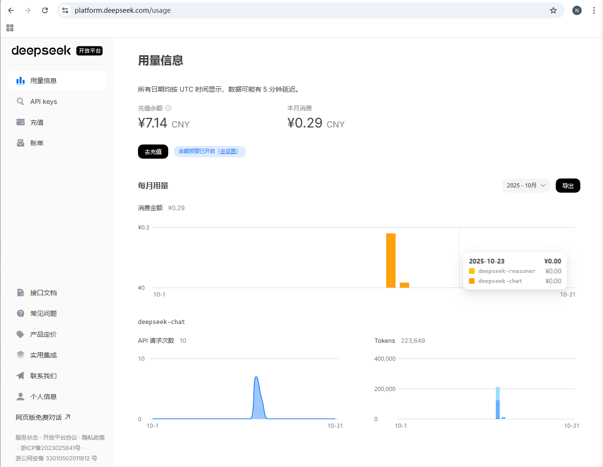
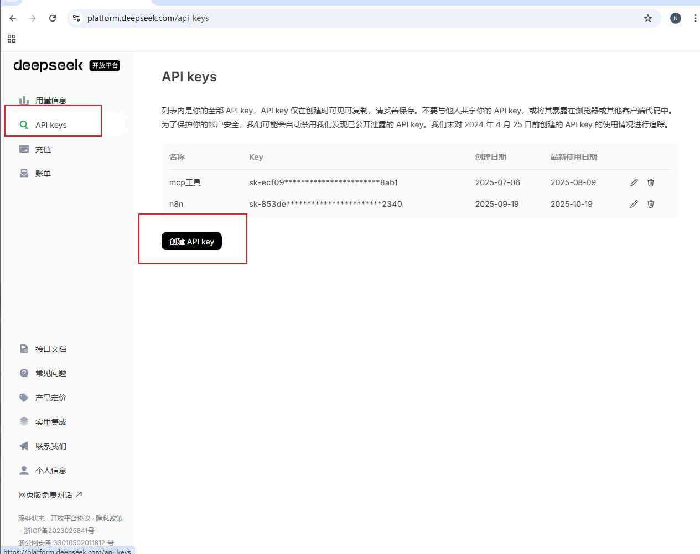
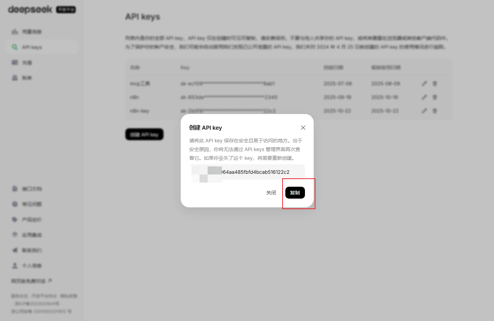

### 准备工作：获取 DeepSeek API 密钥 

这是**唯一需要“外部软件”**（即 DeepSeek 官网）的一步，你必须获取 API 密钥，n8n 才能获得“许可”去调用它。

1. 打开浏览器，访问 DeepSeek 开放平台：
    
    https://platform.deepseek.com/
    
    
1. 注册并登录你的账户。
    
2. 点击左侧菜单的 **"API 密钥"**。
    
3. 点击 **“创建新密钥”**，给它起个名字（比如 `n8n-key`）。

    
4. **立即复制生成的 API 密钥**（`sk-...`开头的一长串字符）并保存好，**这个密钥只会显示一次**。

    

