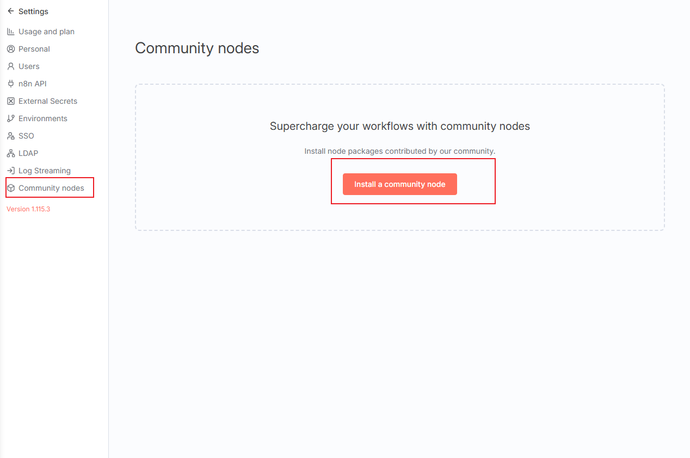
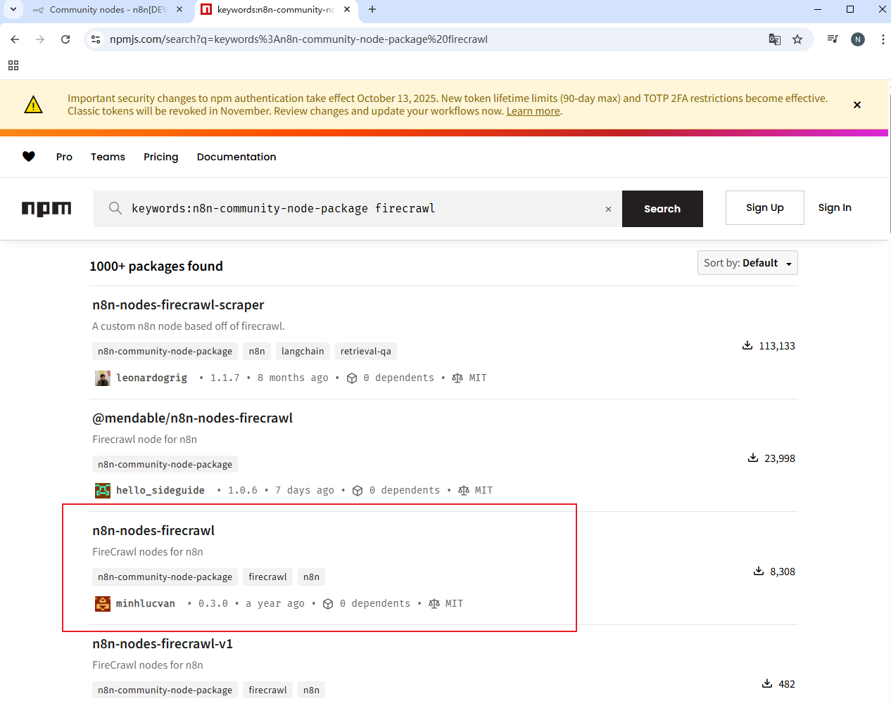
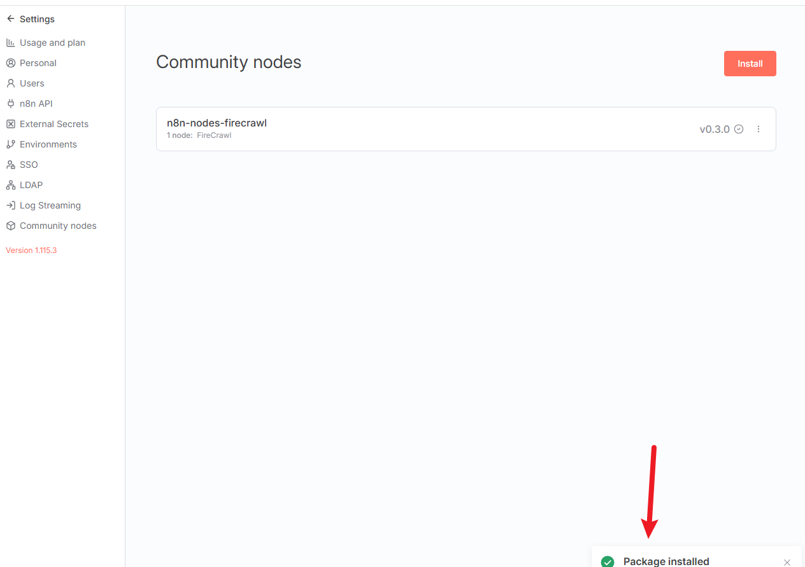
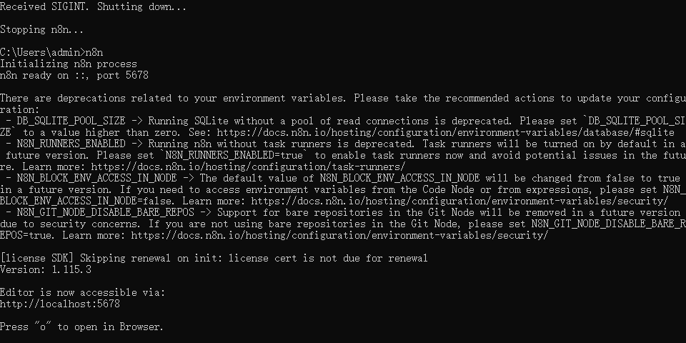
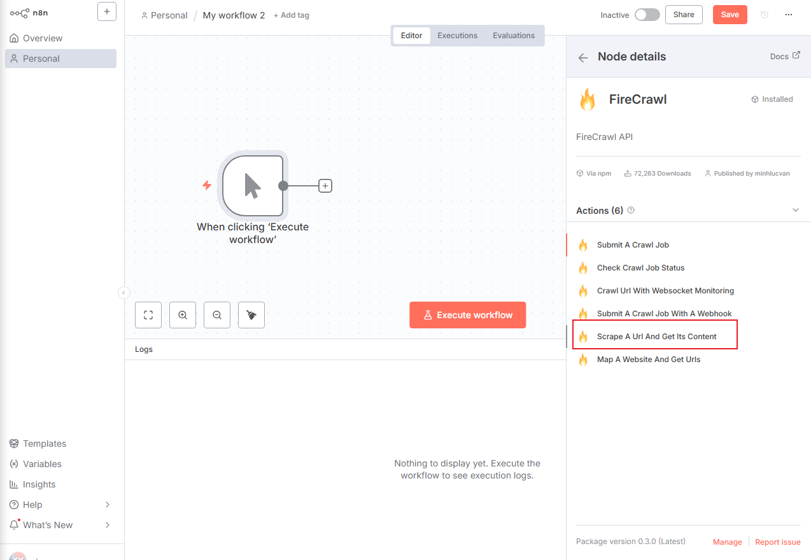

## 教程：在 n8n 中安装和配置 Firecrawl 社区节点

### 引言

本文面向希望在 n8n 中集成网页抓取能力的用户，介绍如何安装与配置 Firecrawl 社区节点，并在工作流中安全、稳定地使用它完成页面内容抓取。适用场景包括：从新闻源抓取全文、从产品网站提取规格信息、为后续 AI 总结/分类提供干净的文本输入等。

目标与收获：
- 完成 Firecrawl 社区节点的安装与启用；
- 正确配置凭证与基础参数；
- 了解常见问题与解决方案；
- 掌握若干最佳实践与使用技巧。

### 背景知识

- 社区节点（Community nodes）：n8n 允许通过第三方包扩展功能，这些包非官方维护，需在 "Settings → Community nodes" 中手动安装和启用。
- Firecrawl：一个专注于“净化网页正文”的抓取服务，可将复杂网页提取为易处理的 Markdown/纯文本，减少广告、导航、脚本等噪音。
- 包命名差异：常见有 `n8n-nodes-firecrawl` 与 `@mendable/n8n-nodes-firecrawl` 两个变体，参数与能力高度重合，本文以截图中的 `n8n-nodes-firecrawl` 为例说明。
- 安全提示：社区节点来自第三方，请在受信网络与受控环境中使用，并了解数据合规与隐私影响。

## 配置步骤

### 步骤 1：进入 n8n 设置

第一步是进入 n8n 的管理设置区域，以便添加新的社区节点。

1. 打开您的 n8n 实例，您会看到主 “Workflows” 仪表板。
2. 在界面左下角的导航菜单中，找到并点击 **Settings**（设置）。

### 步骤 2：打开 Community nodes 菜单

在设置区域中，找到用于管理第三方节点的菜单项。

1. 进入 **Settings**，查看左侧菜单。
2. 点击 **Community nodes**（社区节点）。
3. 打开 "Community nodes" 管理页面后，点击红色 **Install a community node**（安装一个社区节点）按钮开始安装。

### 步骤 3：选择并确认节点包名称

在安装之前，需要确认要安装的 Firecrawl 节点的准确包名称。可以在 npm 网站上搜索：

1. 打开 npm 网站进行搜索。
2. 使用关键词：`keywords:n8n-community-node-package firecrawl`。
3. 搜索结果可能包含 `@mendable/n8n-nodes-firecrawl` 与 `n8n-nodes-firecrawl` 两个包。
4. 结合截图与本文流程，选择 **`n8n-nodes-firecrawl`**。

### 步骤 4：安装并重启服务

确定包名称后，返回 n8n 的 Community nodes 界面完成安装：

1. 在安装界面输入 `n8n-nodes-firecrawl` 并开始安装。
2. 安装成功后，界面显示 **Package installed**（包已安装）。

3. 后台日志会显示确认信息，如 **Community package installed: n8n-nodes-firecrawl**。
4. **重要**：安装社区节点后需重启 n8n 服务，日志会显示关闭与重启过程。
5. 重启完成后，编辑器恢复可用（如 `http://localhost:5678`）。

### 步骤 5：在工作流中使用 Firecrawl 节点

服务重启并加载新节点后，即可在工作流中使用：

1. 返回 n8n 编辑器，创建或打开一个工作流。
2. 在画布中添加 **Firecrawl** 节点（UI 可能显示为 "FireCrawl"）。
3. 打开右侧 **Node details**（节点详情）面板查看配置。
4. 状态应为 "Installed"（已安装）。
5. 在 **Actions**（操作）列表中选择核心功能 **Scrape A Url And Get Its Content**（抓取网址并获取内容）。

## 配置参数说明

以下以 `n8n-nodes-firecrawl` 为例说明常用字段（不同包版本字段命名可能略有差异）：

- Credentials（凭证）
  - 类型：Firecrawl API Key。
  - 作用：用于鉴权与计费，必须设置。

- Operation（操作）
  - 典型值：`scrape` 或 "Scrape A Url And Get Its Content"。
  - 说明：输入一个网页 URL，节点抓取并输出清洗后的正文。

- URL（输入地址）
  - 静态示例：`https://example.com/article`。
  - 动态示例：使用上游节点的字段作为输入：
    - <code v-pre>=&#123;&#123; $json.link &#125;&#125;</code>
  - 提示：若上游数据可能缺失 `link`，建议通过 Set 节点统一并兜底（见下文示例）。

- 输出字段（Output）
  - 常见：抓取结果以纯文本或 Markdown 字符串形式返回，通常位于 `data` 字段。
  - 下游：可接 **Markdown** 节点或 **AI** 节点做进一步处理与排版。

## 示例代码片段

- 在 Set 节点统一并兜底链接字段（避免 `TypeError: reading 'link'`）：
  - 新增字段 `link` 的表达式：
    - <code v-pre>=&#123;&#123; $json.link || $json.guid || $json.url || ($json.id ? ('https://news.ycombinator.com/item?id=' + $json.id) : '') &#125;&#125;</code>
  - 作用：保证 Firecrawl 的 URL 输入始终有值。

- 在 Firecrawl 节点的 URL 字段引用上游 `link`：
  - <code v-pre>=&#123;&#123; $json.link &#125;&#125;</code>

- 将多个抓取结果聚合并转为 HTML（用于邮件/页面展示）：
  - Aggregate 节点合并 `output` 字段为数组；
  - Markdown 节点将数组转为 HTML：
    - 输入表达式：<code v-pre>=&#123;&#123; $json.output.join("\n\n") &#125;&#125;</code>
    - 输出字段通常为 `data`，可直接作为邮件 HTML 内容。

## 注意事项（常见问题与解决方案）

- 安装后节点未出现
  - 检查 **Settings → Community nodes** 是否启用；
  - 重启 n8n 服务后再刷新编辑器；
  - 确认安装日志中无错误信息。

- 包名称差异
  - 若 UI/文档出现 "FireCrawl" 与 "Firecrawl" 混用，属命名差异，不影响功能；
  - `n8n-nodes-firecrawl` 与 `@mendable/n8n-nodes-firecrawl` 均可使用，按你的环境选择即可。

- 上游数据为空导致表达式报错
  - 在 Firecrawl 的 URL 字段使用 <code v-pre>=&#123;&#123; $json.link &#125;&#125;</code> 前，先在 Set 节点统一 `link` 并兜底（见上文示例）。

- 网络与代理
  - 公司/本地代理可能影响安装或访问，优先在可直连环境完成安装；
  - 如需代理，确保代理程序运行且配置正确。

- 安全与合规
  - 社区节点来自第三方，注意数据出境与隐私；
  - 在受控环境与可信来源下使用，定期更新并审计。

## 最佳实践（配置与使用技巧）

- 成本控制与性能
  - 在 Firecrawl 前添加 **Limit** 节点限制抓取数量；
  - 使用并发控制与合理的超时/重试策略，避免高并发导致不稳定。

- 数据质量与鲁棒性
  - 统一上游数据结构（如统一 `link` 字段），避免表达式报错；
  - 使用 **IF** 节点过滤无效条目或抓取失败项。

- 下游处理与呈现
  - 将 Firecrawl 输出（`data`）交给 AI 节点做中文总结；
  - 使用 **Markdown → HTML** 转换，得到精致排版的邮件/页面。

- 可维护性
  - 将 API Key 配置在 Credentials 中，避免硬编码；
  - 为关键节点添加注释与命名一致的字段，便于团队协作。

### 术语一致性

- 文档统一使用 “Firecrawl” 指代该服务；如界面出现 "FireCrawl"，以实际 UI 为准但不影响理解。
- 文中表达式均以 `<code v-pre>` 包裹并做实体转义，避免文档渲染时被 Vue 解析。

### 结语

至此，你已完成在 n8n 中安装与配置 Firecrawl 社区节点的全流程，并掌握常见问题与最佳实践。接下来可以将其接入 RSS 工作流、AI 总结或邮件发送环节，构建完整的信息抓取与分发系统。