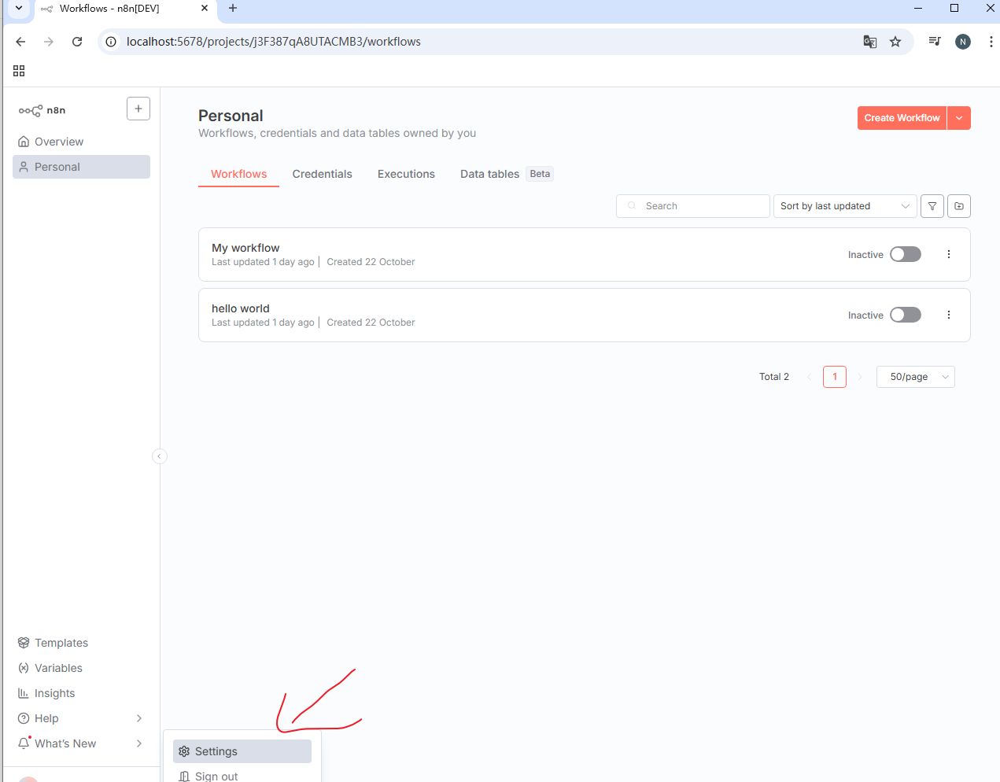
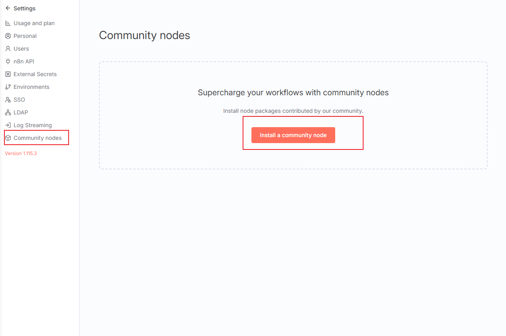
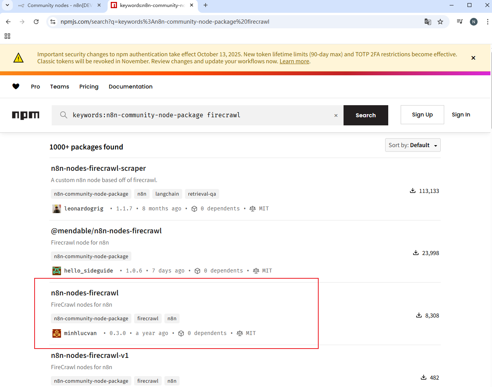
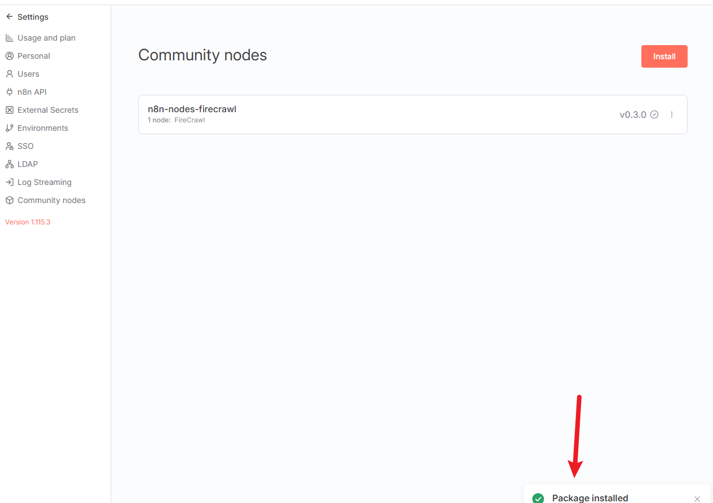
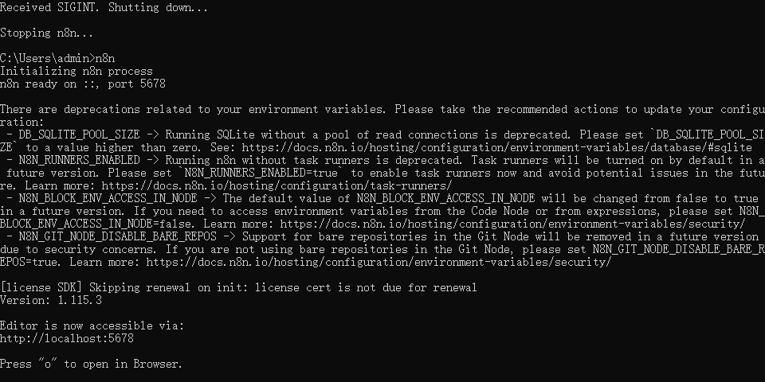
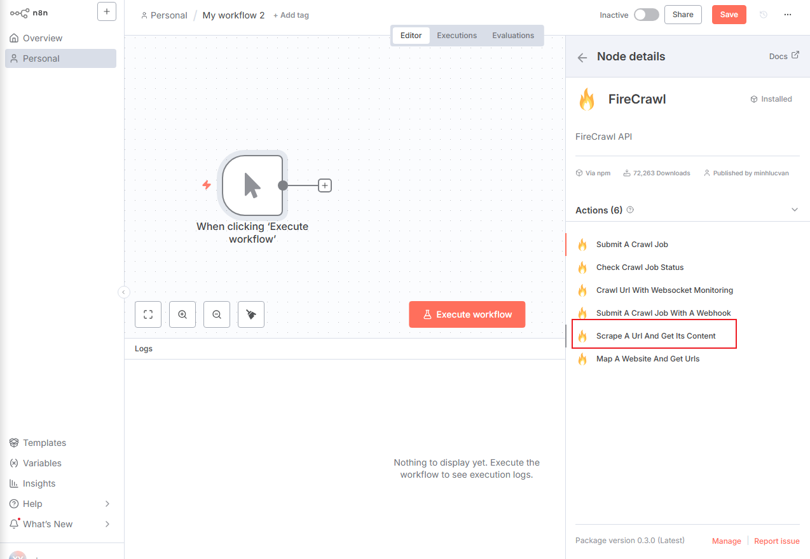

## 教程：在 n8n 中安装和配置 Firecrawl 社区节点

### 第一部分：导航至 n8n 设置

第一步是进入 n8n 的管理设置区域，以便添加新的社区节点。

1. 打开您的 n8n 实例，您会看到主“Workflows”仪表板 。
    
2. 在界面左下角的导航菜单中，找到并点击 **"Settings"**（设置）。
    

### 第二部分：访问社区节点菜单

在设置区域中，您需要找到用于管理第三方节点的特定部分。

1. 进入 "Settings"（设置），查看左侧的菜单。
    
2. 找到并点击 **"Community nodes"**（社区节点）。
    
3. 这将打开 "Community nodes" 管理页面 5。在此页面，点击红色的 **"Install a community node"**（安装一个社区节点）按钮，以开始安装新节点 。
    

### 第三部分：查找并确定节点包名称

在安装之前，您需要知道要安装的 Firecrawl 节点的准确包名称。PDF 中的截图展示了在 npm.js 上进行搜索的过程。

1. 为了找到正确的包，可以在 npm 网站上进行搜索 。
    
2. 搜索时可以使用特定的关键词，例如：`keywords:n8n-community-node-package firecrawl` 。
    
3. 搜索结果会列出多个包，例如 `@mendable/n8n-nodes-firecrawl` 和 `n8n-nodes-firecrawl` 。
    
4. 根据后续的安装截图，本教程选择安装的包名称是 **`n8n-nodes-firecrawl`** 。
    

### 第四部分：安装节点并重启服务

确定包名称后，返回 n8n 界面进行安装。

1. 在 n8n 的 "Community nodes" 安装界面，输入您选择的包名称 `n8n-nodes-firecrawl`  并开始安装。
    
2. 安装成功后，界面上会显示 **"Package installed"**（包已安装）的状态 。

    
3. 同时，n8n 的服务器后台日志（或终端）会显示确认信息，例如 **"Community package installed: n8n-nodes-firecrawl"** 。
    
4. **重要提示**：安装新的社区节点后，n8n 服务必须重启才能加载新节点。日志会显示关闭和重启的过程 。
    
5. 服务重启完成后，日志会显示 n8n 编辑器再次可用，例如在 `http://localhost:5678` 。
    

### 第五部分：在工作流中使用 FireCrawl 节点

服务重启并加载新节点后，您就可以在工作流中使用它了。

1. 返回 n8n 编辑器，创建一个新工作流或打开一个现有的工作流。
    
2. 您现在可以将 **"FireCrawl"** 节点添加到画布中 。
    
3. 点击新添加的 FireCrawl 节点，右侧会打开 **"Node details"**（节点详情）面板 。
    
4. 您可以看到该节点的状态为 "Installed"（已安装） 。
    
5. 在 "Actions"（操作）列表中 ，您可以看到该节点提供的所有功能。对于抓取网页内容的核心功能，请选择 **"Scrape A Url And Get Its Content"**（抓取一个网址并获取其内容） 。
    

