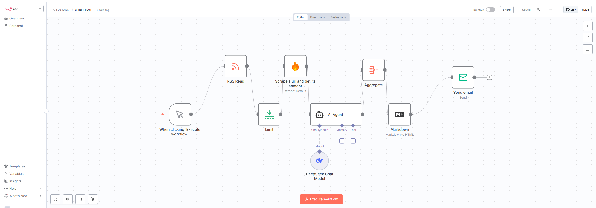
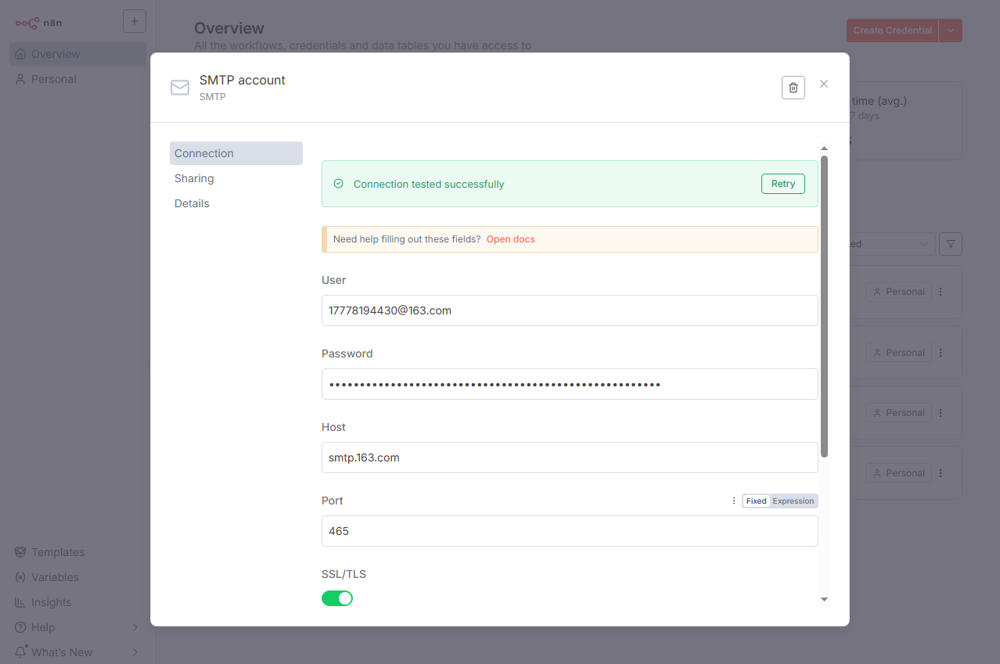
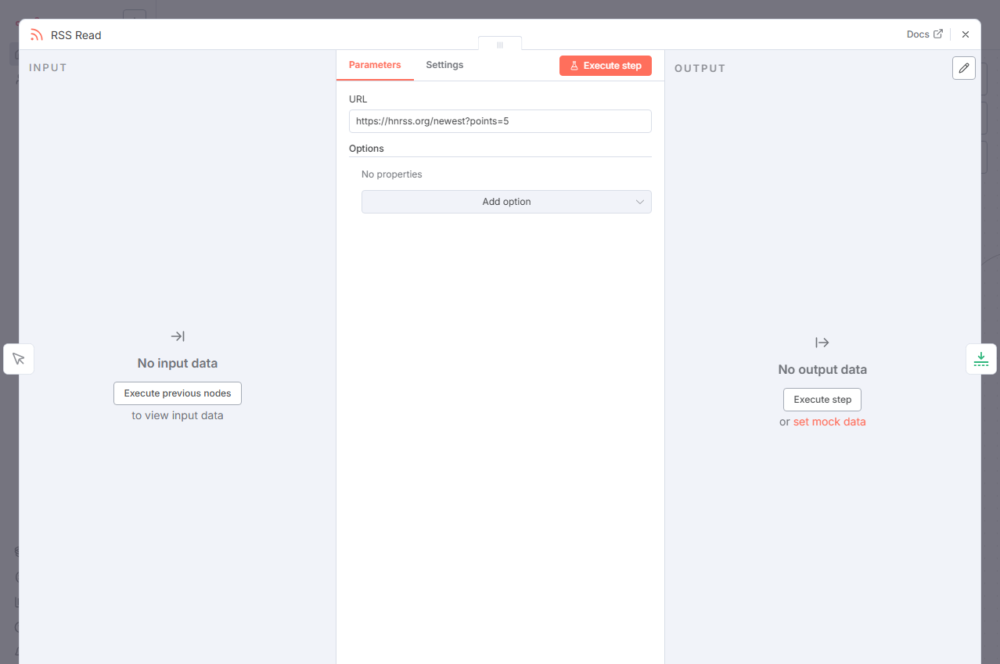
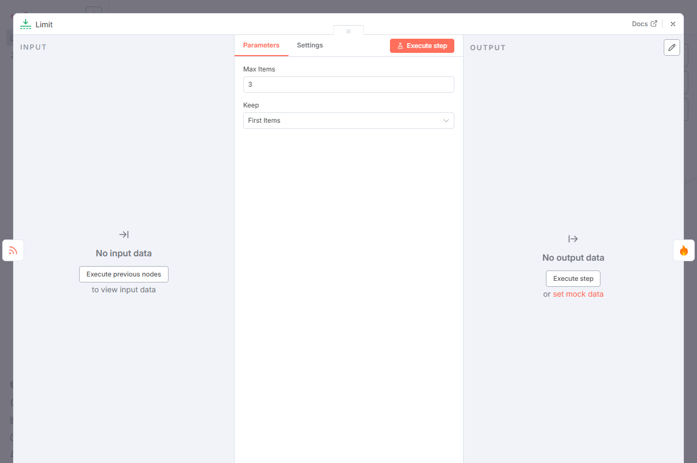
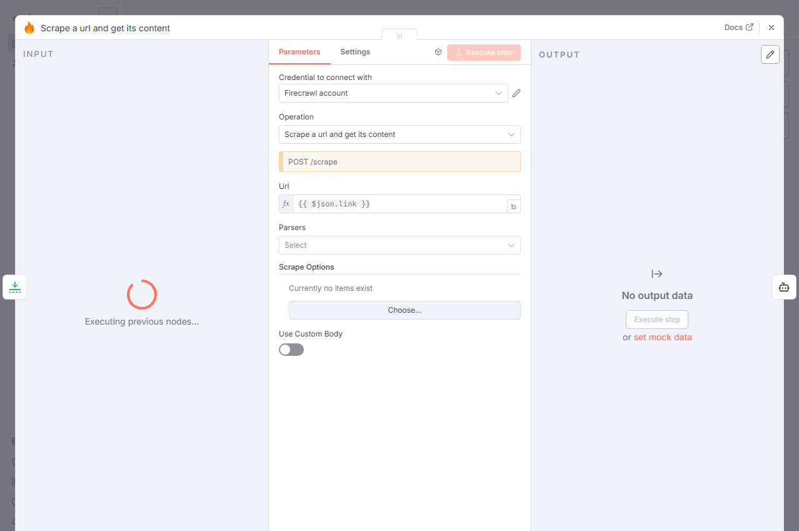
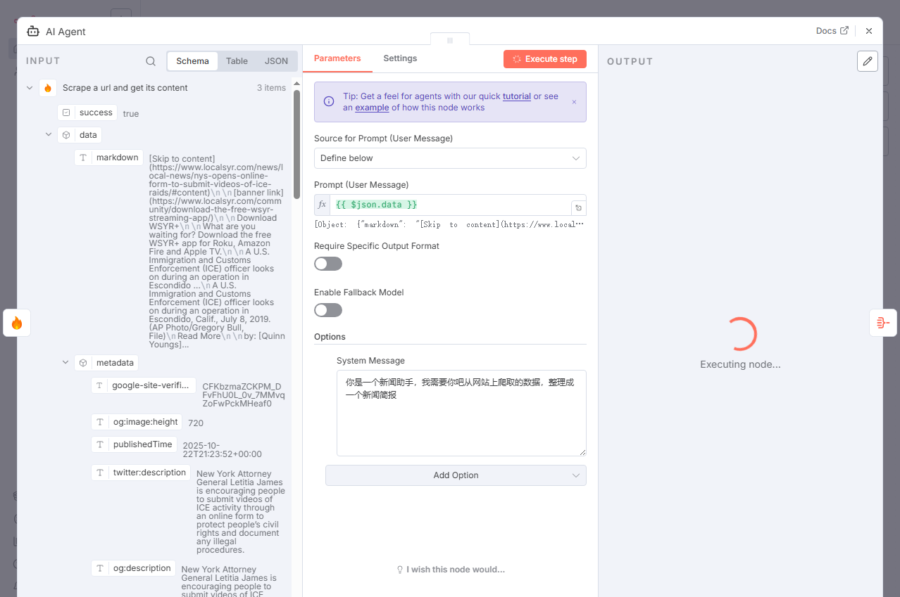
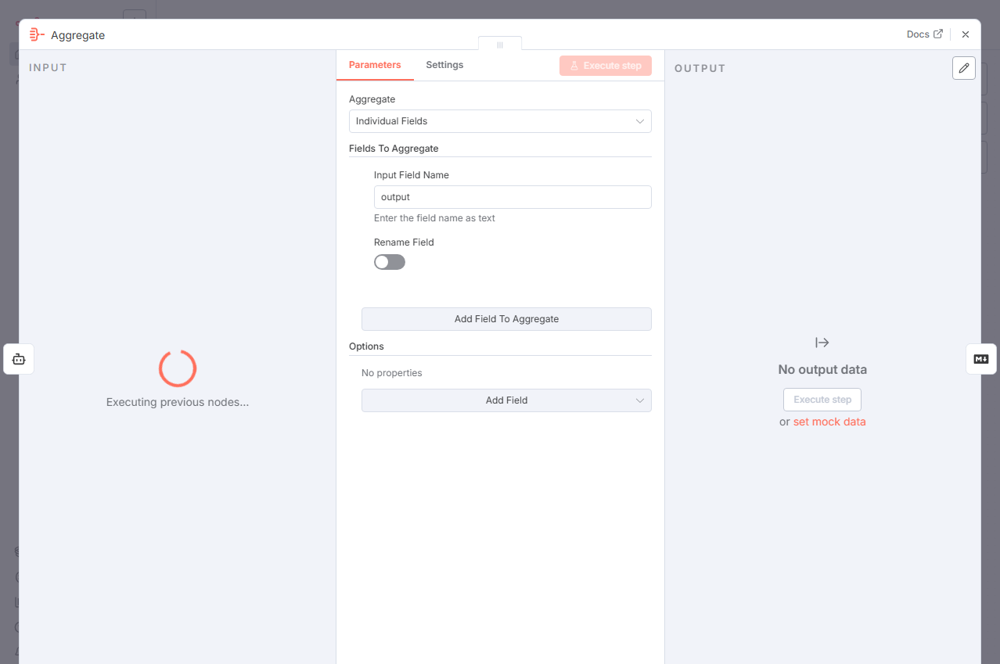
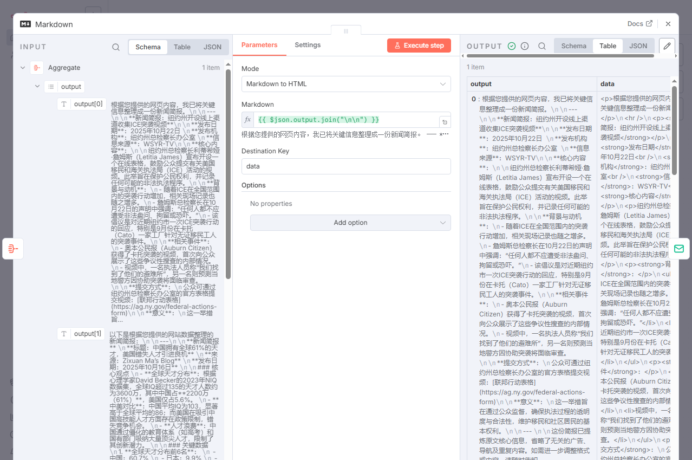
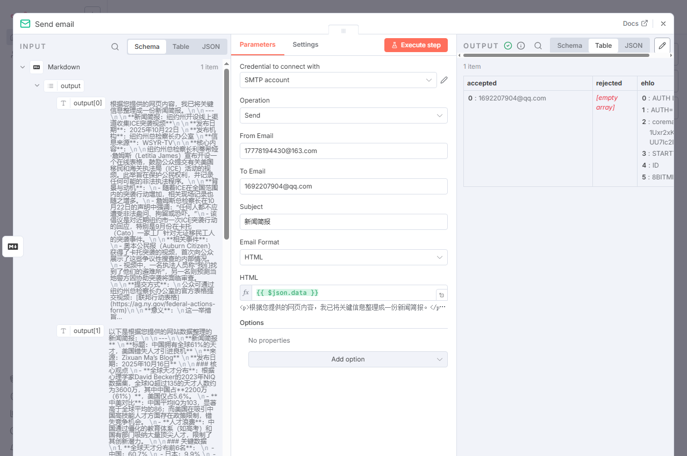

# n8n 深度教程：从零构建 AI 驱动的 Hacker News 新闻简报（Firecrawl + DeepSeek 详解）

## 概述

在这个信息过载的时代，Hacker News (HN) 是获取前沿科技资讯的重要来源，但其信息流通常是未经处理且海量的。我们面临的挑战包括：时间限制导致无法阅读所有文章、标题党导致难以判断文章价值，以及缺乏快速获取文章核心论点的途径。

本教程将指导您使用 n8n 自动化平台，从零开始构建一个智能工作流。这个系统将自动浏览 Hacker News，筛选有价值的文章，抓取全文，使用 AI 进行中文总结，并最终生成一份精炼的新闻简报发送到您的电子邮箱。

最终效果


### 技术栈（组件）

- **n8n**：作为工作流的中央调度平台，负责编排和连接所有服务。
    
- **Hacker News RSS**：作为数据源，提供最新的文章列表。
    
- **Firecrawl**：作为网页抓取服务，访问文章网址并提取干净、无广告的正文内容。
    
- **DeepSeek AI**：作为大语言模型（LLM），负责将原始文章内容总结为易读的中文简报。
    
- **SMTP 服务**：作为邮件发送通道，负责将最终的新闻简报发送给用户。
    


---

## 第一部分：准备工作（凭证配置）

在开始构建工作流之前，必须先配置所有必需的服务凭证。

### 1. n8n 实例

确保您拥有一个正在运行的 n8n 实例（云版本或自托管均可）。


**A. Firecrawl API 凭证**

- **目的**：Firecrawl 用于解决网页抓取的难题：从包含广告、导航栏和脚本的复杂网页中精准提取核心正文。
    
- **操作**：
    
    1. 前往 `Firecrawl.dev` 注册账户。
        
    2. 在 Firecrawl 账户后台找到并复制您的 **API Key**。
        
- **在 n8n 中配置**：
    
    1. 在 n8n 左侧菜单点击 **Credentials** -> **Add Credential**。
        
    2. 搜索并选择 **Firecrawl API**。
        
    3. **Credential Name**: 任意填写（例如：`My Firecrawl Key`）。
        
    4. **API Key**: 粘贴您复制的 Key。
        
    5. 点击 **Save**。
        

**B. DeepSeek API 凭证**

- **目的**：我们需要一个强大的 LLM 来阅读英文文章并生成高质量的中文总结。DeepSeek 在此方面表现优异且性价比高。
    
- **操作**：
    
    1. 前往 DeepSeek 开放平台 (`platform.deepseek.com`) 注册账户。
        
    2. 在 DeepSeek 后台创建并复制一个 **API Key**。
        
- **在 n8n 中配置**：
    
    1. 在 **Credentials** 页面，点击 **Add Credential**。
        
    2. 搜索并选择 **DeepSeek API**。
        
    3. **Credential Name**: `My DeepSeek Key`。
        
    4. **API Key**: 粘贴您的 Key。
        
    5. 点击 **Save**。
        

**C. SMTP 凭证**

- **目的**：这是工作流发送邮件的出口。本例使用 163 (网易) 邮箱。
    
- **操作**：您需要获取以下 4 项信息：
    
    1. **SMTP 服务器**: `smtp.163.com`
        
    2. **SMTP 端口**: `465` (或 `994`，使用 SSL)
        
    3. **邮箱账号**: `17778194430@163.com`
        
    4. **SMTP 授权码**: **注意：这不是您的邮箱登录密码！** 您需要登录 163 邮箱，在“设置” -> “POP3/SMTP/IMAP”中开启服务并获取一个专用的“授权码”。
        
- **在 n8n 中配置**：
    
    1. 在 **Credentials** 页面，点击 **Add Credential**。
        
    2. 搜索并选择 **SMTP**。
        
    3. **Credential Name**: `My 163 SMTP`。
        
    4. **Host**: `smtp.163.com`
        
    5. **Port**: `465`
        
    6. **User**: `17778194430@163.com`
        
    7. **Password**: 粘贴您的“授权码”。
        
    8. **SSL/TLS**: 开启 (因为使用的是 465 端口)。
        
    9. 点击 **Save**。
        

凭证配置完毕，现在可以开始搭建工作流。

---

## 第二部分：逐个节点，构建自动化流程

我们将按照工作流的定义，从左到右逐步解析每个节点。

### 节点 1：When clicking ‘Execute workflow’ (手动触发)

- **节点类型**: `n8n-nodes-base.manualTrigger`
    
- **作用**：作为工作流的启动按钮。在开发和测试阶段，用于手动运行整个流程。
    
- **配置**：无需配置，保持默认。
    
- **数据流**：
    
    - **[输入]**：无。
        
    - **[输出]**：一个空的 JSON 对象 `[{}]`，作为“开始”信号传递给下一个节点。
        

### 节点 2：RSS Read (获取文章列表)

- **节点类型**: `n8n-nodes-base.rssFeedRead`
    
- **作用**：从 Hacker News 的 RSS 源抓取最新的文章列表。
    
- **配置**：
    
    - **URL**: `https://hnrss.org/newest?points=5`
        
- **配置深度解析**：
    
    - `hnrss.org` 是一个将 HN 页面转换为 RSS 格式的第三方服务。
        
    - `newest` 表示获取最新的文章。
        
    - `?points=5` 是一个关键的预过滤器，仅获取“至少有 5 个点赞”的文章，这有助于筛除低质量或无人问津的内容。
        
- **数据流**：
    
    - **[输入]**：来自上一步的 `[{}]` 信号。
        
    - **[输出]**：一个包含多项（通常 20-30 项）文章的数组。每个项目（Item）的数据结构如下：
        
        JSON
        
        ```
        [
          { "title": "...", "link": "https://...", "pubDate": "...", "content": "..." },
          { "title": "...", "link": "https://...", "pubDate": "...", "content": "..." },
          ...
        ]
        ```
        

### 节点 3：Limit (限制数量)

- **节点类型**: `n8n-nodes-base.limit`
    
- **作用**：进行成本控制与效率优化。上一步输出了 20-30 篇文章，全部处理将导致爬虫和 AI 调用耗时且昂贵。此节点用于只保留最相关的几篇。
    
- **配置**：
    
    - **Max Items**: `3`
        
- **配置深度解析**：
    
    - 此设置意味着 n8n 将只保留从 RSS Read 节点传入数组中的前 3 个项目。
        
- **数据流**：
    
    - **[输入]**：一个 20-30 项的数组。
        
    - **[输出]**：一个只包含 3 项的数组，数据结构不变。
        
        JSON
        
        ```
        [
          { "title": "Article A", "link": "link_A", ... },
          { "title": "Article B", "link": "link_B", ... },
          { "title": "Article C", "link": "link_C", ... }
        ]
        ```
        

### 节点 4：Scrape a url and get its content (内容抓取)

- **节点类型**: `@mendable/n8n-nodes-firecrawl.firecrawl`
    
- **作用**：获取每篇文章的完整、干净的正文内容。此节点将展示 n8n 的自动循环（Looping）特性。
    
- **配置**：
    
    - **Credentials**: 选择配置好的 `My Firecrawl Key`。
        
    - **Operation**: `scrape` (抓取)。
        
    - **URL**: <code v-pre>=&#123;&#123; $json.link &#125;&#125;</code>
        
- **配置深度解析**：
    
    - **自动循环**：上一个 "Limit" 节点输出了一个包含 3 个项目的数组。当这个数组进入 "Firecrawl" 节点时，n8n 会自动将此节点执行 3 次，每次处理 1 个项目。
        
    - **表达式 <code v-pre>=&#123;&#123; $json.link &#125;&#125;</code>**：`$json` 代表“当前正在被处理的那个项目”。`$json.link` 则提取该项目的 `link` 字段，即文章的 URL。
        
- **数据流**：
    
    - **[输入]**：依次接收 3 个项目。
        
    - **[输出]**：依次输出 3 个新项目。Firecrawl 会将抓取到的干净正文（Markdown 格式）放入一个名为 `data` 的字段中，并保留原始数据。
        
        JSON
        
        ```
        // 第1次输出
        { "title": "Article A", "link": "link_A", "data": "Full content of Article A..." }
        // 第2次输出
        { "title": "Article B", "link": "link_B", "data": "Full content of Article B..." }
        // 第3次输出
        { "title": "Article C", "link": "link_C", "data": "Full content of Article C..." }
        ```
        

### 节点 5 & 6：AI 智能总结 (AI Agent + DeepSeek)

这一步由两个节点协同完成：一个“服务节点”用于定义模型，一个“执行节点”用于处理数据。

**节点 5（服务节点）：DeepSeek Chat Model**

- **节点类型**: `@n8n/n8n-nodes-langchain.lmChatDeepSeek`
    
- **作用**：此节点在画布上定义了“要使用哪个 AI 大脑”。它不直接参与主数据流，而是为 "AI Agent" 节点提供能力。
    
- **配置**：
    
    - **Credentials**: 选择配置好的 `My DeepSeek Key`。
        
- **放置**：将其放在画布的任意空白位置。它将通过一个特殊的“AI”连接线（灰色圆点）与 Agent 节点相连。
    

**节点 6（执行节点）：AI Agent**

- **节点类型**: `@n8n/n8n-nodes-langchain.agent`
    
- **作用**：AI 代理。它负责接收 Firecrawl 抓来的正文，将其作为提示词发送给 DeepSeek，并获取总结。它同样会自动循环执行 3 次。
    
- **连接**：
    
    - **主流程**：将 "Firecrawl" 节点的主输出（右侧圆点）连接到 "AI Agent" 的主输入（左侧）。
        
    - **AI 连接**：将 "DeepSeek Chat Model" 节点的灰色圆点（AI Language Model）拖拽连接到 "AI Agent" 节点的 **AI Language Model** 末端。
        
- **配置**：
    
    - **Prompt Type**: `Define` (自定义提示词)。
        
    - **Text (输入)**: <code v-pre>=&#123;&#123; $json.data &#125;&#125;</code>
        
    - **Options -> System Message (系统提示词)**: `你是一个新闻助手，我需要你吧从网站上爬取的数据，整理成一个新闻简报`
        
- **配置深度解析**：
    
    - **Text 字段 <code v-pre>=&#123;&#123; $json.data &#125;&#125;</code>**：使用上一步 Firecrawl 节点输出的“干净正文”作为 AI 的主要输入。
        
    - **System Message**：为 AI 设定角色和任务。这能让 AI 的输出更符合我们的预期（生成简报而非闲聊）。
        
- **数据流**：
    
    - **[输入]**：依次接收 3 个包含 `data` 字段的项目。
        
    - **[输出]**：依次输出 3 个新项目。AI 的总结（简报）会被放入一个名为 `output` 的字段中。
        
        JSON
        
        ```
        // 第1次输出
        { ..., "output": "文章 A 的中文总结..." }
        // 第2次输出
        { ..., "output": "文章 B 的中文总结..." }
        // 第3次输出
        { ..., "output": "文章 C 的中文总结..." }
        ```
        

### 节点 7：Aggregate (聚合数据)

- **节点类型**: `n8n-nodes-base.aggregate`
    
- **作用**：到目前为止，我们有 3 份零散的总结。此节点的作用是“等待并合并”。它会等待所有 3 个 AI 总结全部完成后，将它们打包成一个单独的项目。
    
- **配置**：
    
    - **Fields To Aggregate -> Field To Aggregate**: `output`
        
- **配置深度解析**：
    
    - 此配置告诉 n8n：“等待所有分支数据到达，然后从每一个项目中提取 `output` 字段，并将这些值合并成一个数组。”
        
- **数据流**：
    
    - **[输入]**：在不同时间到达的 3 个项目。
        
    - **[输出]**：一个单独的项目。这个项目包含一个名为 `output` 的数组。
        
        JSON
        
        ```
        [
          {
            "output": [
              "文章 A 的中文总结...",
              "文章 B 的中文总结...",
              "文章 C 的中文总结..."
            ]
          }
        ]
        ```
        

### 节点 8：Markdown (格式转换)

- **节点类型**: `n8n-nodes-base.markdown`
    
- **作用**：上一步我们得到了一个数组，但邮件正文需要的是一个完整的字符串。此节点负责将数组转换为格式化的 HTML。
    
- **配置**：
    
    - **Mode**: `Markdown to HTML` (将 Markdown 语法转为 HTML)
        
    - **Markdown (输入)**: <code v-pre>=&#123;&#123; $json.output.join("\n\n") &#125;&#125;</code>
        
- **配置深度解析**：
    
    - **表达式 <code v-pre>=&#123;&#123; $json.output.join("\n\n") &#125;&#125;</code>**：
        
        - `$json.output`：指向上一步 "Aggregate" 节点输出的 `output` 数组。
            
        - `.join("\n\n")`：这是一个 JavaScript 数组方法。它使用“两个换行符”作为连接符，将数组中的所有项合并成一个大字符串。
            
        - `\n\n` (两个换行符) 在 Markdown 语法中代表一个“新段落”。
            
    - **转换流程**：
        
        1. 输入（数组）: `["总结A", "总结B", "总结C"]`
            
        2. Join后（Markdown字符串）: `总结A\n\n总结B\n\n总结C`
            
        3. Mode转换后（HTML字符串）: `<p>总结A</p><p>总结B</p><p>总结C</p>`
            
- **数据流**：
    
    - **[输入]**：`[{ "output": ["A", "B", "C"] }]`
        
    - **[输出]**：`[{ "data": "<p>总结A</p><p>总结B</p><p>总结C</p>" }]`
        
    - (注意：此节点的输出默认放在 `data` 字段中。)
        

### 节点 9：Send email (发送邮件)

- **节点类型**: `n8n-nodes-base.emailSend`
    
- **作用**：最后一步，将排版好的 HTML 简报发送出去。
    
- **配置**：
    
    - **Credentials**: 选择配置好的 `My 163 SMTP`。
        
    - **From Email**: `17778194430@163.com` (发件人地址)
        
    - **To Email**: `36867159@qq.com` (收件人地址)
        
    - **Subject**: `新闻简报`
        
    - **HTML**: <code v-pre>=&#123;&#123; $json.data &#125;&#125;</code>
        
- **配置深度解析**：
    
    - **HTML: <code v-pre>=&#123;&#123; $json.data &#125;&#125;</code>**：这里的 `$json.data` 正是上一步 "Markdown" 节点输出的、包含 `<p>` 标签的 HTML 字符串。将其填入邮件的 HTML 字段，收件人将能看到排版优美的邮件。
        
- **数据流**：
    
    - **[输入]**：`[{ "data": "HTML content..." }]`
        
    - **[输出]**：`[{ "success": true, "message": "Email sent!" }]` (发送成功后的状态)
        

---

## 第三部分：运行与自动化

### 运行工作流

1. 保存您的工作流。
    
2. 点击 n8n 界面右上角的 **Execute workflow**。
    
3. 您将看到每个节点依次变绿。在 "Firecrawl" 和 "AI Agent" 节点上，会显示 (1), (2), (3) 的计数器，代表其正在循环执行。
    
4. 整个过程可能需要 1-2 分钟（取决于网页加载和 AI 响应速度）。
    
5. 当最后一个 "Send email" 节点变绿时，检查您的收件箱 (`36867159@qq.com`)。
    

### 实现全自动运行

目前工作流是手动触发的，要实现全自动，步骤如下：

1. 删除第一个 **Manual Trigger** 节点。
    
2. 添加一个 **Cron** 节点作为新的起始节点。
    
3. **配置 Cron 节点**：
    
    - **Mode**: `Every Day`
        
    - **Time**: `08:00` (或您希望收到简报的时间)
        
    - **Timezone**: `Asia/Shanghai` (选择您的时区)
        
4. **激活工作流**：点击画布右上角的 **Active** 开关，将其设为“ON”。