# 小红书自动发布（Windows 环境）完整指南

本文聚焦在 Windows 环境下，手把手完成 xiaohongshu-mcp 的安装、登录、服务启动、验证，以及在 Trae（字节跳动）中配置 MCP，帮助你实现稳定的“自动发布”能力。内容按“准备 → 安装 → 启动 → 验证 → 集成 → 排错”层次展开，避免环境变量与安全拦截造成的干扰。

更多讨论与问题排查：<https://github.com/xpzouying/xiaohongshu-mcp/issues/56>

## 前置说明

- xiaohongshu-mcp 使用 Go 构建；MCP 验证会用到 `npx`（依赖 Node.js）。
- 推荐使用 Winget 安装 Go 与 Node.js，Windows 会自动配置环境变量，减少后续问题。
- 需在“以管理员身份运行”的终端中执行安装命令。

---

## 安装依赖（Winget）

### 1) 打开命令行（管理员）

1. 在 Windows 搜索框输入 `CMD`。
2. 选择“以管理员身份运行”。

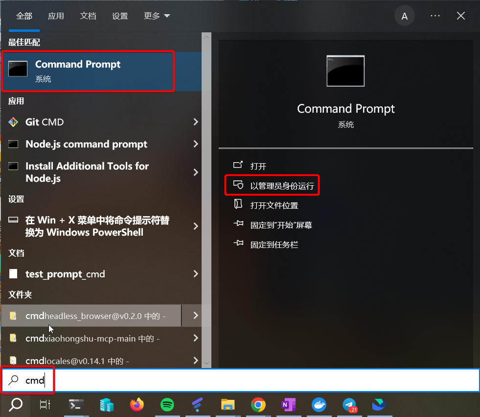

### 2) 安装 Go

```bash
winget install GoLang.Go
```

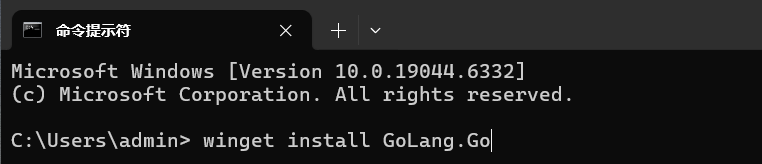

### 3) 安装 Node.js（LTS）

```bash
winget install OpenJS.NodeJS.LTS
```

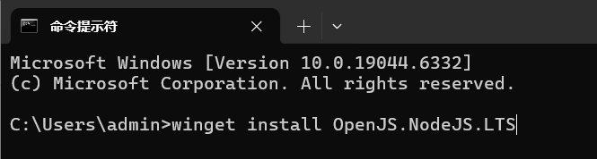

---

## 下载与准备（Windows 构建包）

1. 前往 Releases：<https://github.com/xpzouying/xiaohongshu-mcp/releases>
2. 选择 Windows 构建包 `xiaohongshu-mcp-windows-amd64.zip`。

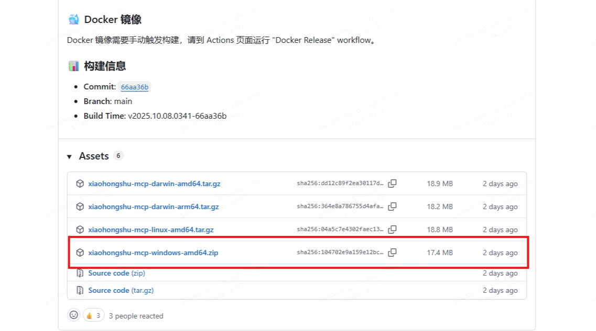

3. 下载完成后解压到本地目录。

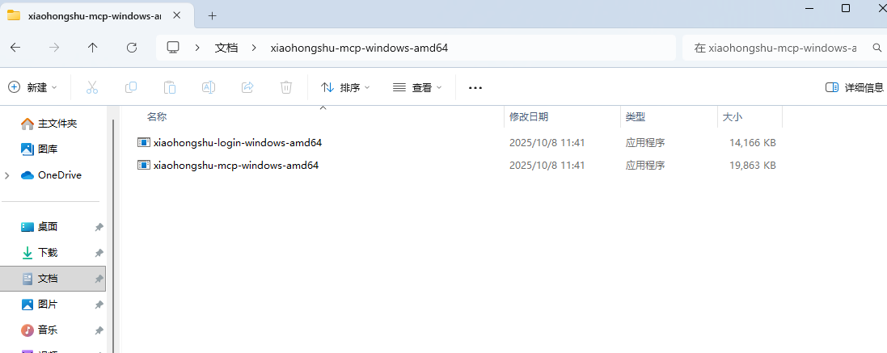

4. 在解压后的目录空白处，右键选择“在终端中打开”。

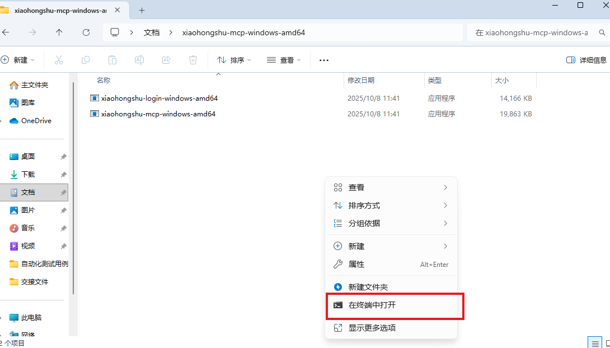

---

## 首次登录（自动下载依赖）

在终端中执行：

```bash
./xiaohongshu-login-windows-amd64.exe
```

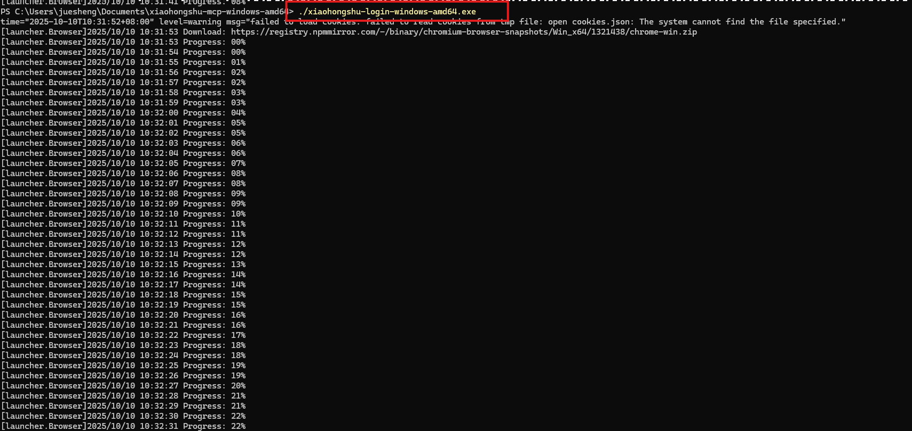

- 首次运行会自动下载所需依赖文件，请耐心等待。
- 下载完成后，按照提示完成登录。

---

## 处理 Windows Defender 误报（如出现）

部分 Windows 11 环境可能会误报病毒并拦截运行，可按以下流程添加排除项：

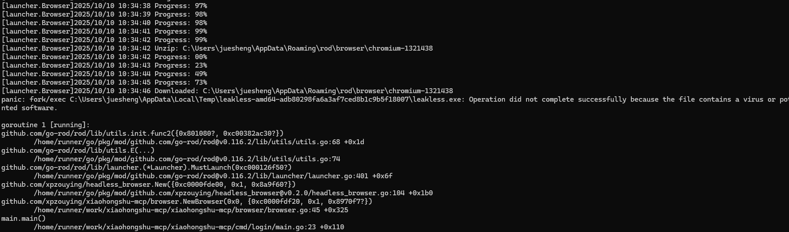
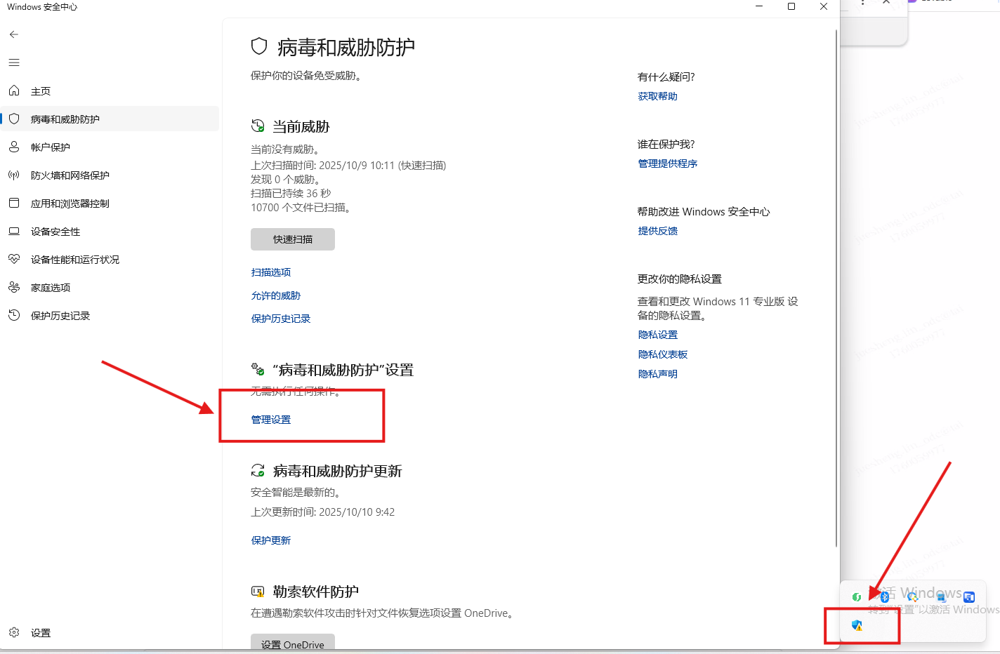

1. 打开 Windows 安全中心（Windows Security）。
2. 点击“病毒和威胁防护”（Virus & threat protection）。
3. 在“病毒和威胁防护设置”下，点击“管理设置”（Manage settings）。
4. 向下滚动，点击“添加或删除排除项”（Add or remove exclusions）。
5. 点击“添加排除项”（Add an exclusion）。
6. 选择“文件夹”（Folder）。
7. 导航并选择出现告警时提示的临时目录（示例路径如下，实际以告警信息为准）：

```
C:\Users\你的用户名\AppData\Local\Temp\leakless-amd64-adb80298fa6a3af7ced8b1c9b5f18007
```

8. 确认添加排除项。

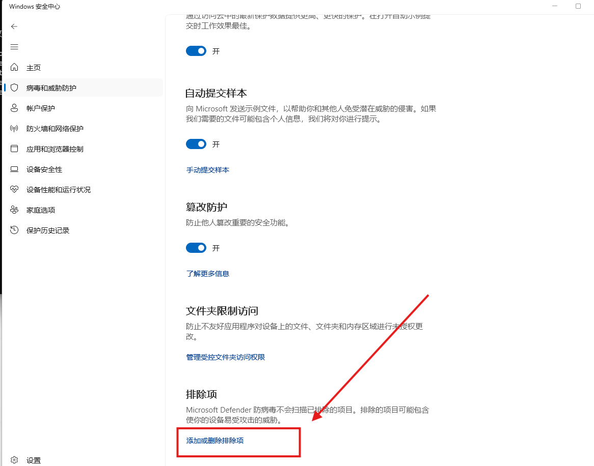
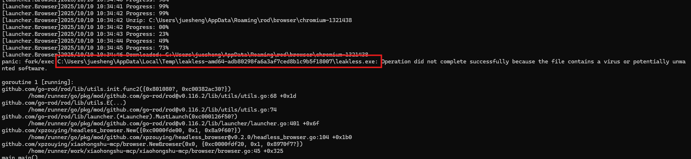
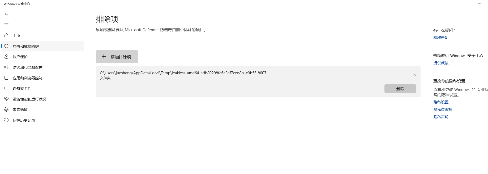

---

## 启动服务与登录状态确认

1. 再次运行登录程序，确保登录有效：

```bash
./xiaohongshu-login-windows-amd64.exe
```

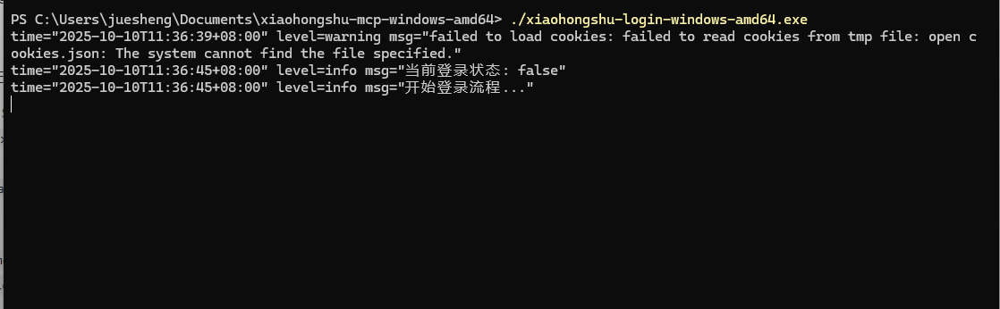


2. 启动 MCP 服务：

```bash
./xiaohongshu-mcp-windows-amd64.exe
```

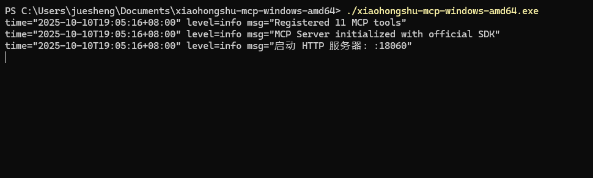

- 注意：服务端口以程序输出为准（示例为 `18060`）。若端口被占用，请关闭冲突程序或修改配置后再启动。

---

## 使用 MCP Inspector 验证服务

通过 MCP Inspector 验证服务是否正常响应：

```bash
npx @modelcontextprotocol/inspector
```

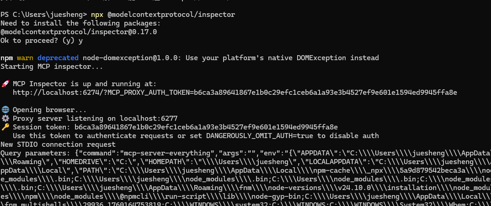
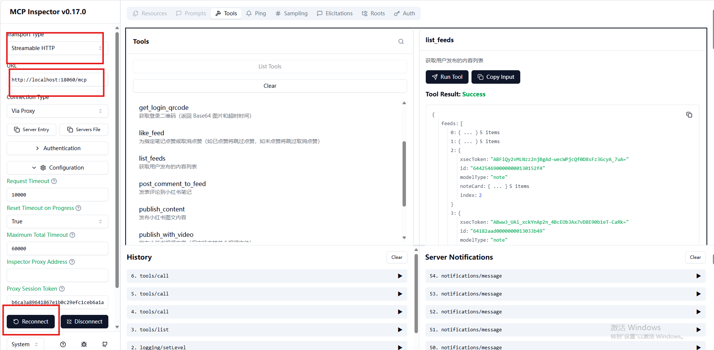

- 若无法连接，请检查：服务是否在运行、端口是否正确、防火墙/安全软件是否拦截。

---

## 在 Trae（字节跳动）中配置 MCP

在 Trae 的设置中，以 JSON 方式添加以下配置：

```json
{
  "mcpServers": {
    "xiaohongshu-mcp": {
      "url": "http://localhost:18060/mcp"
    }
  }
}
```

- 请将 `url` 指向你本地运行的 MCP 服务地址（默认示例为 `http://localhost:18060/mcp`）。
- 添加后重启或刷新 Trae 以加载配置，并在 Trae 中验证服务是否可用。

---

## 常见问题与排查

- `npx` 找不到：确认 Node.js LTS 已安装，并在新开终端中执行。
- 端口连接失败：确认服务已启动、端口未被占用，防火墙允许本地访问。
- Defender 仍拦截：确认已正确添加“排除项”，路径与实际告警保持一致。
- 环境变量问题：优先使用 Winget 安装以自动配置；若手动安装，请检查 `PATH` 设置。
- 网络限制：公司网络策略可能拦截依赖下载或本地端口访问，建议在个人网络或代理下尝试。

---

## 快速检查清单

- 已安装 Go 与 Node.js（LTS），并能在终端执行基本命令。
- 登录程序可正常运行并完成依赖下载。
- MCP 服务启动正常（记录端口）。
- Inspector 能连接并正常交互。
- Trae 已添加 MCP 配置并加载成功。

祝大家使用 xiaohongshu-mcp 服务愉快！