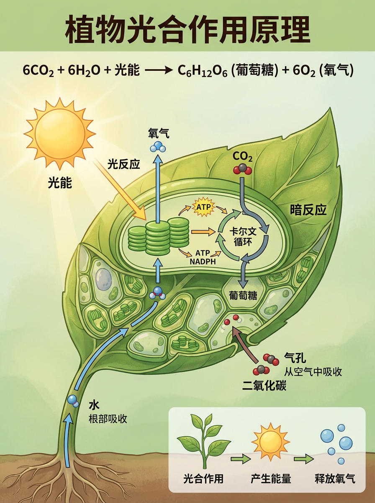
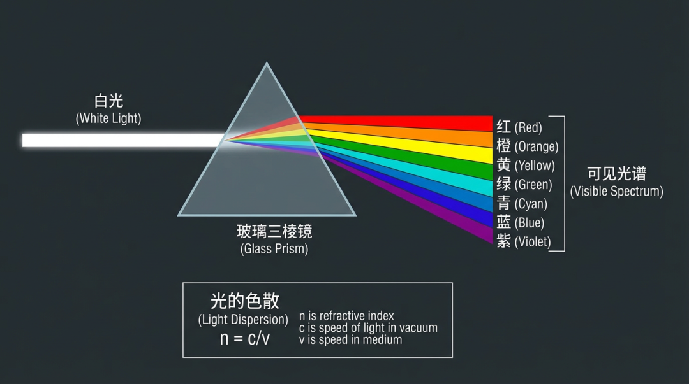
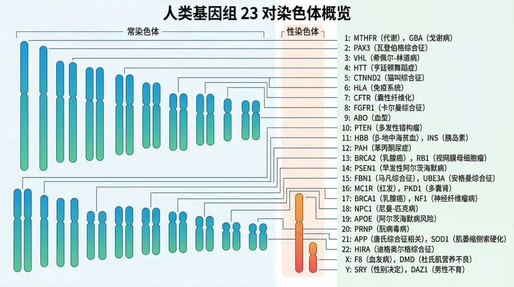

# 01. Nano Banana Pro完全上手指南：从文本到创世神作

**前言：当语言拥有了创造万物的力量**

想象一个世界，在那里，文字不只是符号，而是拥有塑造现实力量的咒语。你低声吟唱一句诗词，眼前便展开一幅相应的水墨画卷；你随口讲述一个荒诞的梦境，梦中场景便真实浮现。这个世界，正随着AI图像生成技术的发展，悄然降临。

今天，我们将一同走进 Nano Banana Pro 的世界，探索这个被誉为“生图界GPT时刻”的强大模型，如何将这一切变为可能。本系列教程将分为三部分，从入门到精通，带你完全掌握这个AI时代的“创世神笔”。

在第一篇，我们将聚焦于它最基础也最惊艳的能力——**文生图（Text-to-Image）**。你将学会如何与AI高效沟通，将你的语言，变成令人震撼的视觉艺术。

---

## 第一章：精准的文字魔法——让AI成为你的专属书法家与排版师

Nano Banana Pro 最令人瞩目的突破之一，便是其超凡的中文理解与生成能力。这不仅仅是生成几个孤立的汉字，而是能精准、稳定地处理大段叙述性文字，并将其完美、合乎逻辑地融入画面之中。

### 教程1：复现千古名篇《琵琶行》

让我们从一个极具东方美学的案例开始。在中国传统艺术中，诗画结合是最高的意境之一。现在，AI也能理解并创作这种意境了。

**核心提示语（Prompt）:**

> 在画面上方有一张长长的画卷上用潇洒的书法写着一整首白居易的《琵琶行》内容是“浔阳江头夜送客，枫叶荻花秋瑟瑟...座中泣下谁最多？江州司马青衫湿。“，同时下方用中国水墨画风格画上这首诗对应的画面。

**深度解析：**

这个提示语的成功，在于它像一位导演，向AI清晰地下达了包含“场景调度”、“内容指定”和“风格要求”的完整指令。

1.  **空间布局指令 (场景调度):** “在画面上方...” 和 “同时下方...”，这是整个画面的基石。它将画布分割为两个功能区，一个用于书法，一个用于绘画，避免了元素杂乱无章地混合。
2.  **内容与风格指令 (上):**
    *   **承载物：** “一张长长的画卷”——这比单纯说“写字”要高明得多，它为文字提供了一个具象的、符合古风美学的载体。
    *   **内容：** “一整首白居易的《琵琶行》”——直接、明确地指定了文本内容。
    *   **风格：** “潇洒的书法”——对文字的艺术风格提出了要求。AI不仅会“写”字，还会“演绎”不同风格的书法。
3.  **内容与风格指令 (下):**
    *   **内容：** “这首诗对应的画面”——这是最关键的一步。它要求AI去“理解”诗词的意境（江、夜、客、枫、荻、秋），而不仅仅是画几个孤立的元素。
    *   **风格：** “中国水墨画风格”——为画面部分定下了基调，确保其艺术风格与上方的书法部分和谐统一。

**技巧拓展：** 在尝试类似的创作时，可以进一步细化你的指令。例如，你可以指定书法的具体风格（如“行书”、“草书”），或者更具体地描述水墨画中你希望出现的场景（如“一叶扁舟，渔火点点”），来获得更符合你想象的画面。

### 教程2：一键生成“微信聊天记录”

从宏大的艺术创作到现代生活的微观场景，Nano Banana Pro 同样游刃有余。它能精准复刻我们日常使用的应用界面，这在UI/UX设计、短剧剧本可视化、社交媒体内容创作等领域有着巨大的应用潜力。

**核心提示语（Prompt）:**

~~~~sh
生成一张微信手机聊天界面截图，严格按照微信的界面UI和排版方式，左侧对话气泡是灰色，右侧对话气泡是绿色，右侧是甄嬛的角色在讲话

群聊名称：紫禁城吃瓜群 

聊天内容：
1. 1.(头像：华妃经典剧照翻白眼表情包) 年世兰：本宫刚听说皇上新得了个会唱昆曲的鹦鹉？@安陵容 妹妹，是你教的吧？😏
2. 2.(头像：流泪猫猫头) 安陵容：姐姐说笑了...嫔妾只会唱曲儿，教鸟儿说话，还得是🐦⬛苏公公...😢
3. 3.(头像：甄嬛端庄剧照) 甄嬛：陵容妹妹的嗓子，连黄鹂都自愧不如。倒是那鹦鹉，学舌的本事，怕不是跟🤐某些人学的？
4. 4.(头像：皇后端庄微笑但眼神犀利的表情包) 皇后：好了好了，姐妹和睦要紧。@华妃 妹妹，你宫里的蟹粉酥不错，本宫让剪秋去取些？🍰
5. 5.(头像：华妃经典剧照翻白眼表情包) 年世兰：呵，皇后娘娘想吃？可惜啊，刚被颂芝“不小心”全打翻了！🤷‍♀️（配图：一碟点心扣地上的表情包）
6. 6.(头像：叶澜依抱猫剧照) 叶澜依：...无聊。有这功夫不如去喂🐯我的大猫。
7. 7.(头像：敬妃数砖表情包) 敬妃：@叶澜依 妹妹的猫...今天又挠坏了我宫里三块金砖！🧱🧱🧱 这个月第三回了！
~~~~

**深度解析：**

这个案例展示了AI对**格式化文本**和**UI组件细节**的惊人理解力。

1.  **UI/UX的精准描述：** “严格按照微信的界面UI和排版方式”、“左侧对话气泡是灰色，右侧对话气泡是绿色”，这些都是像素级的具体指令，是确保生成结果真实性的关键。AI理解这些描述，就像前端开发者理解CSS代码一样。
2.  **结构化内容输入：** 提示语采用了“标签: 内容”的格式（如“群聊名称：”），并结合带编号的列表来组织聊天记录。这种清晰、无歧义的数据结构，让AI能够准确地将每个角色、头像描述（甚至包括emoji表情）和发言内容一一对应，最终渲染出高度逼真的界面。

**技巧拓展：** 你可以利用这个特性快速制作产品原型图或信息流广告素材。尝试修改UI描述（如“将绿色气泡改为蓝色”），或在聊天内容中加入更复杂的元素（如“第5条消息包含一张图片缩略图”），来测试AI对UI的理解深度。

---

## 第二章：突破想象边界——让AI成为你的世界构建师

Nano Banana Pro 拥有一个由海量数据构建的“知识宇宙”。这意味着你可以将现实世界的人物、流行的文化符号（IP）、甚至抽象的科学概念进行“跨界”混搭，创造出前所未有的奇妙场景。

### 教程3：当《原神》玩家遇到马斯克

想看看你最爱的游戏主角和现实世界的风云人物来一场史诗级对决吗？在AI的世界里，这并非难事。

**核心提示语（Prompt）:**

> 生成一张原神的实机战斗图片，旅行者主角正在和 boss 埃隆·马斯克战斗，马斯克站在一台悬浮的火箭装甲上发射能量炮，画面为3D高饱和度奇幻原神游戏风格。

**深度解析：**

这个提示语的魔力在于**“概念缝合”**与**“风格锚定”**。

1.  **核心要素 (概念缝合):** “旅行者主角”、“boss 埃隆·马斯克”。AI精准地从它的知识库中提取了这两个核心IP的视觉特征。
2.  **动态与场景描绘:** “正在...战斗”、“站在一台悬浮的火箭装甲上发射能量炮”。这些描述为静态的画面注入了动感和故事性，让AI知道这不是一张简单的合影，而是一个充满冲突的战斗场景。
3.  **风格指定 (风格锚定):** “3D高饱和度奇幻原神游戏风格”。这是至关重要的一环。它为整个画面定下了基调，告诉AI要用“原神”这款游戏的独特美术风格来渲染一切，包括马斯克的装甲、能量炮的特效以及整体环境。最终，马斯克被毫无违和感地“原神化”了。

### 教程4：打造史上最强“动漫全家福”

如果你的童年男神女神们突破次元壁，来一张世纪大合照，那会是怎样的情景？

**核心提示语（Prompt）:**

> 中国动画中的孙悟空和路飞、漩涡鸣人、炭治郎、御坂美琴、蕾姆、桐谷和人、明日香、草帽乔巴、鹿目圆、阿尼亚·福杰、黑崎一护、艾伦·耶格尔、灰原哀和初音未来和哪吒、李白、唐僧、海绵宝宝、蜡笔小新、迪士尼公主们站在一起，大杂烩式同框，集体大合照；背景是一望无际的草原、蓝天与白云，整体明亮清新的动漫风格。

**深度解析：**

这个案例展示了模型处理**高密度信息**和**多实体并存**的强大能力。这里的核心技巧就是**“清晰罗列”**。

1.  **角色清单：** 将你想要的所有角色名清晰、准确地列出。AI会像购物一样，在自己的“角色货架”上将他们一一拾取。
2.  **构图指令：** “站在一起，大杂烩式同框，集体大合照”，这个指令非常口语化，但AI完全能理解，其核心是要求一个“group photo”式的构图。
3.  **环境与风格：** “背景是一望无际的草原、蓝天与白云，整体明亮清新的动漫风格”，这为合照提供了一个和谐、统一的背景和氛围，避免了因角色过多而产生的混乱感。

**技巧拓展：** 当罗列大量角色时，AI可能会根据自身的训练数据权重，让某些角色更突出。你可以尝试通过调整角色出现的顺序，或者用括号、强调词等方式（如“a huge Spongebob”），来影响最终画面的构图和角色占比。

---

## 第三章：知识的视觉化——让AI成为你的科普插画师

除了天马行空的艺术创作，Nano Banana Pro 还能成为你学习和工作中的得力助手，将复杂的科学知识，转化为清晰、美观、专业的信息图。

### 教程5：绘制科学原理图系列

让我们来看三个不同学科的例子，学习如何让AI为我们绘制专业级的科普图。

**A. 生物学：光合作用原理**

**核心提示语（Prompt）:**
> 用中文给我制作一张科普图片，讲述详细的植物进行光合作用的原理。

**B. 物理学：牛顿三棱镜分光**

**核心提示语（Prompt）:**
> 设计「经典光学实验：牛顿三棱镜分光」分镜式科普海报：左侧画入射白光，中间为玻璃三棱镜，右侧准确依波长顺序散出七色光带；下方小框再现“光的色散”公式 n = c/v；整体为 4:3 比例高清矢量，背景深灰，文字用无衬线体。

**C. 遗传学：人类基因组概览**

**核心提示语（Prompt）:**
> 用中文绘一张「人类基因组 23 对染色体概览」信息图：按实际长度比例竖排染色体条，使用不同渐变色区分常染色体与性染色体，侧边列出每对染色体与已知疾病/特征相关的代表基因（如 HBB、BRCA1）。

**深度解析：**

这组案例的精髓在于“专业术语”**和**“设计规范”**的结合运用。

1.  **善用专业术语：** 无论是“光合作用”、“牛顿三棱镜分光”，还是“人类基因组23对染色体”，AI都能理解这些复杂的科学概念，并调动相关的视觉知识库。你给出的术语越精确，生成的内容就越专业。
2.  **下达设计规范：** 在“牛顿三棱镜”的例子中，提示语包含了大量设计师语言：“分镜式科普海报”、“4:3 比例”、“高清矢量”、“背景深灰”、“无衬线体”。这些指令让画面不仅仅是内容正确，更在视觉上达到了专业信息图的设计标准。
3.  **指令的颗粒度：** “光合作用”的提示语非常概括，给了AI较大的自由发挥空间。而“人类基因组”的提示语则非常细致，规定了“按实际长度比例”、“竖排”、“渐变色区分”、“侧边列出”等具体要求，从而获得了更加规整、信息密度更高的图谱。

**技巧拓展：** 在生成科普类图像时，请将自己想象成一个项目经理，在向一位专业设计师提需求。大胆地使用你所知道的专业术语，并把你对最终成品的所有想象（布局、颜色、字体、风格、信息点）都清晰地描述出来。你描述得越专业、越细致，AI的反馈就越精准，越能成为你的得力助手。