# Nano Banana Pro新出20种邪修玩法，做手办已经落后N个版本了

作者：卡尔的AI沃茨  
发布时间：2025年11月21日 09:37

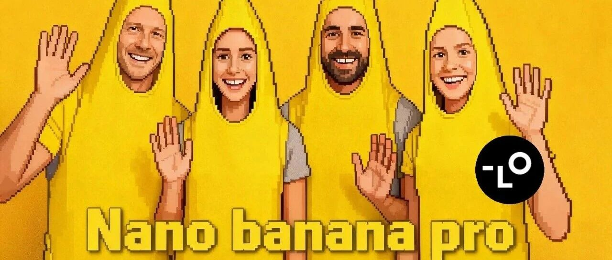

来不及解释了，

全世界都知道Nano banana这个称霸生图的香蕉上线了新pro版本！

还是和我们第一时间接入新模型的lovart一拍即合，我带着百镜系列卷土重来，测测测测测了一整晚，照例是带提示语和效果展示，还有详细的使用教程。

🔗 lovart.ai

我敢说，这个case数量绝对是数一数二，也能让你迅速了解pro版本的香蕉现在有多强！话不多说，Here we go！

提示语和图片我都整理进文档里了，后台回复“香蕉pro”就可以啦。

首先来看文生图方面，Nano banana pro版本最突出的进步就是，拥有了非常稳定的中文能力，这个不仅体现在能做大字海报上，而是大字小字超多文字都可以。

直接来个超强的case。

在画面上方有一张长长的画卷上用潇洒的书法写着一整首白居易的《琵琶行》内容是“浔阳江头夜送客，枫叶荻花秋瑟瑟【这里写好琵琶行全文】座中泣下谁最多？江州司马青衫湿。“，同时下方用中国水墨画风格画上这首诗对应的画面。

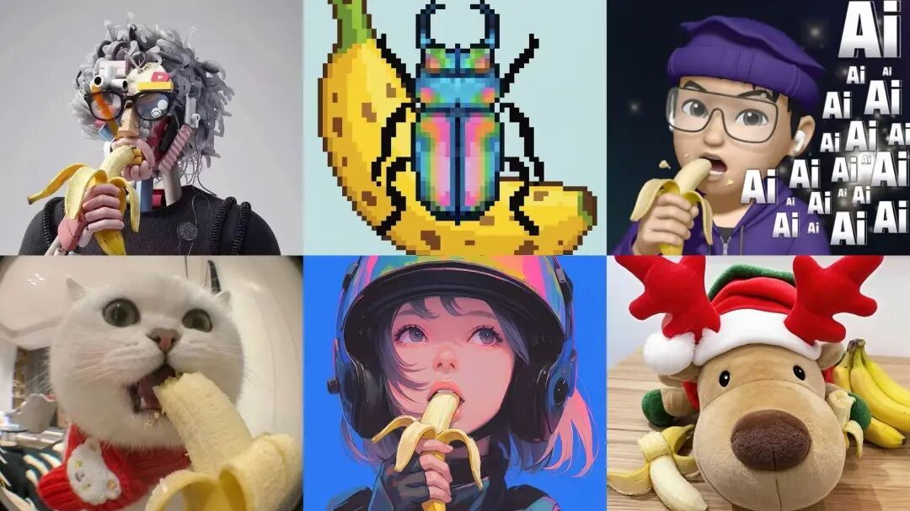

谁懂我看到这张图时的震撼，甚至这个效果只用了一遍就做出来了，不论是文字的稳定性还是下方水墨画的展现都太牛了，这怎么一个版本更新直接就吊打所有人了。

中文能力的提升带来的就是还可以让banana直接复刻一个聊天记录。

生成一张微信手机聊天界面截图，严格按照微信的界面UI和排版方式，左侧对话气泡是灰色，右侧对话气泡是绿色，右侧是甄嬛的角色在讲话。

群聊名称：紫禁城吃瓜群  
聊天内容：

1. (头像：华妃经典剧照翻白眼表情包) 年世兰：本宫刚听说皇上新得了个会唱昆曲的鹦鹉？@安陵容 妹妹，是你教的吧？😏
2. (头像：流泪猫猫头) 安陵容：姐姐说笑了...嫔妾只会唱曲儿，教鸟儿说话，还得是🐦⬛苏公公...😢
3. (头像：甄嬛端庄剧照) 甄嬛：陵容妹妹的嗓子，连黄鹂都自愧不如。倒是那鹦鹉，学舌的本事，怕不是跟🤐某些人学的？
4. (头像：皇后端庄微笑但眼神犀利的表情包) 皇后：好了好了，姐妹和睦要紧。@华妃 妹妹，你宫里的蟹粉酥不错，本宫让剪秋去取些？🍰
5. (头像：华妃经典剧照翻白眼表情包) 年世兰：呵，皇后娘娘想吃？可惜啊，刚被颂芝“不小心”全打翻了！🤷‍♀️（配图：一碟点心扣地上的表情包）
6. (头像：叶澜依抱猫剧照) 叶澜依：...无聊。有这功夫不如去喂🐯我的大猫。
7. (头像：敬妃数砖表情包) 敬妃：@叶澜依 妹妹的猫...今天又挠坏了我宫里三块金砖！🧱🧱🧱 这个月第三回了！

这以后防诈又要多加一个心眼子了。

而且，Google你这次训练到底用了多少数据啊！啥图都能做，

生成一张原神的实机战斗图片，旅行者主角正在和 boss 埃隆·马斯克战斗，马斯克站在一台悬浮的火箭装甲上发射能量炮，画面为3D高饱和度奇幻原神游戏风格。

所以，在Nano banana的世界里，原神中是能跟马斯克干架的。

还没完，那再看看这个全家福大乱炖……

中国动画中的孙悟空和路飞、漩涡鸣人、炭治郎、御坂美琴、蕾姆、桐谷和人、明日香、草帽乔巴、鹿目圆、阿尼亚·福杰、黑崎一护、艾伦·耶格尔、灰原哀和初音未来和哪吒、李白、唐僧、海绵宝宝、蜡笔小新、迪士尼公主们站在一起，大杂烩式同框，集体大合照；背景是一望无际的草原、蓝天与白云，整体明亮清新的动漫风格。

这真的是一张我靠写写名字就能得到的图吗，童年记忆都能同框了啊。

这以后做什么同人漫画，周边，吧唧也就是一句话的事。还有还有，延续之前的优势，Nano banana依旧具备很强的世界知识，比如让它做科普图，

用中文给我制作一张科普图片，讲述详细的植物进行光合作用的原理。

设计「经典光学实验：牛顿三棱镜分光」分镜式科普海报：左侧画入射白光，中间为玻璃三棱镜，右侧准确依波长顺序散出七色光带；下方小框再现“光的色散”公式 n = c/v；整体为 4:3 比例高清矢量，背景深灰，文字用无衬线体。

用中文绘一张「人类基因组 23 对染色体概览」信息图：按实际长度比例竖排染色体条，使用不同渐变色区分常染色体与性染色体，侧边列出每对染色体与已知疾病/特征相关的代表基因（如 HBB、BRCA1）。

来不及解释了，

全世界都知道Nano banana这个称霸生图的香蕉上线了新pro版本！

还是和我们第一时间接入新模型的lovart一拍即合，我带着百镜系列卷土重来，测测测测测了一整晚，照例是带提示语和效果展示，还有详细的使用教程。

🔗 lovart.ai

我敢说，这个case数量绝对是数一数二，也能让你迅速了解pro版本的香蕉现在有多强！话不多说，Here we go！

提示语和图片我都整理进文档里了，后台回复“香蕉pro”就可以啦。

首先来看文生图方面，Nano banana pro版本最突出的进步就是，拥有了非常稳定的中文能力，这个不仅体现在能做大字海报上，而是大字小字超多文字都可以。

直接来个超强的case。

在画面上方有一张长长的画卷上用潇洒的书法写着一整首白居易的《琵琶行》内容是“浔阳江头夜送客，枫叶荻花秋瑟瑟【这里写好琵琶行全文】座中泣下谁最多？江州司马青衫湿。“，同时下方用中国水墨画风格画上这首诗对应的画面

谁懂我看到这张图时的震撼，甚至这个效果只用了一遍就做出来了，不论是文字的稳定性还是下方水墨画的展现都太牛了，这怎么一个版本更新直接就吊打所有人了。

中文能力的提升带来的就是还可以让banana直接复刻一个聊天记录，

生成一张微信手机聊天界面截图，严格按照微信的界面UI和排版方式，左侧对话气泡是灰色，右侧对话气泡是绿色，右侧是甄嬛的角色在讲话

群聊名称：紫禁城吃瓜群 

聊天内容：

1.(头像：华妃经典剧照翻白眼表情包) 年世兰：本宫刚听说皇上新得了个会唱昆曲的鹦鹉？@安陵容 妹妹，是你教的吧？😏
2.(头像：流泪猫猫头) 安陵容：姐姐说笑了...嫔妾只会唱曲儿，教鸟儿说话，还得是🐦⬛苏公公...😢
3.(头像：甄嬛端庄剧照) 甄嬛：陵容妹妹的嗓子，连黄鹂都自愧不如。倒是那鹦鹉，学舌的本事，怕不是跟🤐某些人学的？
4.(头像：皇后端庄微笑但眼神犀利的表情包) 皇后：好了好了，姐妹和睦要紧。@华妃 妹妹，你宫里的蟹粉酥不错，本宫让剪秋去取些？🍰
5.(头像：华妃经典剧照翻白眼表情包) 年世兰：呵，皇后娘娘想吃？可惜啊，刚被颂芝“不小心”全打翻了！🤷‍♀️（配图：一碟点心扣地上的表情包）
6.(头像：叶澜依抱猫剧照) 叶澜依：...无聊。有这功夫不如去喂🐯我的大猫。
7.(头像：敬妃数砖表情包) 敬妃：@叶澜依 妹妹的猫...今天又挠坏了我宫里三块金砖！🧱🧱🧱 这个月第三回了！

这以后防诈又要多加一个心眼子了。

而且，Google你这次训练到底用了多少数据啊！啥图都能做，

生成一张原神的实机战斗图片，旅行者主角正在和 boss 埃隆·马斯克战斗，马斯克站在一台悬浮的火箭装甲上发射能量炮，画面为3D高饱和度奇幻原神游戏风格。

所以，在Nano banana的世界里，原神中是能跟马斯克干架的。

还没完，那再看看这个全家福大乱炖。。。。

中国动画中的孙悟空和路飞、漩涡鸣人、炭治郎、御坂美琴、蕾姆、桐谷和人、明日香、草帽乔巴、鹿目圆、阿尼亚·福杰、黑崎一护、艾伦·耶格尔、灰原哀和初音未来和哪吒、李白、唐僧、海绵宝宝、蜡笔小新、迪士尼公主们站在一起，大杂烩式同框，集体大合照；背景是一望无际的草原、蓝天与白云，整体明亮清新的动漫风格。

这真的是一张我靠写写名字就能得到的图吗，童年记忆都能同框了啊。

这以后做什么同人漫画，周边，吧唧也就是一句话的事。还有还有，延续之前的优势，Nano banana依旧具备很强的世界知识，比如让它做科普图，

用中文给我制作一张科普图片，讲述详细的植物进行光合作用的原理

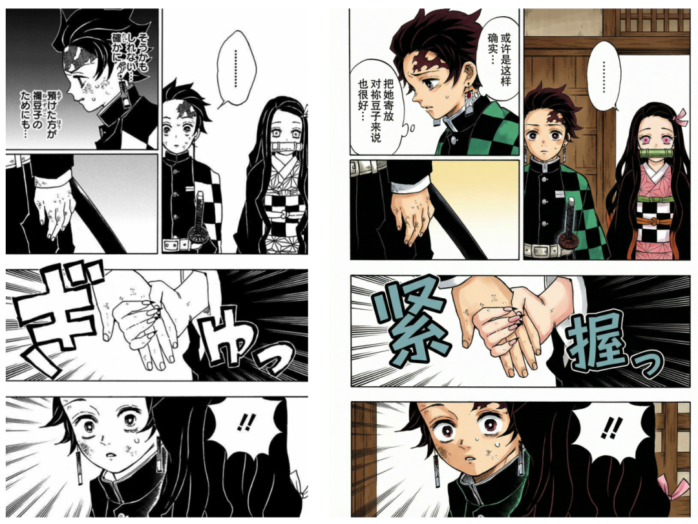

设计「经典光学实验：牛顿三棱镜分光」分镜式科普海报：左侧画入射白光，中间为玻璃三棱镜，右侧准确依波长顺序散出七色光带；下方小框再现“光的色散”公式 n = c/v；整体为 4:3 比例高清矢量，背景深灰，文字用无衬线体。

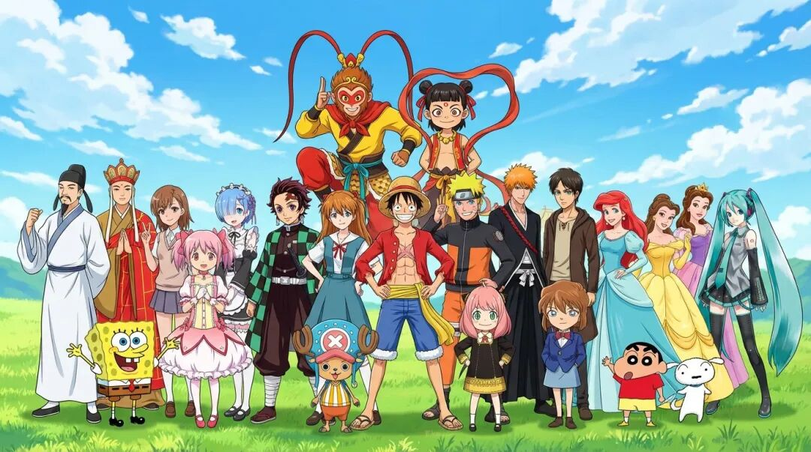

用中文绘一张「人类基因组 23 对染色体概览」信息图：按实际长度比例竖排染色体条，使用不同渐变色区分常染色体与性染色体，侧边列出每对染色体与已知疾病/特征相关的代表基因（如 HBB、BRCA1）；

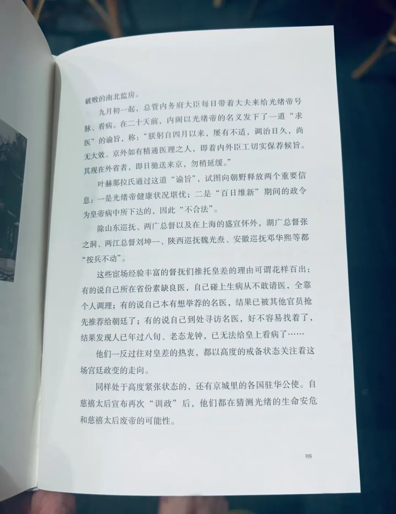

有没有人管管Banana Pro啊，

连化学方程式都给我配平了喂，还有就是有没有学医的人看看这张关于染色体的图是不是正确啊，

外行人看已经是可以放进教科书的程度，真把我给唬住了。甚至是直接通过文字做出非常逼真并且细节面面俱到的UI界面，（提示语太长了放文档里了）

或者是只是通过文字就能做出这种审美高级又能展现城市特点的海报。

我平时测到凌晨三点的时候已经开始困了，

但心里一直有个声音不断在说“还能这样？这样也行？我去，还可以这样？”

直到我做出下面这张图时，我感觉我的大脑褶皱完全展开了（熬夜的后遗症这就是，大家不要熬夜测case）

拿放大镜看的话细节处还是有些问题的，

但是从整张图的完整程度来看，已经是目前生图领域的又一个天花板了。

OK，文生图测试到这，给图生图留点位置，

毕竟我们实际应用中，用到最多的就是图生图，对一致性的需求非常高。

我决定放出我的模特小猫！

帮我的猫穿上疯狂动物城的兔子警官 cos装扮，包括头套帽子和衣服，衣服合理的套在小猫身上，去掉小猫前方的遮挡物，保持原图的构图和写实风格

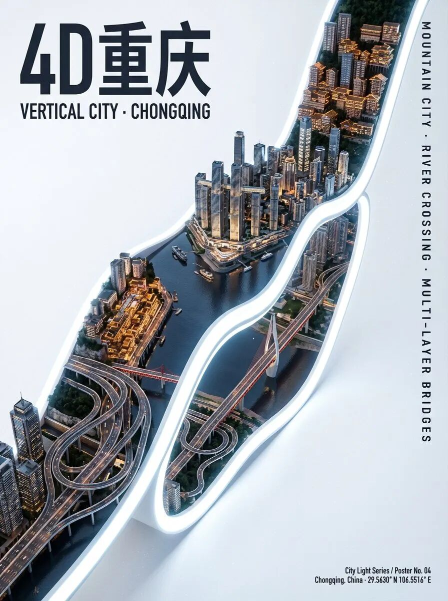

说实话，第二张生成的图我一晚上骗到了很多人，就是我这猫的铲屎官一下子也没反应过来，感觉这小衣服套我家猫身上就应该是这样啊！

那在这个基础上，我还可以给我的小猫做一张和肯德基的联名海报，

甚至我都不需要写海报的文字，Banana Pro自己自由发挥的效果都很好。

以「77（猫的名字）X肯德基」联名企划为主题，围绕同一只宠物（形象、花色等与上传图片绝对一致）生成一张联名海报。统一宠物形象与肯德基品牌识别（红白配色、经典LOGO、餐厅场景等）的前提下，让小猫穿肯德基员工制服、带上肯德基员工帽子，佩戴工牌站在柜台前、兜售炸鸡、汉堡和套餐、与炸鸡桶、薯条、汽水等元素互动等。画面风格活泼、有趣、具有商业联名感，适合用于线上宣传与活动海报。然后自由的为这张海报添加合适的中文内容。

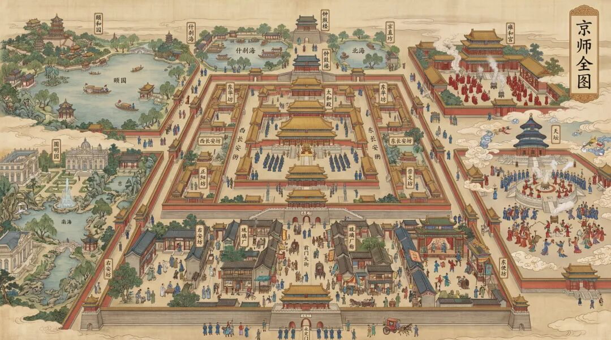
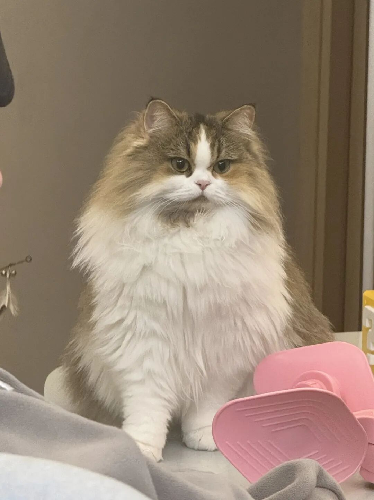
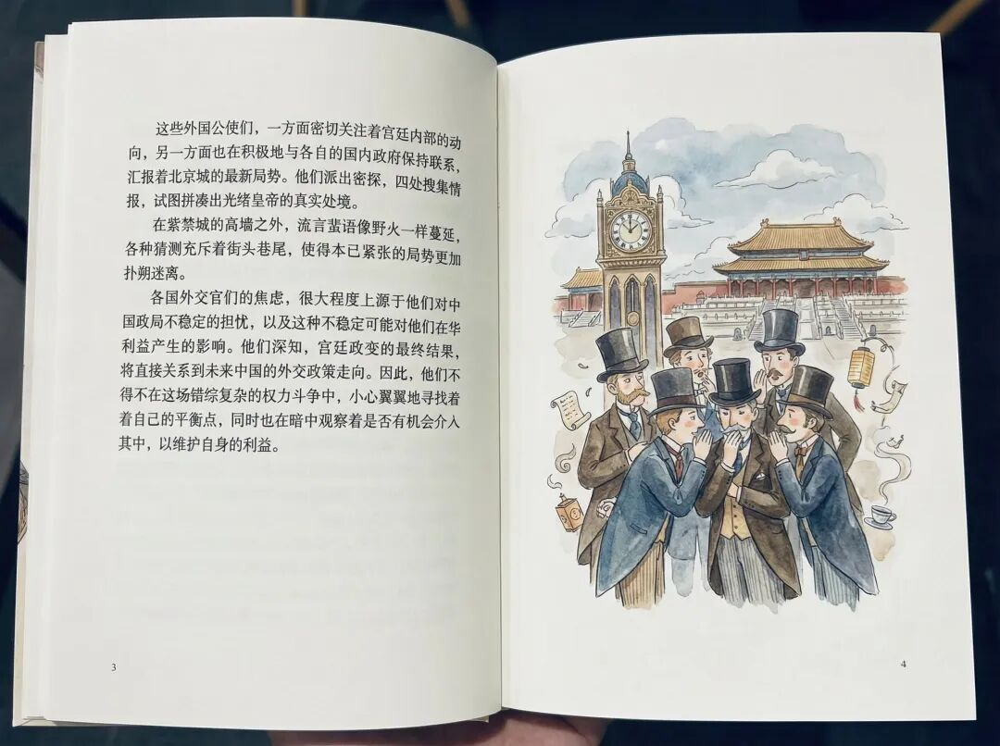

还可以利用lovart内置agent对话的优势，

直接调用banana生成一组海报图，这个批量生图的速度和质量我真的原地跳起来720度点赞。

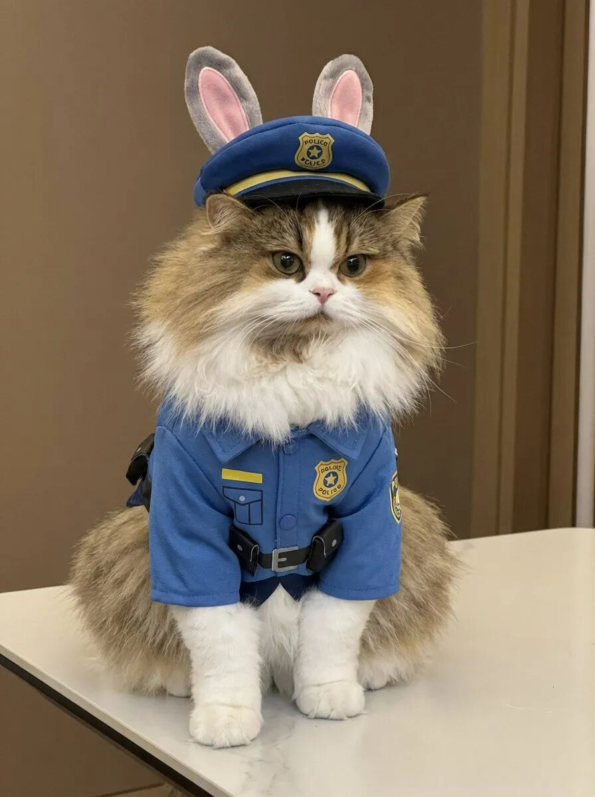

Banana pro这次还有升级，对于风格的迁移能力加强了，

比如我想复刻一张海报，现在真的就是打几个字就可以，它都是可以自动给你改好内容的。。。。

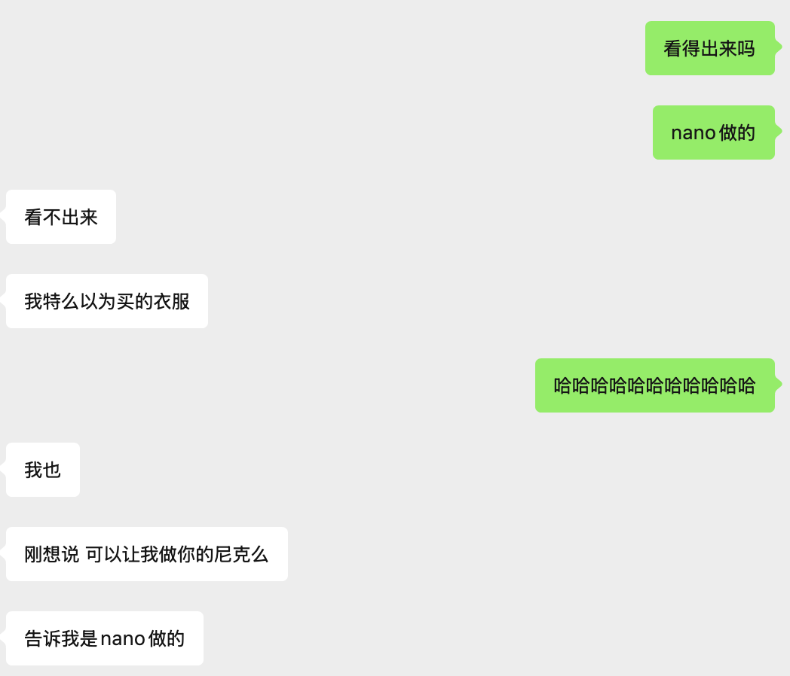

参考图片风格，将主题色换成粉色，将菜篮子换成化妆箱，并将图中关于生鲜水果的元素和文字全部改成美妆的元素和文字内容

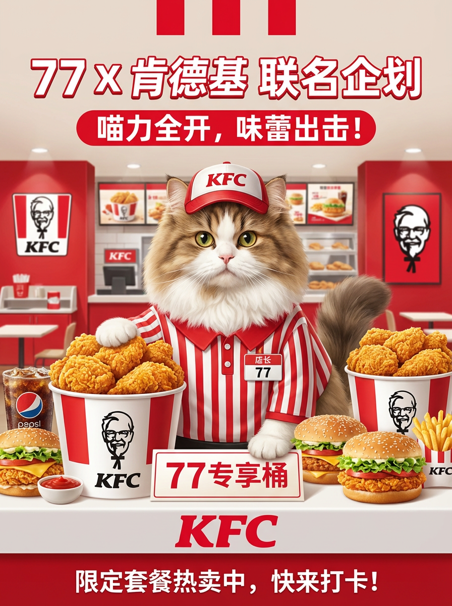

字体的迁移能力也很强，基本上处处保持一致，还有自己的小细节，包括下面这张马年海报，甚至图中巨小的英文都从“SNAKE”改成“HOUSE”，几乎和背景色融为一体极易被忽略的“2025”也改成了“2026”。

参考图片的风格和色彩以及构图，生成一张2026年马年大吉的春节海报，保持字体一致

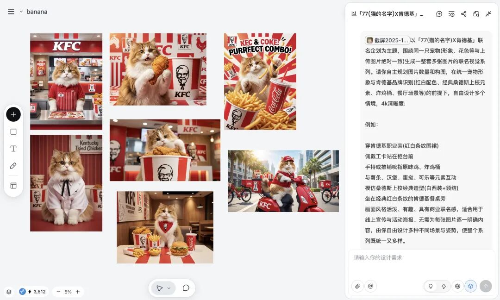

如果有一个具体的产品，同时还想复刻想要的海报风格，

上传两张图就完事了，照样可以得到一张背景、细节元素、文字都和你的产品一一对应的海报，同时产品还能保持高度的一致。

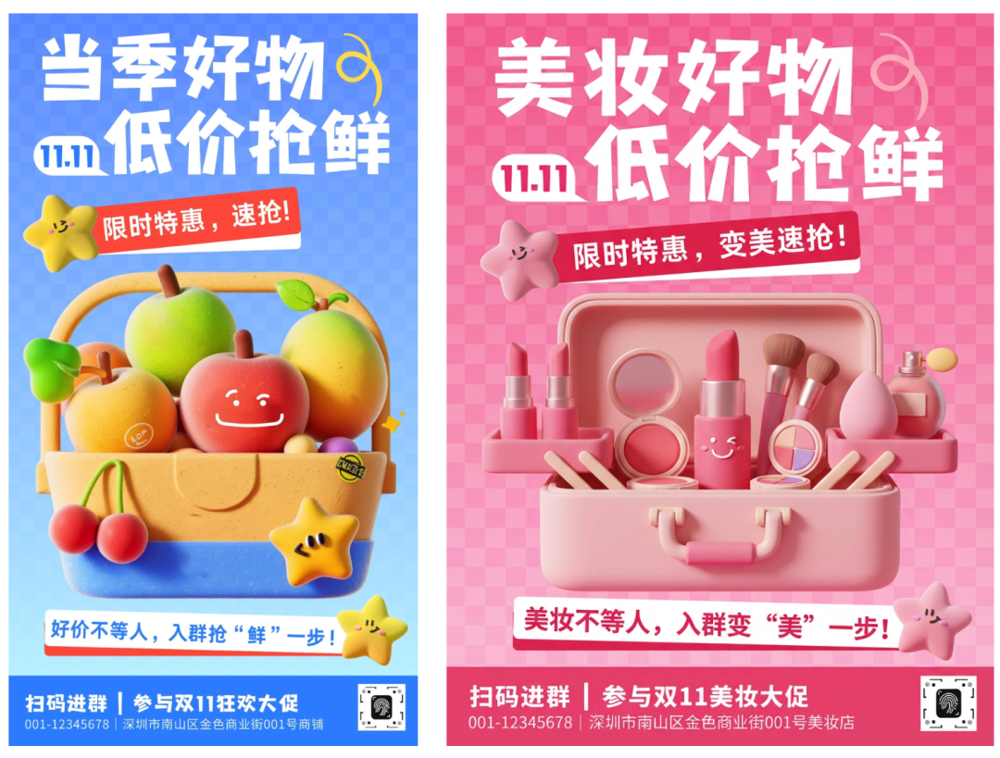

参考图1的海报风格，制作一张图2洗衣液产品的海报，保持图2的产品一致性，同时图中所有的元素和文字内容都是和图2的洗衣液相关

中文能力强，风格迁移能力强的Nano banana pro还还还还保持了丰富的世界知识，

还能生成4k的具备更高细节的图片，比方我可以让它建模一张城市线稿，

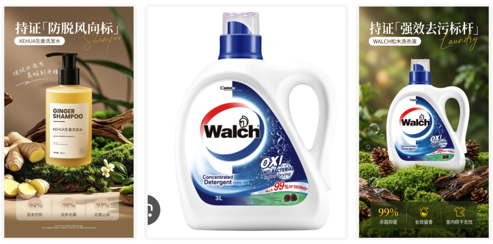

根据这张线稿，生成一张细节丰富的城市设计效果图

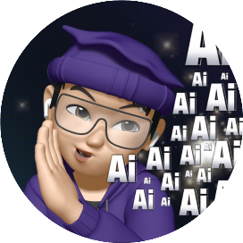

或者是让它转换拍摄视角，

把这张图的四格场景都换成头顶的俯视视角

甚至能在保证原图一致的情况下，既完成填色还能完成翻译，完了，这下汉化组也可以下班了。。。。

给这张漫画页上色并翻译成中文放到图中原来的位置，保持构图和图片细节的一致

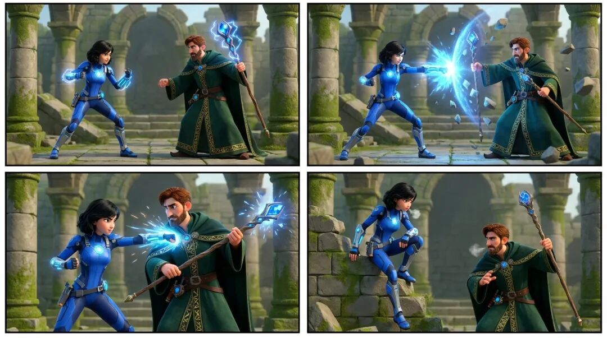

还有一个真的牛到超出我想象的能力，

我给Banana这样一张书的内页，让它帮我生成下一张书页的内容。

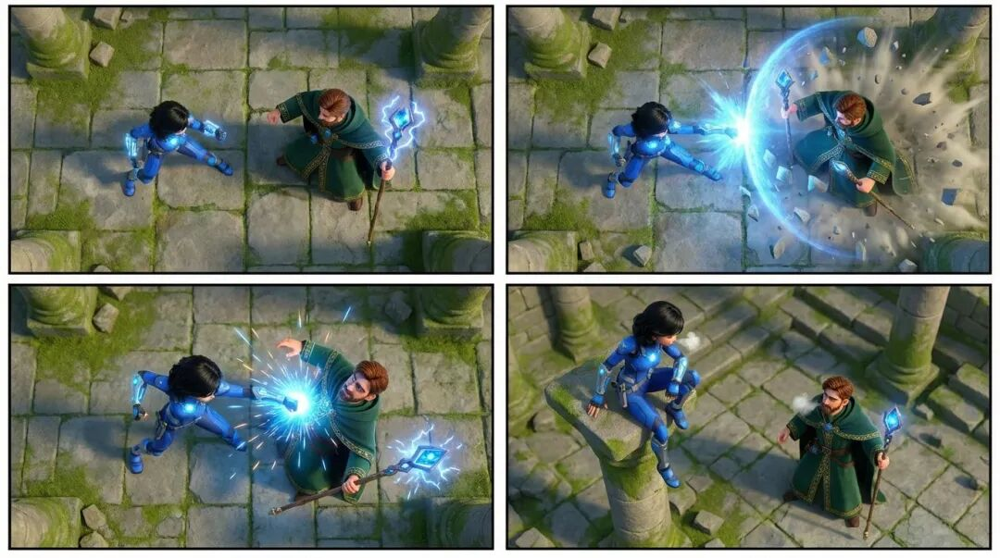
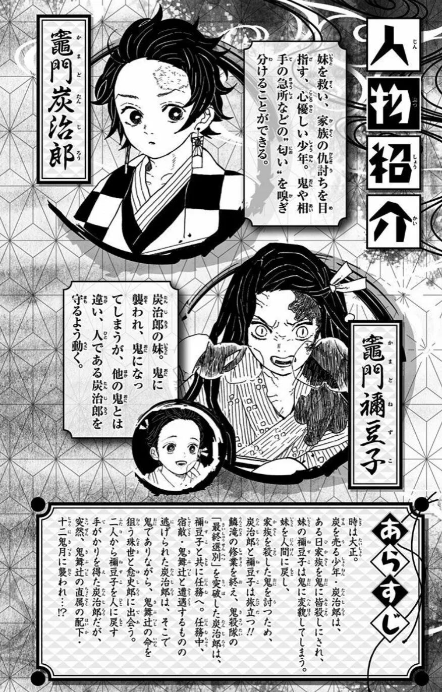

于是就有了这张我堪称为神级效果的图，真的延续了上一页的文字内容，甚至还做出了合适的配图，而且打印在书上的文字，就是很清晰的宋体，你跟我说这是AI？

生成图中这本书的下一页，页面的位置要正确，文字内容要延续，并且文字保持清晰

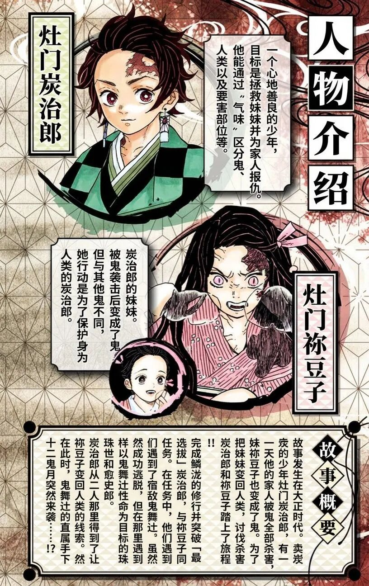

到这里，我不相信你还不想去试试。。。。

这把老朋友还是有送福利！

11.21到11.23 Lovart里的 Banana Pro 全员FREE。到11.30前订阅Basic以上任意的年plan，送Banana Pro「365 天 Unlimited」，生图模式下0积分不限量使用

距离上一版的Nano banana才过去不到三个月啊，我甚至有种错觉这模型已经上了一年了，

那么短的时间，AI生图上限又被打破了，

前天我还在讲Gemini3是又一个GPT时刻，

今天的Banana pro又是生图界的GPT时刻。

解决了原本中文小字难以维持稳定的情况，

还拥有着极强的世界知识和推理能力，

甚至还有几乎一遍成的成功率。

我相信，

不管是设计界，影视界，跨界的，

在见到它的时候一定又惊又喜，

但是，怕什么呢？

这个时代就是如此！

@ 作者 / 阿汤 & 卡尔

最后，感谢你看到这里👏
如果喜欢这篇文章，不妨顺手给我们
点赞👍｜在看👀｜转发📪｜评论📣

如果想要第一时间收到推送，不妨给我个星标🌟

更多的内容正在不断填坑中……

---

备注：
- 所有图片均已下载至 `./images/` 并以顺序命名（image_1.* 至 image_9.*）。
- 若个别网络图片下载失败，会在 `download.log` 中记录失败条目。
