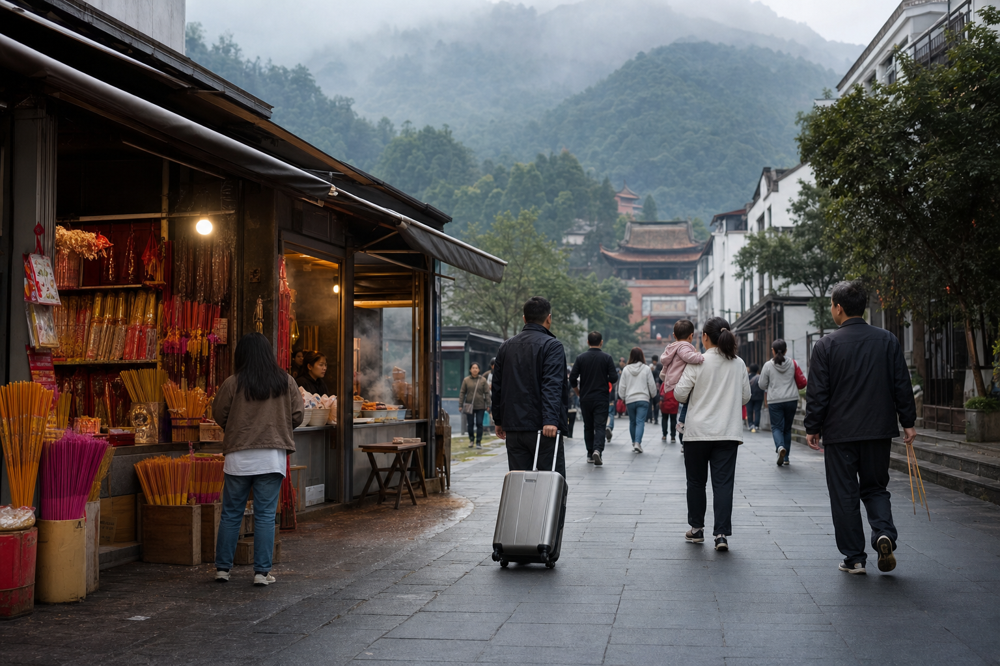
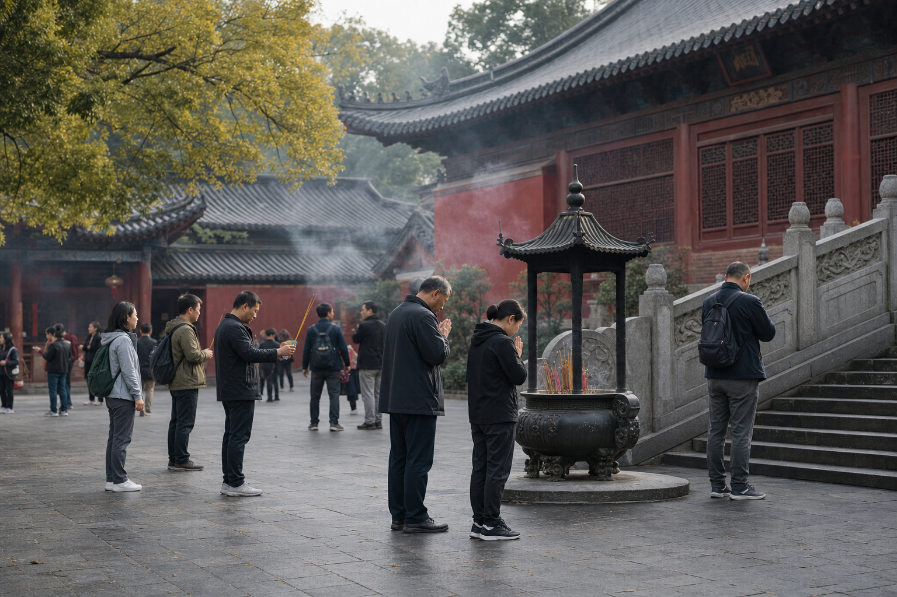
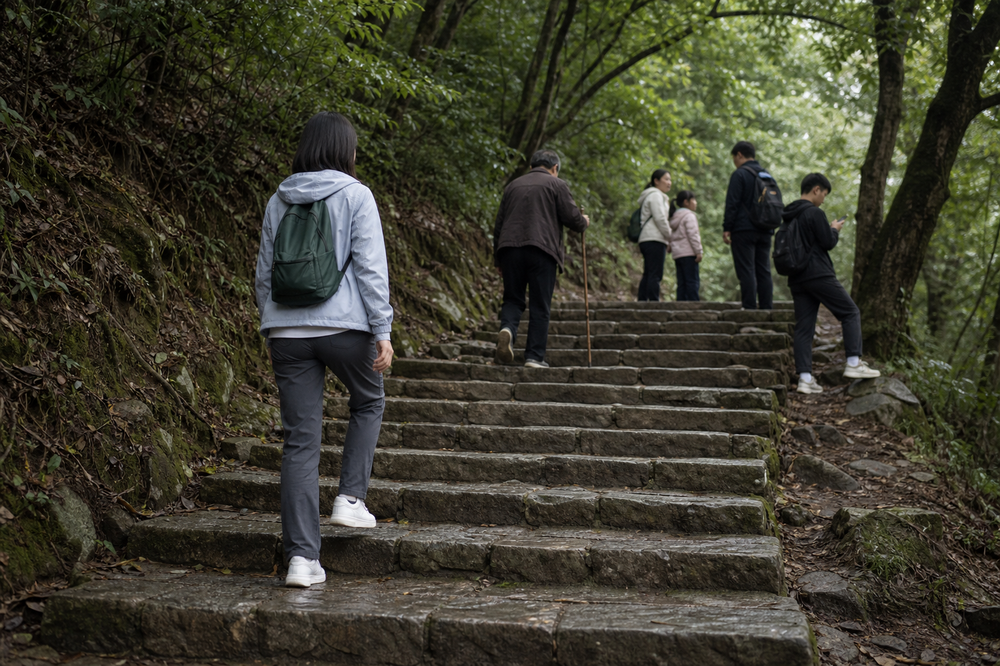
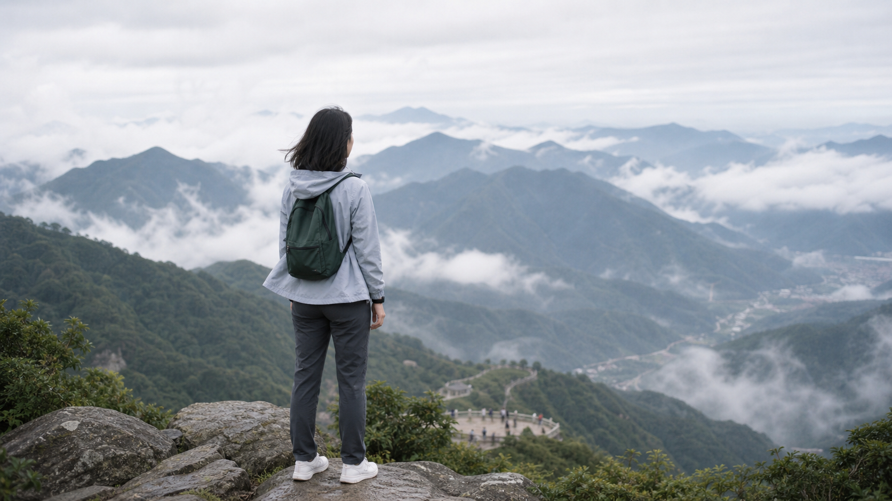
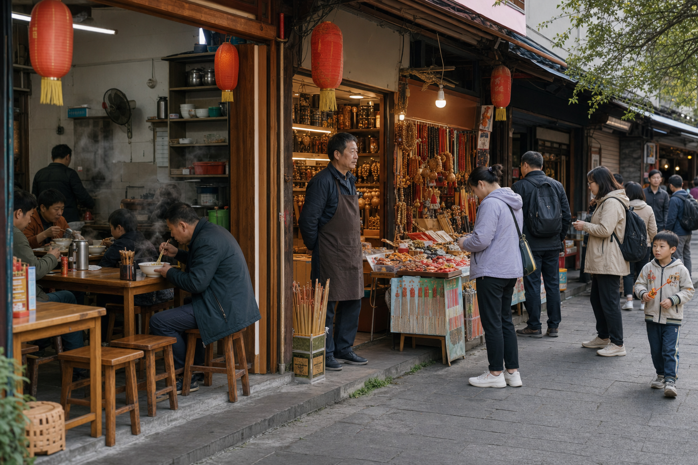
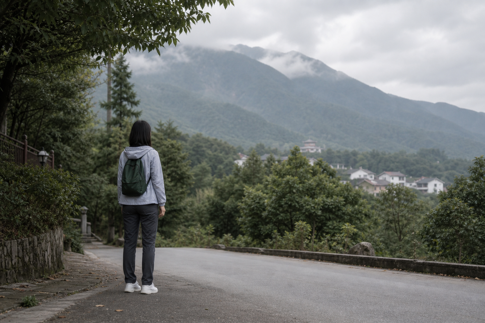

# 南岳衡山游记：山风替我，把心事吹慢了一点

一直觉得，去南岳衡山，不能只当成一次爬山。

它更像是一次把自己从日常里暂时抽出来的机会。  
把工作、焦虑、琐碎的事都先放一放，沿着山路往上走，走着走着，人也就安静下来了。

到南岳的时候，最先感受到的不是山，而是烟火气。

街边有卖香的铺子，有热气腾腾的米粉店，也有来来往往的游客。有人拖着行李，有人抱着孩子，有人一大早就已经买好了香，神色认真地往南岳大庙方向走。

那一刻我突然觉得，南岳最特别的地方，不只是风景，而是这里承载了很多人的愿望。

有人求平安，有人求顺利，有人求家人健康，也有人什么都不说，只是安静地走一走、拜一拜，好像心里就踏实了一些。

---

## 一、先去南岳大庙，看人间的愿望

南岳大庙是此行的第一站。

走进大庙，脚步会不自觉慢下来。红墙、青瓦、香炉、石阶，还有风吹过屋檐时发出的细微声响，都让人觉得时间变慢了。

这里没有想象中那么喧闹。

即使人很多，大家也都带着一种默契的安静。有人低头许愿，有人双手合十，有人站在一旁等家人。香火升起来的时候，空气里有一种很特别的味道，不刺鼻，反而让人有点安心。

我看着那些慢慢散开的烟，忽然想到一句话：

**很多愿望，说出口之前，其实已经在心里放了很久。**

来南岳的人，未必都能清楚说出自己想要什么。  
但至少在这一刻，大家都愿意相信：认真生活的人，应该被山听见一次。

---

## 二、上山的路，不只是去祝融峰

从山脚往上走，才真正开始感受到衡山的气质。

南岳衡山不像有些山那样锋利、陡峭，它更温和一些。山路一路向上，树影铺在台阶上，风从林子里吹过来，带着一点湿润的凉意。

刚开始爬的时候，还觉得自己挺有劲。  
走到后面，腿开始发酸，话也少了。

但奇怪的是，人一旦进入这种节奏，反而不太想抱怨。  
一步一步走，累是真的累，可心里也是真的清爽。

路上遇到很多人。

有年轻人一边爬一边拍照，有老人拄着登山杖慢慢往上走，也有一家人互相等着、喊着、笑着。山路把陌生人短暂地放在同一条线上，大家目标一致，都往更高的地方去。

这时候你会发现，爬山这件事很像生活。

看起来是奔着山顶去的，其实真正让人记住的，往往是中途那些喘气、停留、回头看的瞬间。

---

## 三、祝融峰上的风，把很多事吹开了

快到祝融峰的时候，风明显大了起来。

站在高处往远处看，山一层一层地铺开，云雾在山间慢慢移动。远处的房子、道路、人群，都变得很小。

人在山上，很容易生出一种奇妙的感觉：

原来那些让自己反复纠结的事，放到天地之间，其实也没有那么大。

风吹过来的时候，衣角被吹起来，头发也乱了。可我没有急着整理，只是站在那里看了很久。

那一刻没有什么特别宏大的感悟。  
只是觉得，能出来走走，能看到山，能感受到风，能暂时不被手机和消息追着跑，就已经很好了。

很多时候，我们不是需要一个答案。  
只是需要一个地方，让心慢慢平静下来。

南岳衡山就是这样的地方。

它不急着告诉你什么道理，只是让你走，让你看，让你在山风里把自己重新放轻一点。

---

## 四、山下的烟火气，也很动人

下山后，重新回到街上，又是另一种感觉。

山上的风清清冷冷，山下的人间却热热闹闹。  
米粉店里有人大口吃粉，香铺老板熟练地招呼客人，小摊前有人挑选纪念品，孩子拿着小玩意儿跑来跑去。

这种反差很有意思。

一边是山里的清静，一边是山下的烟火。  
一边是信仰和愿望，一边是吃饭、赶路、生活。

可南岳的好，恰恰就在这里。

它不是远离人间的山，而是一座和人间连在一起的山。  
你可以在这里许愿，也可以在这里吃一碗热粉；可以登高望远，也可以在街边慢慢闲逛。

它让人觉得，所谓修行，未必一定要离生活很远。  
认真吃饭，认真走路，认真对待心里的愿望，也是一种很朴素的修行。

---

## 五、离开南岳的时候，我带走了一点安静

离开的时候，我回头看了一眼衡山。

山还在那里，不说话，也不挽留。  
来的人一批又一批，走的人也一批又一批。每个人都带着自己的心事来，又带着一点新的力量离开。

这趟南岳之行，没有特别复杂的安排，也没有刻意追求打卡。

就是去大庙走了走，去山上吹了吹风，在山下吃了点东西，然后把一些乱七八糟的情绪，留给了山路和云雾。

如果你最近也觉得有点累，或者心里有些事情一直放不下，可以找个时间去一趟南岳衡山。

不一定非要想明白什么。  
也不一定非要求一个结果。

去看看山，吹吹风，走一段路。  
也许回来以后，你还是要面对原来的生活。

但你会发现，心里好像没那么堵了。

**南岳的风，未必能替你解决所有问题。  
但它会提醒你：慢一点，也没关系。**
