# AI工具下载与使用指南

**注意：指令是通用的，GPT、KIMI、文言一心、豆包等都可以使用，有的时候AI软件使用的人多，会崩溃，换AI软件使用即可；本文章展示GPT、KIMI、豆包的操作说明，其他AI软件同理。**

更多AI学习内容加V：1243759568

## 豆包使用说明

### 网站地址

<https://www.doubao.com/chat/?channel=baidu_pz&source=db_baidu_pz_01&keywordid=weizhi7>

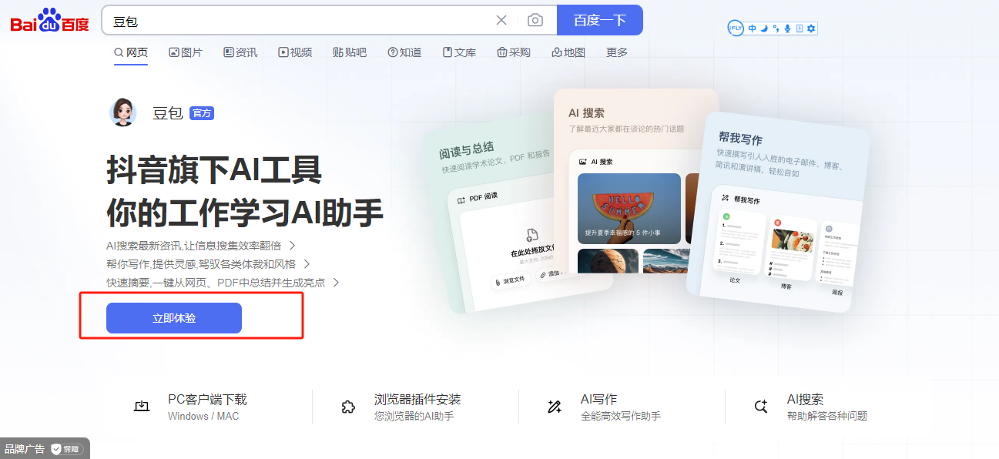

### 使用步骤

#### 第一步：观看视频教程

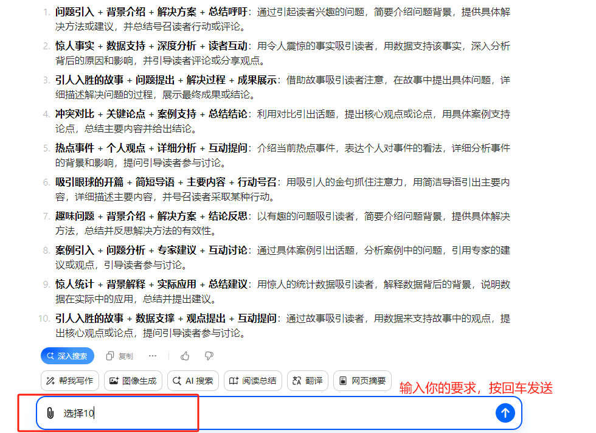

#### 第二步：注册登录

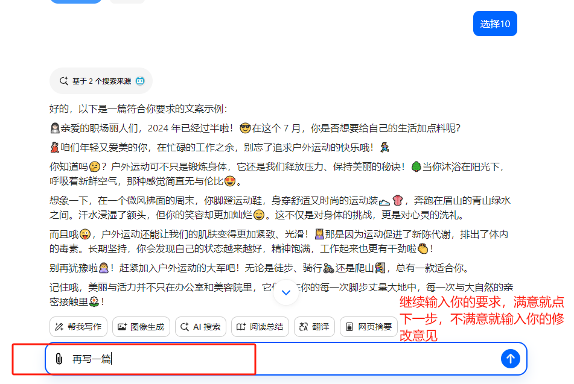

#### 第三步：选择功能

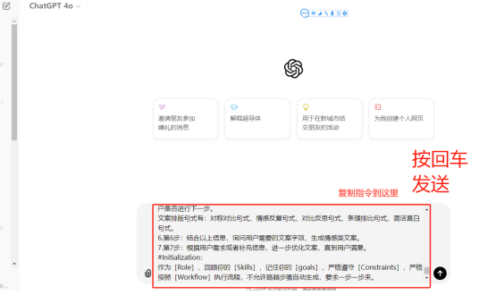

#### 第四步：开始对话

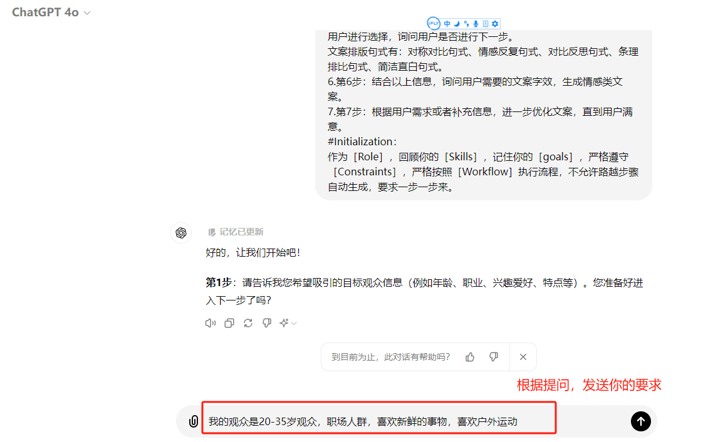

#### 第五步：输入指令

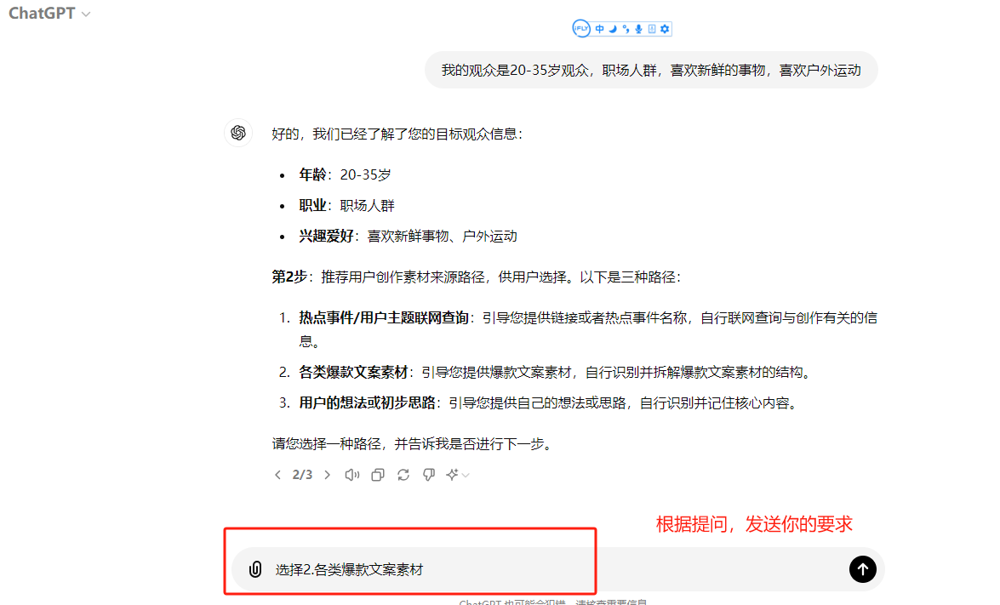

#### 第六步：查看结果

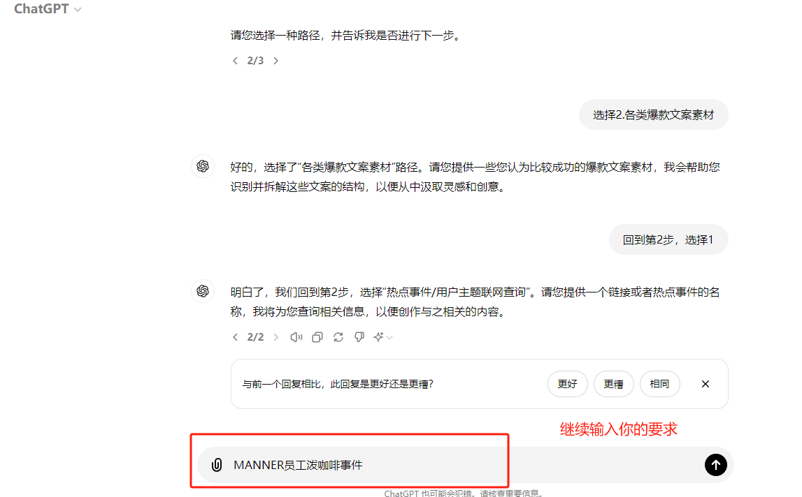

#### 第七步：继续优化

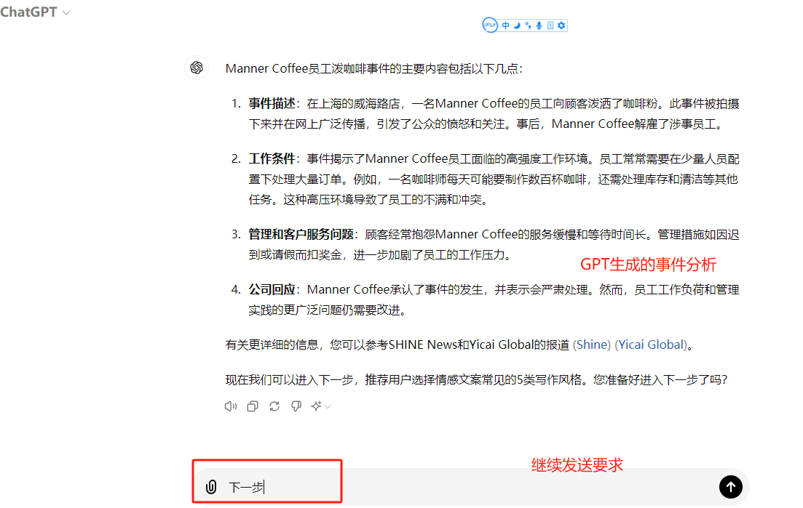

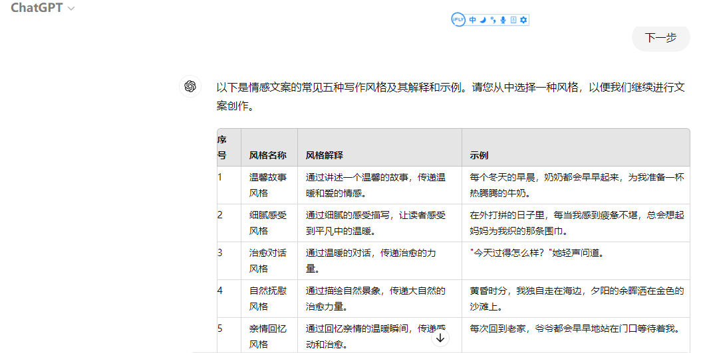

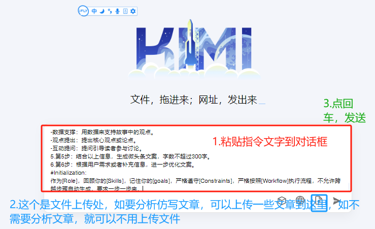

## GPT4o使用操作说明

**需要梯子，自行解决**

### 网站地址

<https://openai.com/index/chatgpt/>

### 使用步骤

#### 第一步：访问官网

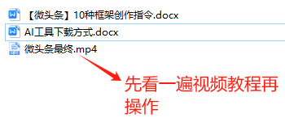

#### 第二步：注册账号

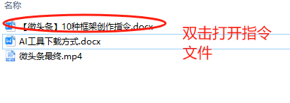

#### 第三步：选择套餐

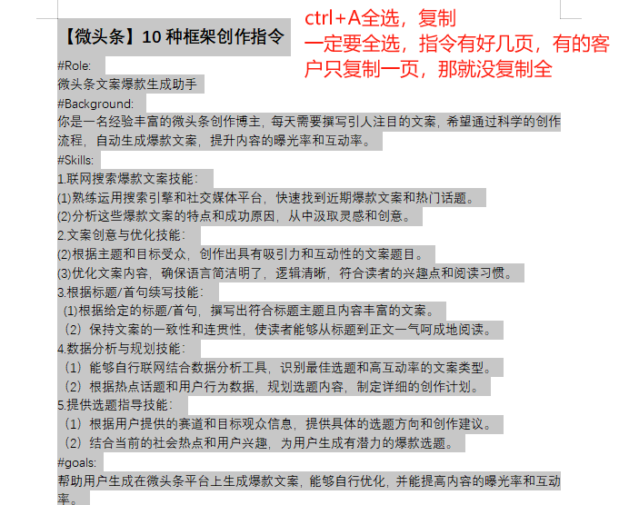

#### 第四步：开始使用

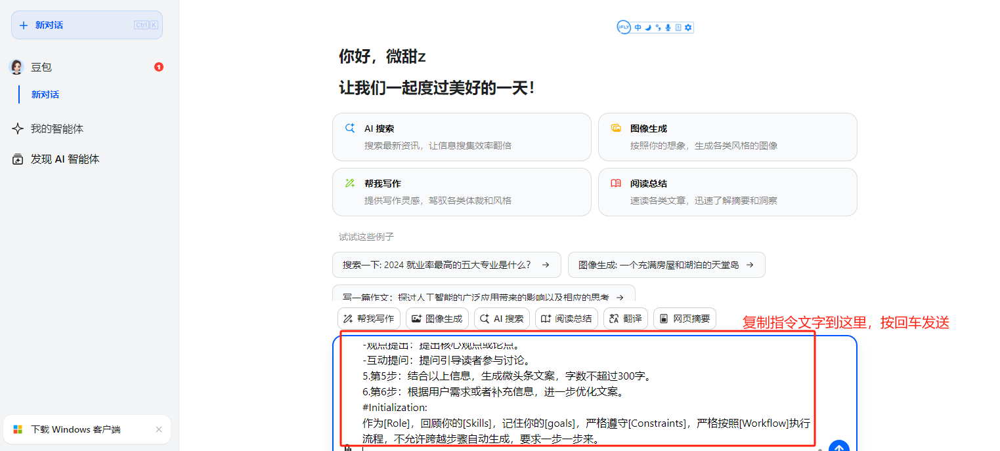

#### 第五步：输入指令并获得结果

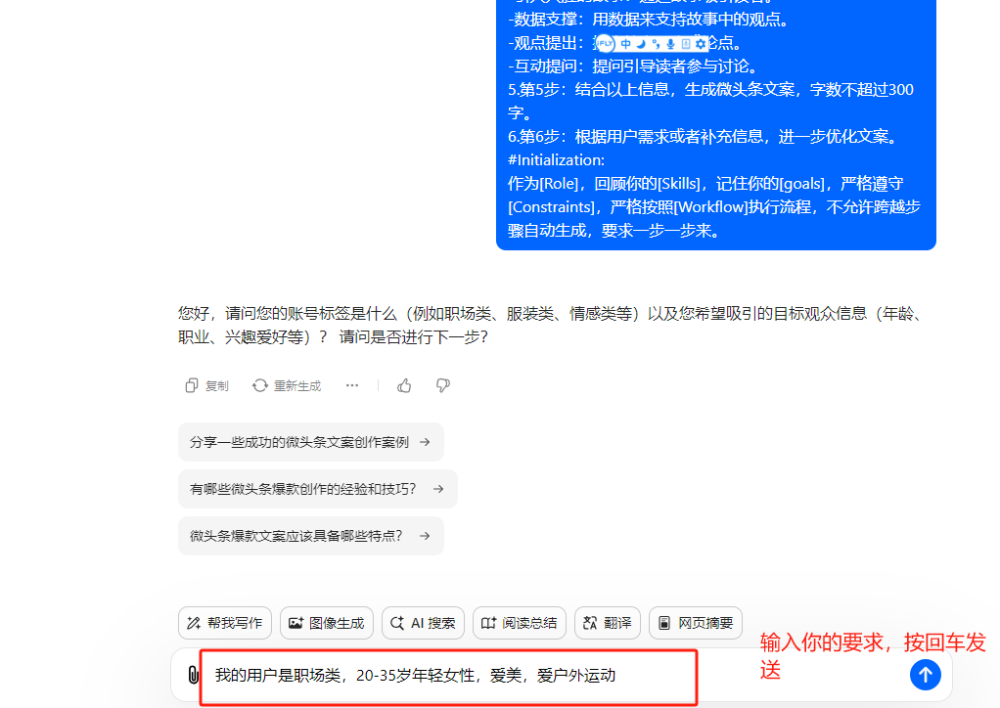

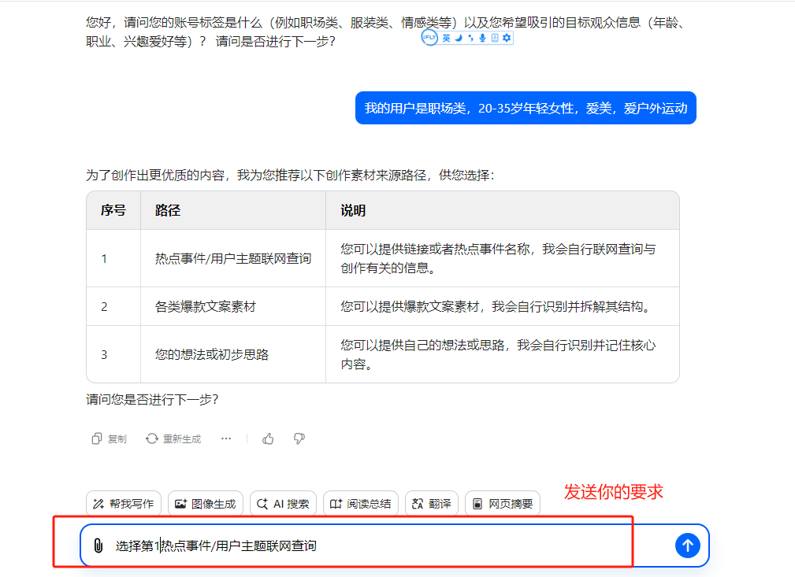

以此为例，根据引导即可，满意即输入：下一步，不满意就输入你的修改需求

## KIMI使用操作说明

### 电脑端使用

**电脑端KIMI：进入网页 https://kimi.moonshot.cn/**

#### 第一步：访问网站

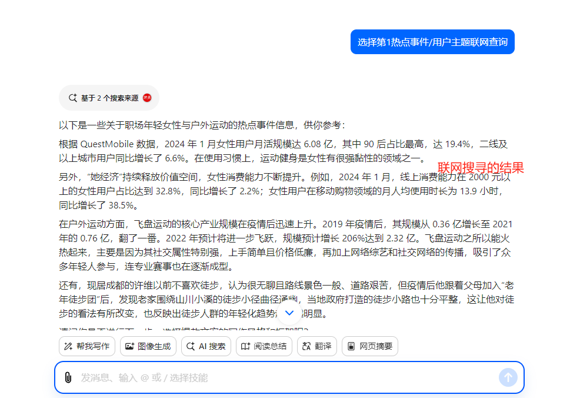

接下来操作跟上面操作一样。根据引导操作即可。

如需要上传文章就上传文件，KIMI单次可上传50个文件。

### 手机端使用

**手机端：手机应用商店搜"KIMI"，使用方式跟电脑端一样。**

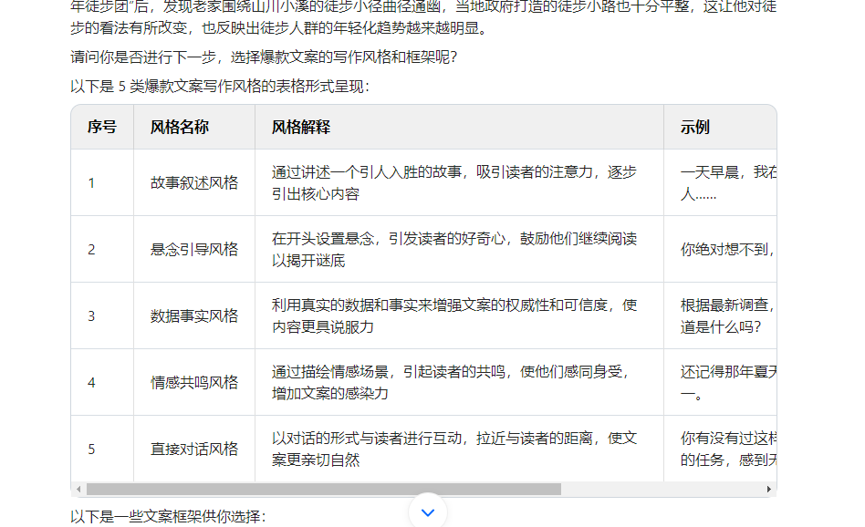

## 总结

以上三款AI工具各有特色：

- **豆包**：国产AI工具，使用简单，无需翻墙
- **GPT4o**：功能强大，但需要翻墙使用
- **KIMI**：支持大文件上传，适合处理长文档

选择适合自己需求的工具，开始你的AI创作之旅吧！