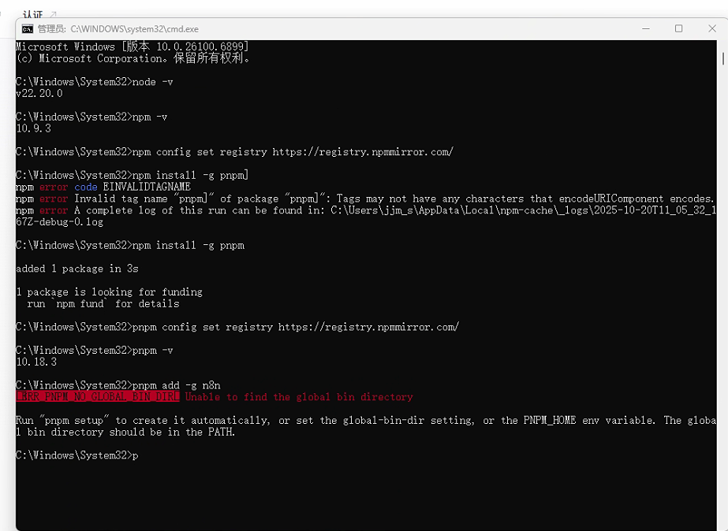

本教程将指导你如何在 Windows 10/11 操作系统上，**直接安装 Node.js**（不使用 nvm），并使用 `pnpm` 和淘宝镜像来安装 n8n，同时解决 `pnpm` 的全局路径配置问题。

## 准备工作

1. **管理员权限的终端**：
    
    - 点击 "开始" 菜单。
        
    - 输入 "PowerShell"。
        
    - 在搜索结果上右键，选择 "以管理员身份运行"。
        
    - **后续所有步骤，请全程使用这个管理员 PowerShell 窗口。**
        
2. **卸载旧的 Node.js (如果安装过)**：
    
    - 打开 "控制面板" -> "程序和功能"，如果列表里有 "Node.js"，请先将其卸载。
        

---

## 步骤一：安装 Node.js 和 npm

我们将直接从官网下载并安装 Node.js 的 LTS (长期支持) 版本。

1. **下载 Node.js**
    
    - 访问 Node.js 官方网站： [https://nodejs.org/](https://nodejs.org/)
        
    - 下载 "LTS" (长期支持) 版本的 Windows 安装程序 (`.msi` 文件)。
        
    - （例如 `20.x.x LTS` 版本）
        
1. **安装 Node.js**
    
    - 双击运行你下载的 `.msi` 文件。
        
    - 使用默认设置，一路点击 "Next" 完成安装。安装程序会自动将 `node` 和 `npm`添加到你的系统环境变量 (Path) 中。
        
2. **验证安装**
    
    - **关闭**你所有的终端窗口，然后**重新打开一个新的管理员 PowerShell 窗口**（这一步是为了让系统加载新的环境变量）。
        
    - 在新的管理员窗口中输入：
        
    
    PowerShell
    
    ```
    node -v
    # 应显示你安装的版本，如 v20.10.0
    
    npm -v
    # 应显示 npm 的版本，如 10.2.3
    ```
    

## 步骤二：配置镜像并安装 pnpm

现在你的系统已经有了 `npm`，我们用它来安装 `pnpm`。

1. **配置 npm 使用淘宝镜像**
    
    - 在你的管理员 PowerShell 窗口中，执行：
        
    
    PowerShell
    
    ```
    npm config set registry https://registry.npmmirror.com/
    ```
    
2. **使用 npm 全局安装 pnpm**
    
    - 执行以下命令来安装 `pnpm`：
        
    
    PowerShell
    
    ```
    npm install -g pnpm
    ```
    

## 步骤三：配置 pnpm 环境 (解决截图中的报错)


这是**最关键的一步**，用于解决你截图中遇到的 `ERROR PNPM_GLOBAL_BIN_DIR` 错误。`pnpm` 需要设置自己的全局安装路径。

1. **运行 pnpm setup**
    
    - 安装完 pnpm 后，运行以下命令：
        
    
    PowerShell
    
    ```
    pnpm setup
    ```
    
    - 这个命令会自动创建 `pnpm` 需要的目录，并将该目录添加到你的系统环境变量 (Path) 中。
        
2. **重启终端 (必须！)**
    
    - `pnpm setup` 修改了环境变量，但这些更改只对**新打开**的终端窗口生效。
        
    - **请再次关闭你当前的管理员 PowerShell 窗口，然后重新打开一个新的管理员 PowerShell 窗口。**
        
3. **验证 pnpm**
    
    - 在**新打开的**管理员窗口中，验证 `pnpm` 是否已可用：
        
    
    PowerShell
    
    ```
    pnpm -v
    # 应显示 pnpm 的版本号，如 10.18.3
    ```
    

## 步骤四：使用 pnpm 全局安装 n8n

现在 `pnpm` 环境已经准备就绪，我们可以正式安装 n8n 了。

1. **配置 pnpm 使用淘宝镜像**
    
    - （这是一个好习惯）在你的管理员 PowerShell 窗口中，执行：
        
    
    PowerShell
    
    ```
    pnpm config set registry https://registry.npmmirror.com/
    ```
    
2. **执行安装 n8n 命令**
    
    - 现在，再次运行你之前失败的命令：
        
    
    PowerShell
    
    ```
    pnpm add -g n8n
    ```
    
    - 由于你已经运行了 `pnpm setup` 并重启了终端，这次命令应该会顺利执行并成功安装 n8n。
        

## 步骤五：启动 n8n 并配置防火墙

1. **启动 n8n**
    
    - 安装完成后，在**任何终端窗口** (管理员或非管理员均可) 中输入启动命令：
        
    
    PowerShell
    
    ```
    n8n
    ```
    
2. **处理 Windows 防火墙弹窗 (关键！)**
    
    - 当你第一次运行 `n8n` 时，Windows 防火墙很可能会弹出一个 "Windows 安全警报"。
        
    - 你**必须**勾选 "**专用网络**" (如家庭或工作网络)。
        
    - 点击 "**允许访问**"。
        
3. **访问 n8n 界面**
    
    - 当终端显示以下信息时，说明 n8n 已经成功启动：
        
    
    ```
    n8n ready on 0.0.0.0, port 5678
    Editor is now available on: http://localhost:5678
    ```
    
    - 打开你的浏览器 (Chrome, Edge 等)，访问地址：`http://localhost:5678`
        
    - 首次访问会引导你设置所有者账户，完成后即可开始使用。
        

---

## 常用问题解答 (FAQ)

**Q1: 我输入 `pnpm` 或 `n8n` 时，提示 `command not found` (命令未找到)？**

- **A**: 99% 的原因是终端没有重新打开。
    
    - **解决方法**：在你安装完 `node` 或运行完 `pnpm setup` 后，**必须关闭当前所有 PowerShell/CMD 窗口，然后重新打开一个新的**。
        

**Q2: 启动 n8n 时报错，提示端口 `5678` 已被占用 (Error: listen EADDRINUSE)？**

- **A**: 说明你电脑上已有其他程序占用了 `5678` 端口。
    
    - **解决方法**：启动 n8n 时指定一个新端口，例如 `5679`：
        
        PowerShell
        
        ```
        n8n --port=5679
        ```
        
    - 然后访问 `http://localhost:5679`。
        

**Q3: n8n 启动了，但我局域网内的其他电脑 (如手机) 无法访问 `http://我的电脑IP:5678`？**

- **A**: 这是 Windows 防火墙问题。
    
    - **解决方法**：确保你在步骤五的防火墙弹窗中，勾选了 "**专用网络**" 并点击了 "**允许访问**"。如果错过了，你需要去 "高级安全的 Windows Defender 防火墙" -> "入站规则" 中，找到 "Node.js" 相关的规则，确保它对 "专用" 网络是启用的。
        

**Q4: 如何更新 n8n 到最新版本？**

- **A**: 在**管理员 PowerShell** 窗口中，执行 `pnpm` 的更新命令：
    
    PowerShell
    
    ```
    pnpm up -g n8n
    ```