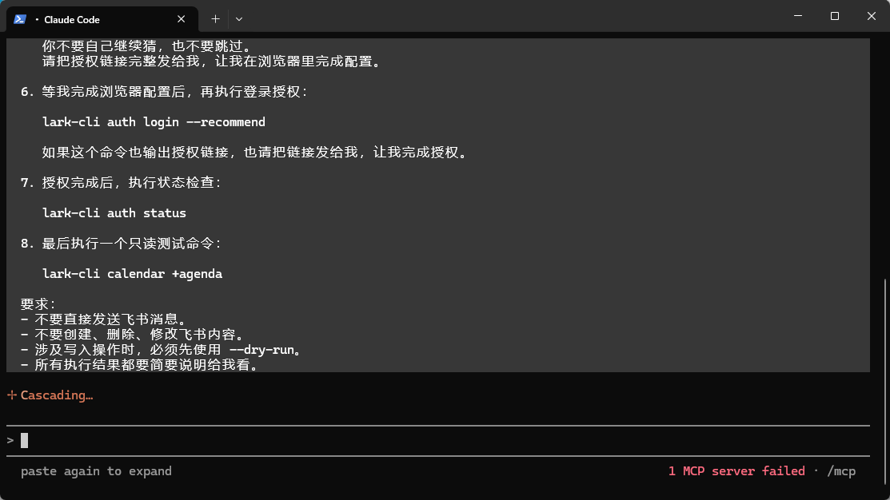
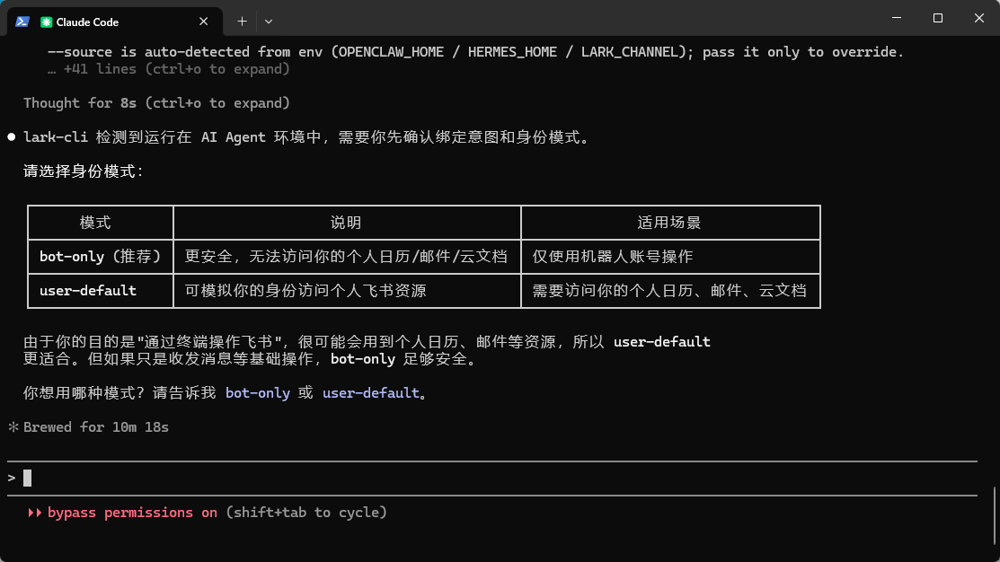
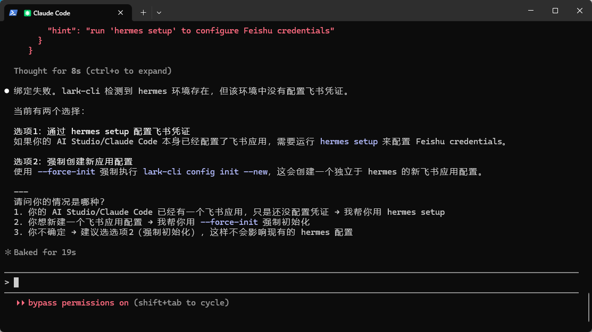
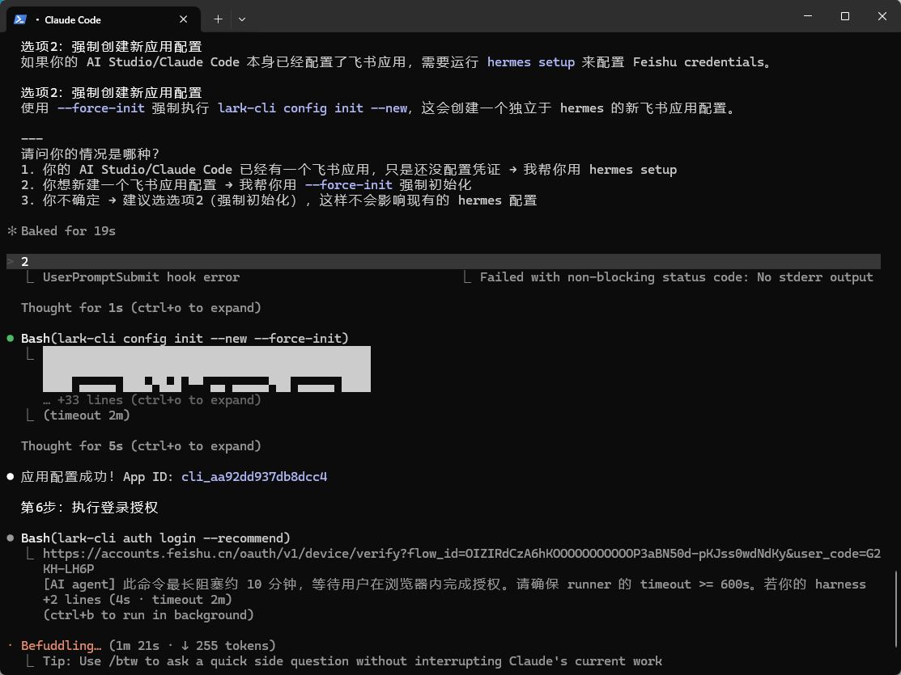
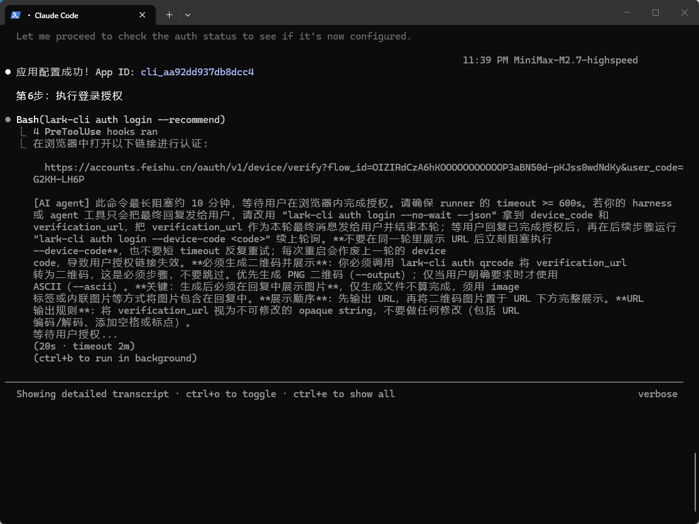
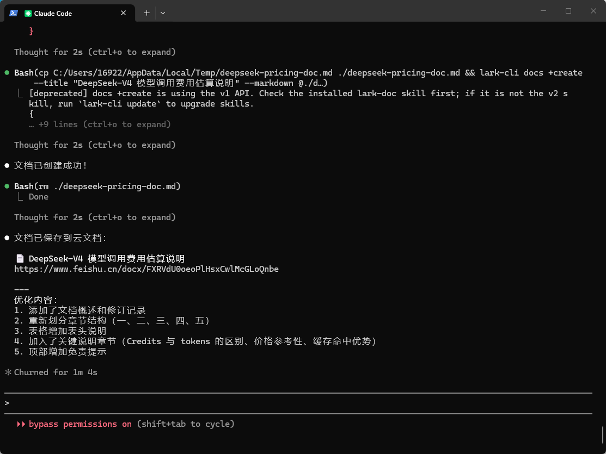
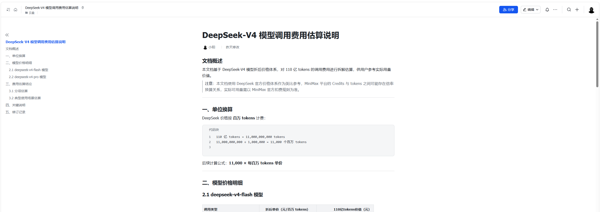

# 飞书 CLI 授权与 AI 文档生成图文教程

> 适用场景：夜校课堂教学  
> 课件用途：带学生理解“AI Agent 如何通过 `lark-cli` 安全访问飞书资源，并把 Markdown 内容生成飞书云文档”  
> 建议课时：50-70 分钟  
> 上课时间参考：2026 年 5 月 30 日中午

---

## 0. 课程导入

这组截图记录了一次完整的实操链路：

1. 明确授权规则：不要猜链接，不要跳过浏览器授权。
2. 选择身份模式：`bot-only` 或 `user-default`。
3. 处理环境配置问题：`hermes` 环境下缺少飞书凭证。
4. 初始化新的飞书应用配置：使用 `--force-init`。
5. 浏览器授权：通过飞书 OAuth 链接完成登录认证。
6. 验证授权状态：使用只读命令确认配置成功。
7. 生成飞书云文档：把 Markdown 文档上传为飞书文档。
8. 查看最终文档：确认标题、目录、正文、表格等内容生成成功。

本课的核心不是“背命令”，而是让学生理解一条工程化思路：

> 先安全授权，再最小化验证，最后自动化产出。

---

## 1. 教学目标

学完本课，学生应能做到：

- 说清楚 `lark-cli` 在 AI Agent 工作流中的作用。
- 区分 `bot-only` 与 `user-default` 两种身份模式。
- 理解为什么访问个人日历、邮件、云文档时需要用户授权。
- 能根据终端提示完成飞书浏览器授权。
- 能使用只读命令检查授权是否成功。
- 能把本地 Markdown 文档生成为飞书云文档。
- 能识别常见错误提示，并知道下一步该如何处理。

---

## 2. 课前准备

教师演示环境建议准备：

- Windows 电脑。
- Claude Code 或类似 AI Agent 终端环境。
- 已安装 `lark-cli`。
- 可登录的飞书账号。
- 浏览器能打开 `accounts.feishu.cn` 授权链接。
- 至少准备一个 Markdown 文件，用于演示创建飞书云文档。

学生跟练环境建议：

- 先观察教师演示，不要求所有学生立即配置真实账号。
- 若学生需要实操，建议使用测试飞书账号或课堂专用空间。
- 涉及个人日历、邮件、云文档时，必须提醒学生注意隐私与权限。

---

## 3. 图片总览

| 图片 | 教学环节 | 重点 |
|---|---|---|
| 图 1 | 授权前的安全要求 | 不猜链接、不跳过浏览器授权、先只读测试 |
| 图 2 | 选择身份模式 | `bot-only` 与 `user-default` 的区别 |
| 图 3 | 配置失败诊断 | `hermes` 环境存在但没有飞书凭证 |
| 图 4 | 强制初始化并发起授权 | `config init --new --force-init` 与 `auth login --recommend` |
| 图 5 | 浏览器授权等待中 | 设备授权链接与超时注意事项 |
| 图 6 | 创建飞书云文档 | 使用 Markdown 生成云文档并返回链接 |
| 图 7 | 查看最终文档 | 生成后的文档结构和教学成果 |

---

## 4. 第一部分：授权前先立规则



### 4.1 图中发生了什么

图 1 展示的是 AI Agent 在继续执行之前，先明确授权和安全要求。终端里出现了几个关键动作：

```bash
lark-cli auth login --recommend
```

用于发起推荐方式的飞书登录授权。

```bash
lark-cli auth status
```

用于检查当前授权状态。

```bash
lark-cli calendar +agenda
```

用于读取日程，属于只读测试命令。

### 4.2 课堂讲解重点

这一页适合作为开场安全规范。

教师可以强调：

- 授权链接必须完整复制到浏览器中打开。
- 不要让 AI 自己“猜测”授权是否完成。
- 不要跳过浏览器授权步骤。
- 授权完成后，先用 `auth status` 检查状态。
- 涉及写入、修改、删除数据时，优先使用 `--dry-run` 或先做只读验证。
- 首次配置时，先用 `calendar +agenda` 这类只读命令确认权限链路可用。

### 4.3 给学生的理解方式

可以把整个流程类比成：

> AI Agent 是操作员，`lark-cli` 是工具，飞书账号是门禁卡。  
> 操作员想进入你的日历、文档、邮件，必须先拿到你明确授权的门禁卡。

### 4.4 课堂提问

- 为什么不能直接把飞书账号密码告诉 AI？
- 为什么授权后还要执行 `auth status`？
- 为什么第一次测试最好使用只读命令？

---

## 5. 第二部分：选择身份模式



### 5.1 图中发生了什么

图 2 显示 `lark-cli` 检测到当前运行在 AI Agent 环境中，因此要求用户先确认“绑定意图”和“身份模式”。

界面中给出了两种模式：

| 模式 | 说明 | 适用场景 |
|---|---|---|
| `bot-only` | 更安全，无法访问个人日历、邮件、云文档 | 只使用机器人账号操作 |
| `user-default` | 可模拟用户身份访问个人飞书资源 | 需要访问个人日历、邮件、云文档 |

### 5.2 教学判断

如果课堂目标是“通过 AI 读取或创建个人飞书资源”，例如：

- 查看自己的日程。
- 创建个人云文档。
- 搜索个人云空间文件。
- 操作个人邮箱或任务。

那么通常选择：

```text
user-default
```

如果课堂目标只是让机器人发群消息，或操作不涉及个人资源的数据，那么更推荐：

```text
bot-only
```

### 5.3 教师提示词

可以这样对学生解释：

> `bot-only` 更像“公司机器人账号”，权限边界更窄。  
> `user-default` 更像“你本人授权给工具”，能力更强，但也更需要注意隐私和范围。

### 5.4 常见误区

- 误区 1：认为 `bot-only` 一定能访问自己的文档。  
  实际上它通常不能访问个人资源。

- 误区 2：认为 `user-default` 不安全。  
  它不是天然不安全，而是权限更接近本人账号，必须认真管理授权范围。

- 误区 3：不知道选哪个。  
  课堂演示“访问个人飞书资源”时，优先选择 `user-default`。

---

## 6. 第三部分：遇到配置失败时如何判断



### 6.1 图中发生了什么

图 3 中出现了绑定失败提示：

```text
lark-cli 检测到 hermes 环境存在，但该环境中没有配置飞书凭证。
```

这说明当前不是命令输错了，而是运行环境中缺少飞书 credentials，也就是缺少能让 `lark-cli` 调用飞书 API 的应用凭证。

终端给出两个解决方向：

1. 如果 AI Studio 或 Claude Code 已经配置过飞书应用，只是缺少凭证，可以运行：

```bash
hermes setup
```

2. 如果要创建一个新的飞书应用配置，可以运行：

```bash
lark-cli config init --new --force-init
```

### 6.2 课堂讲解重点

这里要教学生学会看错误提示，而不是看到失败就重装。

判断逻辑如下：

| 现象 | 含义 | 处理方式 |
|---|---|---|
| 检测到 `hermes` 环境 | 当前在 AI Agent 集成环境里 | 不一定是坏事 |
| 没有飞书凭证 | 当前环境还不能调用飞书 API | 需要配置 credentials |
| 已经有飞书应用 | 只是缺少凭证 | 运行 `hermes setup` |
| 需要新建应用配置 | 不想影响已有环境 | 运行 `config init --new --force-init` |

### 6.3 本次截图选择的路径

截图中选择的是第 2 种：

```text
2
```

也就是强制创建新的应用配置。

这适合课堂演示，因为它更独立，不容易影响学生或教师已有的其他配置。

---

## 7. 第四部分：强制初始化新应用并发起登录



### 7.1 图中发生了什么

图 4 展示了选择方案 2 后，AI Agent 执行了：

```bash
lark-cli config init --new --force-init
```

随后终端显示应用配置成功，并出现类似：

```text
应用配置成功！App ID: cli_xxx
```

然后进入第 6 步：

```bash
lark-cli auth login --recommend
```

该命令会生成一个飞书浏览器授权链接。

### 7.2 命令解释

```bash
lark-cli config init --new --force-init
```

含义：

- `config init`：初始化配置。
- `--new`：创建新的配置。
- `--force-init`：强制初始化，避免卡在旧配置上。

```bash
lark-cli auth login --recommend
```

含义：

- 发起登录授权。
- 让工具根据当前环境推荐合适的授权方式。
- 通常会输出一个需要在浏览器中打开的飞书链接。

### 7.3 课堂提醒

教师演示时不要把真实的 App ID、授权链接、验证码长期展示给学生记录。  
这些内容通常有时效性，也可能和账号权限相关。

可以告诉学生：

> 看到 `App ID` 说明“应用配置”这一步完成了；  
> 看到飞书授权链接，说明接下来要进入浏览器授权。

---

## 8. 第五部分：浏览器授权



### 8.1 图中发生了什么

图 5 显示 `auth login --recommend` 已经输出了飞书授权链接，并提示：

- 在浏览器中打开链接进行认证。
- 命令会等待用户在浏览器内完成授权。
- 授权链接通常有时间限制。
- 不要反复刷新或重复生成多个授权链接。

### 8.2 学生操作步骤

1. 复制终端里完整的授权链接。
2. 打开浏览器。
3. 粘贴链接并访问。
4. 使用飞书账号登录。
5. 确认授权。
6. 回到终端，等待命令继续执行。

### 8.3 教师强调

这一页要讲清楚两个安全点：

第一，授权链接不要随意发给别人。  
它代表当前这次授权流程。

第二，不要修改授权链接。  
链接中的参数是完整流程的一部分，改一个字符都可能导致失败。

### 8.4 常见问题

| 问题 | 可能原因 | 解决方式 |
|---|---|---|
| 链接打不开 | 网络、浏览器或账号环境问题 | 换浏览器，确认能访问飞书 |
| 授权后终端没反应 | 终端还在等待或超时 | 等待几秒，必要时重新执行登录命令 |
| 提示超时 | 授权太慢 | 重新运行 `lark-cli auth login --recommend` |
| 多次生成链接后混乱 | 链接不是同一轮流程 | 使用最新那一个链接 |

---

## 9. 第六部分：检查授权状态

授权完成后，不要急着执行写入操作。先检查状态：

```bash
lark-cli auth status
```

如果状态正常，再执行一个只读测试：

```bash
lark-cli calendar +agenda
```

### 9.1 为什么先做只读测试

只读测试的价值是：

- 不会修改飞书数据。
- 能确认账号、应用、权限、网络链路都正常。
- 出问题时容易定位。

### 9.2 教师演示建议

可以按这个节奏讲：

1. `auth status` 看“有没有登录成功”。
2. `calendar +agenda` 看“能不能读取个人资源”。
3. 确认成功后，再进入创建文档等写入动作。

---

## 10. 第七部分：用 Markdown 创建飞书云文档



### 10.1 图中发生了什么

图 6 展示 AI Agent 将一个 Markdown 文件创建为飞书云文档。

截图里可以看到类似命令结构：

```bash
lark-cli docs +create --title "DeepSeek-V4 模型调用费用估算说明" --markdown @./deepseek-pricing-doc.md
```

执行成功后，终端返回：

```text
文档已创建成功！
文档已保存至云文档：
DeepSeek-V4 模型调用费用估算说明
https://www.feishu.cn/docx/...
```

### 10.2 命令解释

```bash
lark-cli docs +create
```

创建一篇飞书云文档。

```bash
--title "DeepSeek-V4 模型调用费用估算说明"
```

指定文档标题。

```bash
--markdown @./deepseek-pricing-doc.md
```

把本地 Markdown 文件作为正文内容导入。

### 10.3 为什么用 Markdown

Markdown 适合课堂教学和 AI 生成内容，因为它：

- 结构清晰。
- 容易写标题、列表、表格、代码块。
- 便于版本管理。
- 很适合从 AI 输出转换成正式文档。

### 10.4 推荐的 Markdown 文档结构

```markdown
# 文档标题

## 文档概述

说明这个文档解决什么问题。

## 一、背景

解释为什么要做这件事。

## 二、计算方法

列出公式、单位换算、关键参数。

## 三、结果表格

| 项目 | 数值 | 说明 |
|---|---:|---|
| 示例 | 100 | 示例说明 |

## 四、注意事项

列出风险、假设和限制。

## 五、修订记录

记录日期、修改人、修改内容。
```

---

## 11. 第八部分：查看最终生成的飞书文档



### 11.1 图中发生了什么

图 7 是生成后的飞书云文档页面。可以看到文档标题为：

```text
DeepSeek-V4 模型调用费用估算说明
```

左侧有自动生成的目录，正文中包含：

- 文档概述。
- 单位换算。
- 模型价格明细。
- 费用估算结论。
- 关键说明。
- 修订记录。

正文中还包含代码块和表格，这说明 Markdown 内容已经被正确转换成了飞书文档结构。

### 11.2 课堂讲解重点

这一页可以用来告诉学生：

> AI 不只是能回答问题，还能把结构化内容直接产出到真实办公系统里。

也可以强调：

- 标题层级会影响左侧目录。
- 表格适合展示价格、参数、对比信息。
- 代码块适合展示公式、命令、换算过程。
- 文档生成后仍然可以在飞书中二次编辑和分享。

### 11.3 本例中的文档主题

本例创建的是一篇“模型调用费用估算说明”。  
文档里使用“tokens”“百万 tokens”“110 亿 tokens”等概念做费用估算。

这类文档适合用来演示：

- AI 生成专业说明文。
- Markdown 转云文档。
- 表格化展示计算结果。
- 把一次性问答沉淀为可分享资料。

---

## 12. 完整实操流程

下面是一条适合课堂演示的完整流程。

### 12.1 确认身份模式

如果需要访问个人飞书资源，选择：

```text
user-default
```

如果只需要机器人能力，选择：

```text
bot-only
```

### 12.2 初始化配置

如果提示缺少飞书凭证，并且你希望创建独立的新配置：

```bash
lark-cli config init --new --force-init
```

### 12.3 发起登录授权

```bash
lark-cli auth login --recommend
```

复制终端输出的飞书授权链接，到浏览器完成授权。

### 12.4 检查授权状态

```bash
lark-cli auth status
```

### 12.5 执行只读测试

```bash
lark-cli calendar +agenda
```

### 12.6 准备 Markdown 文档

示例文件名：

```text
deepseek-pricing-doc.md
```

### 12.7 创建飞书文档

```bash
lark-cli docs +create --title "DeepSeek-V4 模型调用费用估算说明" --markdown @./deepseek-pricing-doc.md
```

### 12.8 打开返回链接检查结果

重点检查：

- 标题是否正确。
- 目录是否生成。
- 正文层级是否清楚。
- 表格是否完整。
- 代码块是否保留格式。
- 是否需要补充说明或修订记录。

---

## 13. 课堂演示脚本

### 13.1 开场 5 分钟

教师说：

> 今天我们不只是看 AI 怎么回答问题，而是看 AI 怎么进入真实办公流程：  
> 它会通过命令行工具连接飞书，完成授权，然后把一份 Markdown 文档生成到飞书云文档里。

展示图 1，强调安全规则。

### 13.2 身份模式 10 分钟

展示图 2。

教师提问：

> 如果我要让 AI 读取我的日程，应该选 `bot-only` 还是 `user-default`？

引导学生得出：

```text
user-default
```

再追问：

> 如果只是机器人发群通知呢？

引导学生得出：

```text
bot-only
```

### 13.3 错误诊断 10 分钟

展示图 3。

教师说：

> 这里失败不是坏事，它给了我们非常明确的信息：环境存在，但凭证没有配置。

带学生读出两个方案：

- `hermes setup`
- `lark-cli config init --new --force-init`

说明本次课堂选择第二种方案，因为它适合独立演示。

### 13.4 授权实操 15 分钟

展示图 4 和图 5。

依次讲：

1. 初始化应用配置。
2. 生成授权链接。
3. 浏览器打开链接。
4. 飞书账号确认授权。
5. 回到终端等待完成。

课堂提醒：

> 授权链接不要发到群里，不要截图传播，不要改链接参数。

### 13.5 文档生成 15 分钟

展示图 6 和图 7。

教师演示：

1. 准备 Markdown。
2. 执行 `docs +create`。
3. 打开飞书链接。
4. 检查标题、目录、表格、代码块。

最后总结：

> 这就是从“AI 生成内容”到“办公系统可用成果”的完整闭环。

---

## 14. 学生练习

### 练习 1：判断身份模式

请判断下面场景应该使用哪种模式：

| 场景 | 推荐模式 |
|---|---|
| 查看自己的今天日程 | `user-default` |
| 创建自己的飞书云文档 | `user-default` |
| 机器人向固定群发送通知 | `bot-only` |
| 搜索自己的云空间文件 | `user-default` |
| 只做服务端自动任务 | `bot-only` |

### 练习 2：读错误提示

看到下面提示时，应该怎么处理？

```text
hermes 环境存在，但该环境中没有配置飞书凭证
```

参考答案：

- 如果已有飞书应用，只是缺少凭证，运行 `hermes setup`。
- 如果要创建独立新配置，运行 `lark-cli config init --new --force-init`。

### 练习 3：设计一篇 Markdown 文档

让学生设计一个可上传到飞书的 Markdown 文档结构，主题可以任选：

- 课程签到说明。
- 班级作业提交规范。
- AI 工具使用注意事项。
- 某个模型调用费用估算。
- 本周学习总结。

要求包含：

- 一级标题。
- 至少 3 个二级标题。
- 至少 1 个表格。
- 至少 1 个代码块或命令块。
- 至少 1 段注意事项。

---

## 15. 常见问题与处理

### Q1：为什么 `bot-only` 不能访问我的个人文档？

因为 `bot-only` 使用的是机器人身份，不等于你本人。个人文档、个人日历、个人邮箱通常需要用户身份授权。

### Q2：为什么授权链接要用浏览器打开？

因为飞书需要确认“是账号本人在授权”。浏览器登录和确认动作是权限安全的一部分。

### Q3：为什么授权后还要检查状态？

因为浏览器授权成功，不代表本地命令行一定已经正确拿到并保存授权状态。`auth status` 可以帮助确认。

### Q4：为什么先跑只读命令？

只读命令不会改数据，适合验证账号、权限、网络和配置是否正常。

### Q5：创建文档失败怎么办？

先检查：

- 是否已经完成 `auth login`。
- `auth status` 是否正常。
- Markdown 文件路径是否正确。
- `--markdown @文件名` 的 `@` 是否保留。
- 当前身份是否有创建云文档权限。
- 如果命令提示版本过旧，先执行 `lark-cli update`。

### Q6：飞书文档生成后格式不理想怎么办？

优先检查 Markdown 原文：

- 标题层级是否正确。
- 表格分隔线是否完整。
- 代码块是否使用三个反引号。
- 列表前后是否有空行。
- 超长表格是否需要拆分。

---

## 16. 板书提纲

```text
AI Agent + lark-cli + 飞书 = 自动化办公工作流

一、先授权
  lark-cli auth login --recommend

二、选身份
  bot-only：机器人身份，更安全，权限较窄
  user-default：用户身份，可访问个人资源

三、查状态
  lark-cli auth status

四、只读测试
  lark-cli calendar +agenda

五、创建文档
  lark-cli docs +create --title "标题" --markdown @文件.md

核心原则：
  不猜链接
  不跳过授权
  不先做危险写入
  先验证，再产出
```

---

## 17. 课堂总结

这节课的完整链路可以压缩成一句话：

> 通过 `lark-cli` 完成飞书授权，让 AI Agent 在明确权限边界内，把本地 Markdown 内容自动生成到飞书云文档。

本课最重要的三个能力：

1. 会授权：理解并完成浏览器 OAuth 授权。
2. 会判断：知道什么时候用 `bot-only`，什么时候用 `user-default`。
3. 会产出：能把 Markdown 转成结构清晰的飞书云文档。

---

## 18. 课后作业

请学生完成以下任务：

1. 写一篇 Markdown 文档，主题为“我的 AI 学习计划”。
2. 文档必须包含标题、目录结构、表格和注意事项。
3. 如果有飞书测试环境，尝试使用 `lark-cli docs +create` 创建为飞书云文档。
4. 提交内容包括：
   - Markdown 原文。
   - 飞书文档截图。
   - 遇到的问题和解决过程。

---

## 19. 教师备忘

上课时建议注意：

- 不展示可复用的真实授权链接。
- 不让学生把个人账号授权给不可信环境。
- 演示写入操作前先确认空间和权限。
- 如果现场网络不稳定，提前准备图 1 到图 7 作为离线讲解材料。
- 如果 `lark-cli docs +create` 提示接口版本或技能版本过旧，先检查是否需要更新 `lark-cli` 或相关技能。

---

## 20. 一句话复盘

```text
安全授权 -> 状态检查 -> 只读验证 -> Markdown 生成飞书文档 -> 浏览器确认成果
```

