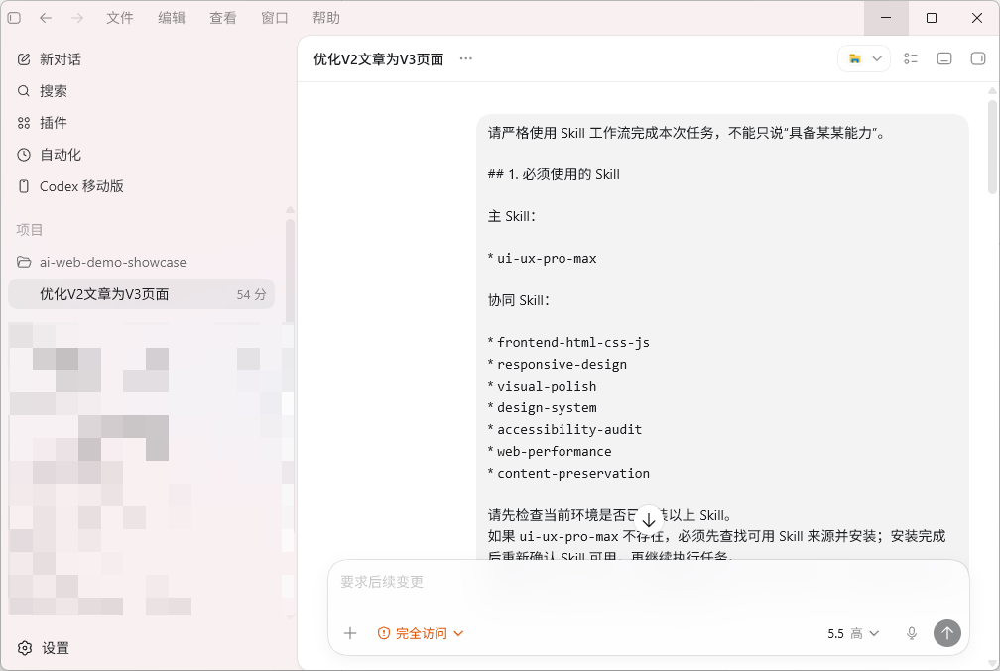
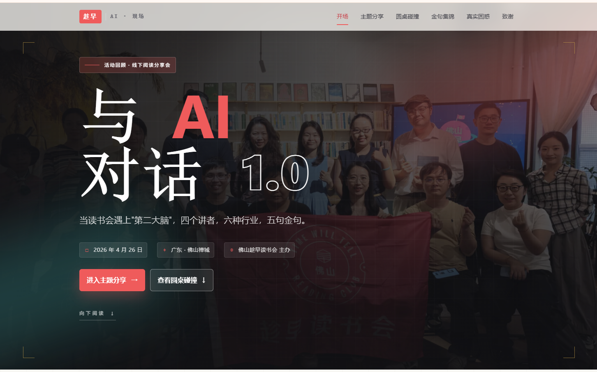
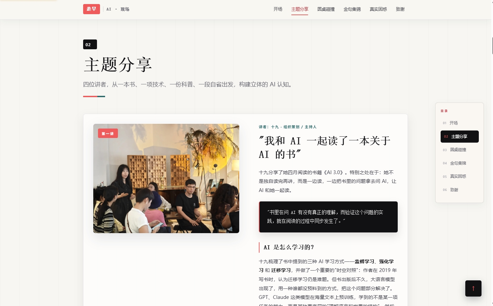
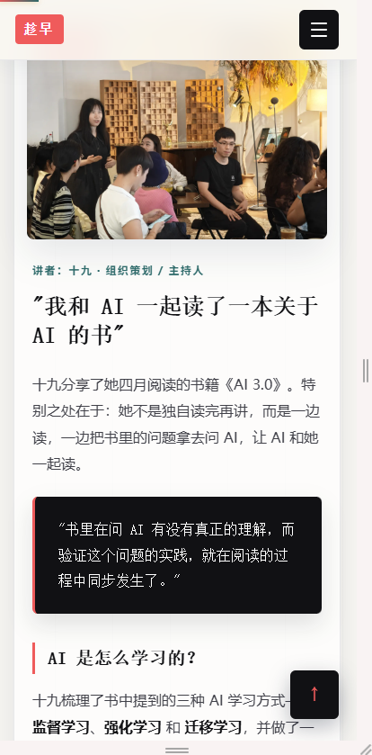
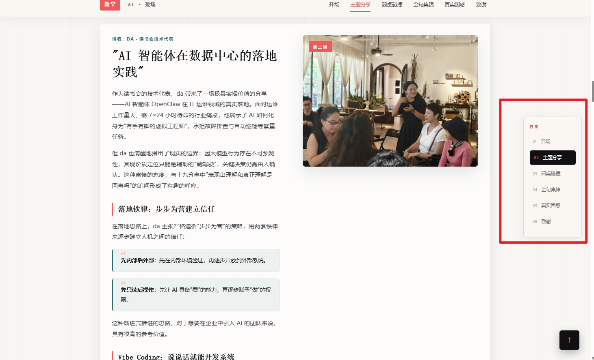
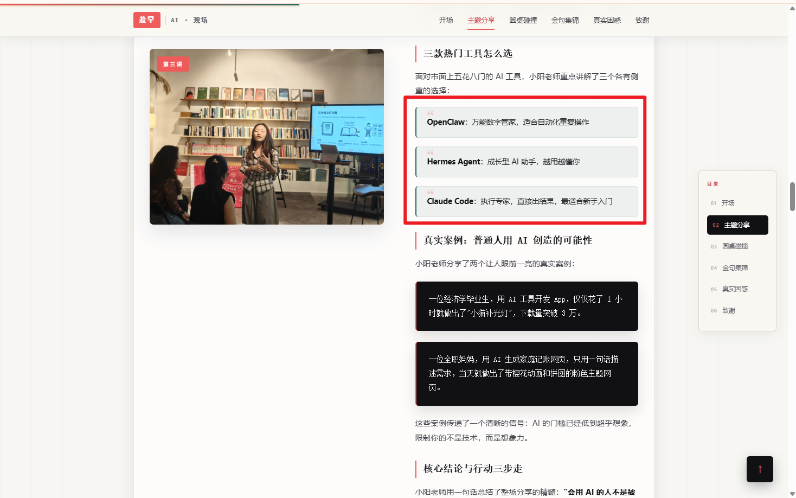
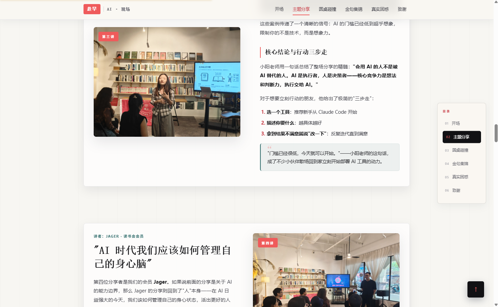

# AI 网页制作第 3 步：用 UX/UI Skill，把网页优化得更像正式作品

前两篇，我们已经完成了两个阶段。

第 1 步，用千问把公众号文章变成了一个可以打开的基础 HTML 网页。

这个版本叫 **V1 基线版**。

第 2 步，用 Claude Code 读取本地图片素材，把纯文字网页升级成图文页面。

这个版本叫 **V2 图文作品版**。

到了 V2，网页已经不再是单纯的文字排版了。

它有图片，有首屏，有导航，有目录，有图文穿插，也有一些基础交互。

但只要你认真看，还是会感觉：

> 好像已经像网页了，但还差一点正式作品的质感。

这就是第 3 步要解决的问题。

这一篇，我们用 **Codex** 来操作本地项目，并通过 `ui-ux-pro-max` 这类 UX/UI Skill，把 V2 打磨成更接近商业展示页的 V3。

---

## 一、为什么 V2 还是差点意思？

V2 最大的进步，是让页面从“纯文字”变成了“图文内容”。

但图文内容不等于正式作品。

很多 AI 生成网页的问题，恰恰就卡在这里。

它看起来有结构，但不够高级。

它有图片，但图片和文字之间的节奏不够顺。

它有按钮，但按钮不像真正可点击的产品入口。

它有卡片，但卡片之间的间距、圆角、阴影、层级不统一。

它有首屏，但首屏不够抓人。

这就是 V2 常见的问题：

> 内容已经完整，结构也有了，但视觉系统还没有真正建立起来。

所以 V3 的重点，不是继续加内容，也不是重新写文章，而是做最后一轮 UI / UX 打磨。

简单说：

> 不改文章事实，只重做页面的皮肤、节奏和体验。

---

## 二、这一篇为什么换成 Codex？

前一篇使用 Claude Code，是因为它很适合读取本地目录、接入图片、改造 HTML / CSS / JS 文件。

这一篇换成 Codex，是因为 V3 更接近“工程化审查 + 精细化修改”。

它不只是生成一个页面，而是要在已有 V2 的基础上完成一次有约束的升级。

这时 Codex 更适合承担下面这些任务：

- 读取 V2 的现有文件；
    
- 分析 HTML 中的文章结构；
    
- 保留原始内容；
    
- 新建 V3 输出目录；
    
- 把 CSS 和 JS 内联进单文件 HTML；
    
- 不修改、不覆盖 V2 原文件；
    
- 按指定 Skill 工作流执行；
    
- 最后输出生成文件、图片引用和 review 清单。
    

也就是说，这一步更像真实开发中的“版本升级”。

V2 是输入。

V3 是输出。

中间由 Codex 执行，并通过 UX/UI Skill 约束页面质量。

---

## 三、什么是 ux-max 类 Skill？

这里说的 ux-max 类 Skill，不是简单让 AI “审美好一点”。

它更像是一组面向 UX/UI 的专业优化规则。

这类 Skill 的目标不是改文章，而是提升页面表达效率。

它主要处理这些问题：

- 页面层级是否清楚；
    
- 首屏是否有吸引力；
    
- 配色是否统一；
    
- 字号和行高是否舒服；
    
- 卡片是否有一致的组件规范；
    
- 按钮是否符合可点击标准；
    
- 移动端是否好用；
    
- 页面是否有商业展示感；
    
- 交互是否轻量、不打扰阅读；
    
- 内容是否被完整保留。
    

这一篇主 Skill 是：

```text
ui-ux-pro-max
```

协同 Skill 包括：

```text
frontend-html-css-js
responsive-design
visual-polish
design-system
accessibility-audit
web-performance
content-preservation
```

这些 Skill 分工不同。

`ui-ux-pro-max` 负责整体体验和视觉打磨。

`frontend-html-css-js` 负责 HTML、CSS、JS 的落地。

`responsive-design` 负责移动端适配。

`visual-polish` 负责细节质感。

`design-system` 负责统一颜色、字号、间距、按钮和卡片。

`accessibility-audit` 负责可访问性，比如按钮尺寸、对比度、语义结构。

`web-performance` 负责性能，避免页面过重。

`content-preservation` 负责内容保护，避免 AI 为了好看乱改原文。

这一步要强调一句：

> Skill 的作用是优化表达，不是改写事实。

---

## 四、V3 的目标是什么？

V3 不是推翻 V2。

它是在 V2 的基础上做作品级打磨。

这一版的目标可以概括为四句话：

第一，内容不变。

原文的章节、事实、数据、人名、引语和核心观点都要保留。

第二，体验升级。

让页面更像一个正式作品网站，而不是普通公众号排版。

第三，视觉统一。

颜色、字号、间距、圆角、阴影、按钮、卡片要形成统一设计系统。

第四，交付简单。

最终只输出一个 `index.html` 文件，CSS 和 JS 全部内联，双击即可打开。

---

## 五、输入和输出目录

这一步的输入目录是 V2：

```text
F:\素材\趁早AI\AI2.0\网页制作\ai-web-demo-showcase\public\v2-claude-assets
```

输出目录是 V3：

```text
F:\素材\趁早AI\AI2.0\网页制作\ai-web-demo-showcase\public\v3-uxmax-polished
```

这里有一个非常重要的原则：

> 只能读取 V2，不能修改、覆盖、删除、移动 V2 中的任何文件。

V3 必须重新生成到新目录。

这是做版本管理时非常重要的习惯。

V1 是基础版。

V2 是图文版。

V3 是精修版。

每个版本都独立保留，这样后面才能做对比，也方便回滚。

---

## 六、给 Codex 的完整执行提示词

下面这段，是本篇最核心的操作提示词。

可以直接发给 Codex。

```text
请严格使用 Skill 工作流完成本次任务，不能只说“具备某某能力”。

## 1. 必须使用的 Skill

主 Skill：

- ui-ux-pro-max

协同 Skill：

- frontend-html-css-js
- responsive-design
- visual-polish
- design-system
- accessibility-audit
- web-performance
- content-preservation

请先检查当前环境是否已安装以上 Skill。

如果 ui-ux-pro-max 不存在，必须先查找可用 Skill 来源并安装；安装完成后重新确认 Skill 可用，再继续执行任务。

如果协同 Skill 不存在，也请尽量安装；确实无法安装时，必须在结果中说明原因，并使用已安装 Skill 配合完成优化。

## 2. 输入与输出目录

输入目录：

F:\素材\趁早AI\AI2.0\网页制作\ai-web-demo-showcase\public\v2-claude-assets

输出目录：

F:\素材\趁早AI\AI2.0\网页制作\ai-web-demo-showcase\public\v3-uxmax-polished

重要：

只能读取 V2 目录，千万不要修改、覆盖、删除、移动 v2-claude-assets 中的任何文件。

请在 V3 目录重新生成成品。

## 3. 执行要求

读取 V2 的 index.html。

解析标题、章节、段落、引用、列表、图片和结尾内容。

保留原文全部章节、事实、数据、人名、引语和核心观点。

不改写、不删减，只做 UI、UX、视觉层级、响应式和交互增强。

输出为为带目录层级的原生静态网页项目

F:\素材\趁早AI\AI2.0\网页制作\ai-web-demo-showcase\public\v3-uxmax-polished\index.html

CSS / JS 全部内联。

不使用 CDN、外部字体、框架、Node、npm 或构建工具。

浏览器双击即可打开。

图片路径使用相对路径，可引用 V2 assets，例如：

../v2-claude-assets/assets/xxx.jpg

不要复制、移动或破坏素材。

## 4. V3 视觉优化重点

请充分发挥 ui-ux-pro-max 的作品级 UI/UX 能力：

- Hero 首屏高度不少于 60vh
- 必须包含大标题、副标题、主按钮、次按钮
- 首屏加入渐变背景、模糊光晕、装饰元素，禁止空白寡淡
- 建立统一设计系统：颜色、字号、行高、间距、圆角、阴影、按钮、卡片统一
- 控制 3 个主色 + 1 个强调色
- 移动端优先，重点适配 375px、390px、414px
- 按钮高度不少于 44px
- 增强章节目录、重点观点模块、引用卡片、图文节奏、阅读进度条、返回顶部、结尾 CTA
- 加入轻量 icon、细腻动效和装饰渐变
- 整体要达到商业化作品展示页质感，而不是普通文章排版

## 5. 完成后输出

请列出：

1. 已安装 / 已调用的 Skill
2. 如果某些 Skill 安装失败，说明失败原因
3. 生成文件路径
4. 引用图片路径
5. 视觉调整说明，不超过 10 条
6. 建议我重点 review 的地方

请直接执行，不要反复询问确认。
```

这段提示词的重点，不是让 Codex “自由发挥”。

而是让它按照一个明确的工作流执行：

先查 Skill。

再读 V2。

再保护内容。

再生成 V3。

最后给出交付报告。

---

## 七、Codex 执行时，应该重点观察什么？

把提示词发给 Codex 后，不要只看它最后有没有生成文件。

中间过程也要看。

重点观察五件事。

### 1. 有没有先检查 Skill

这一步很关键。

因为这一篇的核心不是“声称自己有设计能力”，而是明确要求使用 Skill 工作流。

Codex 应该先检查这些 Skill 是否可用。

尤其是主 Skill：

```text
ui-ux-pro-max
```

如果没有安装，就应该先查找来源并安装。

如果安装失败，也要说明失败原因，而不是跳过去假装已经使用。

---

### 2. 有没有保护 V2 目录

V2 是上一版成果。

这一篇只允许读取 V2，不能修改 V2。

所以 Codex 不应该在 `v2-claude-assets` 目录里直接覆盖 `index.html`、`css/style.css` 或 `js/main.js`。

正确做法是新建：

```text
v3-uxmax-polished
```

然后把最终成品输出到：

```text
v3-uxmax-polished/index.html
```

这样 V2 和 V3 都能保留。

后面做文章截图时，也可以直接做同屏对比。

---

### 3. 有没有完整解析原文结构

V3 不是重新写文章。

所以 Codex 应该先读取 V2 的 `index.html`，并解析其中的内容

这一步的目的，是防止 AI 为了“好看”乱删内容。

尤其是文章里的事实、数据、人名、引语和核心观点，必须保留。

---

### 4. 没有变成单文件 HTML

这一篇的交付要求是：

```text
index.html
css/style.css
js/main.js
```


---

### 5. 图片路径有没有写对

V3 可以继续引用 V2 的图片素材。

但路径必须是相对路径，比如：

```text
../v2-claude-assets/assets/xxx.jpg
```

不能写成本机绝对路径：

```text
F:\素材\趁早AI\AI2.0\网页制作\xxx.jpg
```

也不要复制、移动或删除素材。

只引用即可。

---

## 八、V3 主要优化哪些地方？

这一版不是简单“美化一下”。

它应该从整体体验上升级。

### 1. 首屏 Hero 更像正式作品

V2 的首屏可能只是标题加图片。

V3 的 Hero 应该更完整。



读者打开页面时，第一眼就要感受到这是一个被设计过的作品页。

不是一篇普通文章。

---

### 2. 建立统一设计系统

V2 常见的问题是：每个模块看起来都还行，但放在一起不统一。

V3 要解决这个问题。



建议控制在：

> 3 个主色 + 1 个强调色。

颜色少，页面才容易高级。

---

### 3. 移动端优先

这类教程网页，大部分读者很可能会在手机上看。

所以 V3 必须移动端优先。

重点适配：

```text
375px
390px
414px
```

这几个宽度基本覆盖了常见手机阅读场景。

按钮高度也要注意。

移动端按钮不要太矮，至少要有：

```text
44px
```

这样才比较容易点击。

---

### 4. 章节目录更清楚

目录不是摆设。

它应该帮助读者快速理解整篇文章结构。

V3 可以把目录做成一个视觉模块，而不是普通列表。


---

### 5. 重点观点模块更突出

文章里的关键观点，不应该淹没在正文里。

可以把它们做成重点信息卡片。

比如：

> V3 不是重写内容，而是提升同一份内容的表达效率。

这类句子适合做成卡片、标语或高亮区域。

它能让读者快速抓住文章价值。

---

### 6. 图文节奏更自然

V2 已经加入图片，但图片可能只是简单插入。

V3 要让图片和内容形成节奏。

    

图片不是装饰。

图片应该参与表达。


---

## 九、V2 和 V3 的对比

V2 和 V3 最大的区别，不是内容多了多少，而是表达效率不同。

|对比项|V2 图文作品版|V3 UX/UI 精修版|
|---|---|---|
|内容|保留原文并加入图片|内容不变，表达更高效|
|首屏|有基础封面|有完整 Hero 和视觉冲击|
|视觉系统|有样式但不够统一|颜色、字号、间距、组件统一|
|目录|可以跳转|更像正式导航模块|
|卡片|基础卡片|模块化信息组件|
|移动端|可阅读|更适合手机浏览和点击|
|交互|基础交互|阅读进度、返回顶部、菜单体验更顺|
|质感|像图文网页|更像商业展示作品页|

一句话总结：

> V2 解决“网页开始有作品感”，V3 解决“作品看起来更正式”。

---

