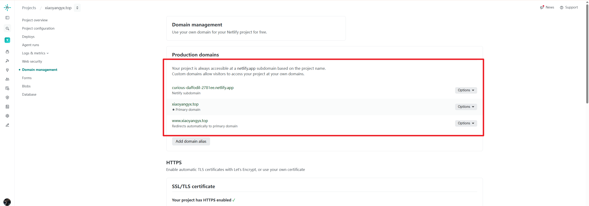
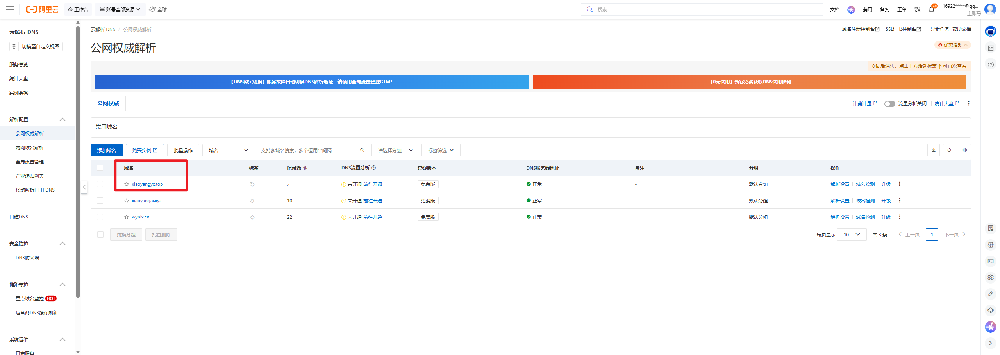
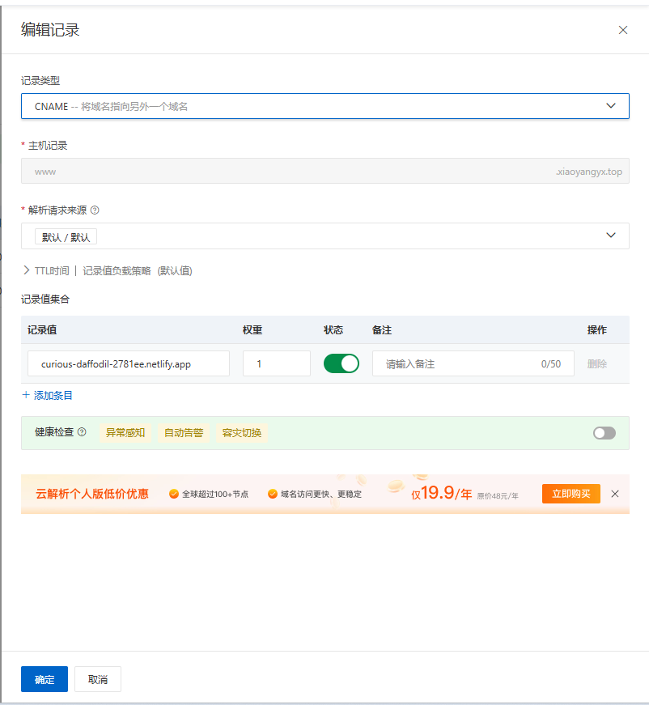
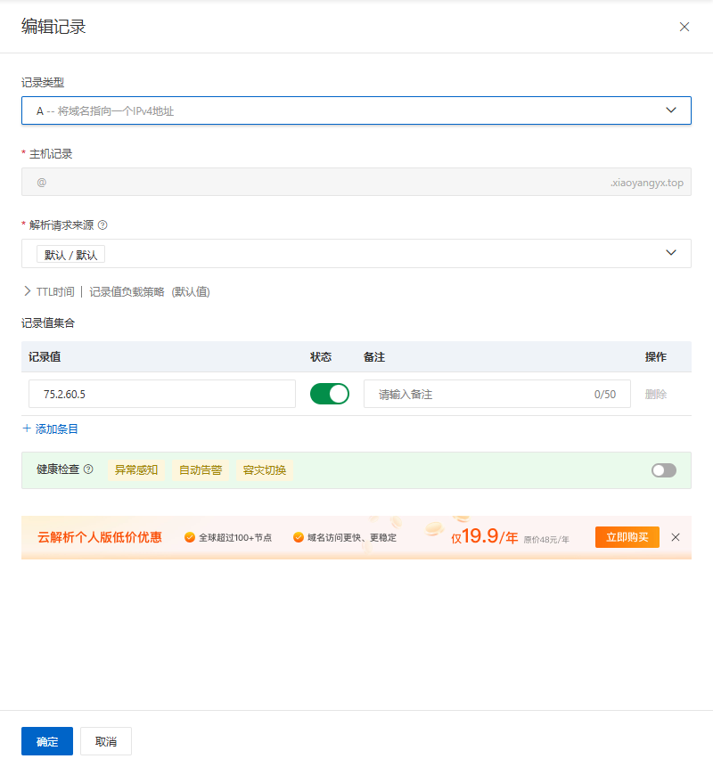
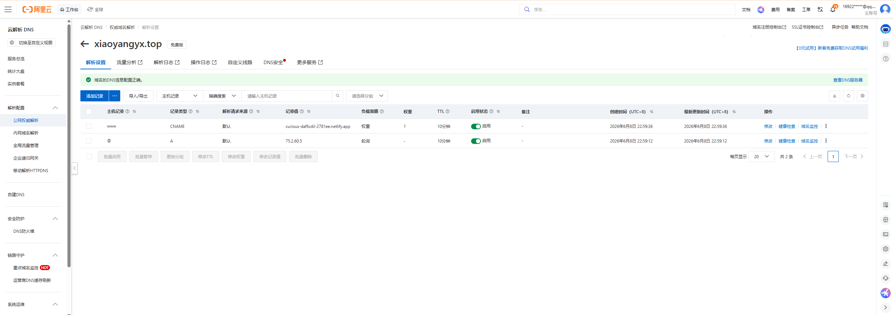
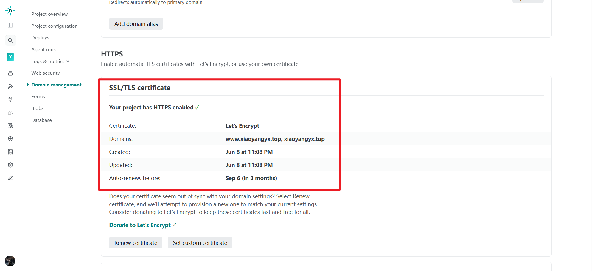
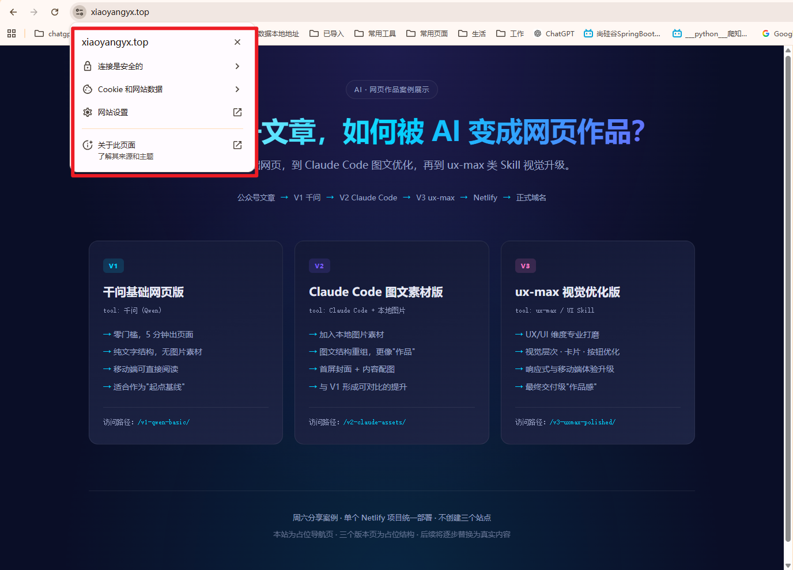

# 第 5 步：绑定自己的域名，让 AI 网页作品正式上线

前面我们已经完成了四件事：

第一步，把公众号文章变成 V1 基础网页。

第二步，加入图片素材，做成 V2 图文网页。

第三步，用 UX/UI Skill 打磨成 V3 精修网页。

第四步，用一个 Netlify 项目，把三个版本一起发布出去。

现在，网站已经可以正式访问：

```text
https://xiaoyangyx.top/
```

这个首页就是整个作品展示的入口。

页面里放了三个版本：

```text
/v1-qwen-basic/
/v2-claude-assets/
/v3-uxmax-polished/
```

也就是说，我们现在不是只做了一个网页，而是做了一个完整的 AI 网页作品展示站。

---

## 一、这一步解决什么问题？

Netlify 部署成功后，默认会生成一个临时域名，比如：

```text
curious-daffodil-2781ee.netlify.app
```

这个地址能访问，但不适合作为正式作品链接。

所以我们要绑定自己的域名：

```text
xiaoyangyx.top
```

绑定完成后，访问方式就变成：

```text
https://xiaoyangyx.top/
```

三个版本也可以分别访问：

```text
https://xiaoyangyx.top/v1-qwen-basic/
https://xiaoyangyx.top/v2-claude-assets/
https://xiaoyangyx.top/v3-uxmax-polished/
```

这样发给别人时，就不再是一个临时测试链接，而是一个真正属于自己的作品地址。

---

## 二、在 Netlify 里绑定域名

进入 Netlify 项目后台，找到：

```text
Domain management
```

在 Production domains 里，可以看到当前项目已经有两个地址：

```text
curious-daffodil-2781ee.netlify.app
xiaoyangyx.top
```

其中：

```text
curious-daffodil-2781ee.netlify.app
```

是 Netlify 自动生成的默认域名。

```text
xiaoyangyx.top
```

是我们绑定的正式域名，并且已经被设置为 Primary domain。

这一步完成后，Netlify 就知道：

> 以后访问 xiaoyangyx.top，就打开这个 Netlify 项目。


---

## 三、在阿里云做域名解析

域名是在阿里云管理的，所以解析也要去阿里云后台配置。

进入阿里云控制台，找到：

```text
云解析 DNS
```

选择域名：

```text
xiaoyangyx.top
```


然后进入解析设置。

如果绑定主域名，一般需要配置主机记录：

```text
@
```

如果同时要支持：

```text
www.xiaoyangyx.top
```

还需要配置：

```text
www
```

简单理解：


```text
@    代表 xiaoyangyx.top
www  代表 www.xiaoyangyx.top
```


配置完成后，阿里云负责把访问请求指向 Netlify 项目。

这里最容易错的是：不要把完整页面路径写进 DNS。

DNS 只负责域名解析，不负责页面路径。

不要写：

```text
https://xiaoyangyx.top/v3-uxmax-polished/
```

只需要让域名指向 Netlify 项目即可。

路径是部署目录决定的。

---

## 四、确认 HTTPS 已经生效

域名解析完成后，还要看 HTTPS 证书。

在 Netlify 的 HTTPS 区域里，可以看到：

```text
Your project has HTTPS enabled
```

证书是：

```text
Let's Encrypt
```

当前证书包含的域名是：

```text
www.xiaoyangyx.top
xiaoyangyx.top
```


这说明两个地址都已经被证书覆盖。

正常情况下，浏览器打开：

```text
https://xiaoyangyx.top/
```

地址栏会显示安全锁。


如果刚配置完时提示“不安全”，不要马上重配。

一般先检查三件事：

```text
1. 阿里云解析有没有写对
2. Netlify 里有没有添加 xiaoyangyx.top
3. HTTPS 证书是否已经签发完成
```

如果解析刚刚修改，等待一段时间是正常的。

---

## 五、最终检查三个网页版本

最后，逐个打开下面几个地址：

```text
https://xiaoyangyx.top/
https://xiaoyangyx.top/v1-qwen-basic/
https://xiaoyangyx.top/v2-claude-assets/
https://xiaoyangyx.top/v3-uxmax-polished/
```

重点检查：

```text
1. 首页是否正常显示
2. 三张版本卡片是否能点击
3. V1 是否能打开
4. V2 图片是否正常显示
5. V3 页面是否正常显示
6. HTTPS 是否正常
7. 手机端打开是否正常
```

如果这些都没问题，就说明整个 AI 网页作品已经正式上线。

到这里，五篇教程形成了一个完整闭环：

```text
第 1 步：用千问把文章变成网页
第 2 步：用 Claude Code 加入图片素材
第 3 步：用 UX/UI Skill 做视觉精修
第 4 步：用 Netlify 发布三个版本
第 5 步：绑定 xiaoyangyx.top 正式上线
```

最终效果就是：

```text
https://xiaoyangyx.top/
```

这是一个完整的 AI 网页作品展示入口。

从公众号文章，到本地网页，再到正式域名上线，这套流程就跑通了。